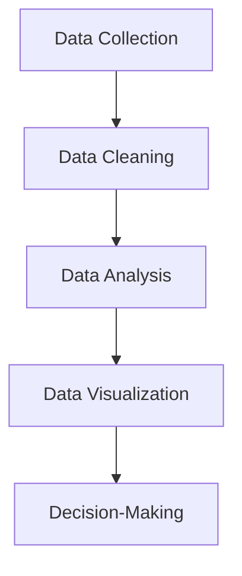

Q what is data science ?  

- An interdisciplinary field combining statistics, computer science, and domain knowledge.

- Involves extracting insights and knowledge from structured and unstructured data.

- Core techniques: machine learning, data mining, predictive analytics

(or)

- Data science is the study of data that helps us derive useful insight for business decision making.

- Data Science is all about using tools, techniques, and creativity to uncover insights hidden within data.

- It combines math, computer science, and domain expertise to tackle real-world challenges in a variety of fields.
---

Why is Data Science Important?

- Helps make data-driven decisions

- Drives innovation across industries

- Powers technologies like AI, recommendation systems, fraud detection, etc.

- Generates value from vast amounts of data

**Steps to Data science**

**Data Collection:** Gathering raw data from various sources, such as databases, sensors, or user interactions.

**Data Cleaning:** Ensuring the data is accurate, complete, and ready for analysis.

**Data Analysis:** Applying statistical and computational methods to identify patterns, trends, or relationships.

**Data Visualization:** Creating charts, graphs, and dashboards to present findings clearly.

**Decision-Making:** Using insights to inform strategies, create solutions, or predict outcomes.

----

Q Difference Between Data Science and Data Visualization?

**Data Science:** Full pipeline—collecting, cleaning, analyzing, modeling data, extracting insights, and making predictions or decisions. Encompasses stats, ML, programming, and domain knowledge.

**Data Visualization:** Subset/tool of data science—focuses on representing data visually (charts, graphs, dashboards) to communicate insights effectively. Doesn’t inherently analyze or predict.

(or)

**Data Science:** Data science is study of data. It involves developing methods of recording, storing, and analyzing data to extract useful information

**Data Visualization:** Data visualization is the graphical representation of information and data in a pictorial or graphical format(Example: charts, graphs, and maps).

---

Importance of Data science

roles in data science

Data science work flow and life cycle

difference between data science and big data

- **Data Science:** Focused on **analyzing data** to extract insights, build models, and make decisions. Uses statistics, ML, and visualization.
    
- **Big Data:** Refers to **massive, complex datasets** (volume, velocity, variety, veracity) that traditional tools can’t handle efficiently. Focus is on **storage, processing, and management**.

(or)

**Data Science:**

1. Extracts insights from structured and unstructured data.
    
2. Uses statistics, machine learning, and visualization.
    
3. Focuses on solving problems and making predictions.
    
4. Works with datasets of any size, not necessarily huge.
    

**Big Data:**

1. Deals with massive, high-velocity, and diverse datasets.
    
2. Focuses on storage, processing, and management.
    
3. Enables scalable analysis, often using distributed systems.
    
4. Infrastructure-centric; insights require additional tools like data science.

data science and artificial intelligence

![[Pasted image 20250815123836.png]]

data science tools and technologies

<b>DATA SCIENCE APPLICATIONS</b>

**Healthcare:** Data science improves patient outcomes by using predictive analytics to detect diseases early, creating personalized treatment plans and optimizing hospital operations for efficiency.

**Finance:** Data science helps detect fraudulent activities, assess and manage financial risks, and provide tailored financial solutions to customers.

**Retail:** Data science enhances customer experiences by delivering targeted marketing campaigns, optimizing inventory management, and forecasting sales trends accurately.

**Technology:** Data science powers cutting-edge AI applications such as voice assistants, intelligent search engines, and smart home devices.

**Transportation:** Data science optimizes travel routes, manages vehicle fleets effectively, and enhances traffic management systems for smoother journeys.

**Manufacturing:** Data science predicts potential equipment failures, streamlines supply chain processes, and improves production efficiency through data-driven decisions.

**Energy:** Data science forecasts energy demand, optimizes energy consumption, and facilitates the integration of renewable energy resources.

**Agriculture:** Data science drives precision farming practices by monitoring crop health, managing resources efficiently, and boosting agricultural yields.

examples of applications

--- 

**Fraud Detection **

- **Goal:** Identify fraudulent activity **before it causes major damage**.
    
- **Approach:** Analyze historical data to detect patterns and anomalies.
    
- **Challenges:** Real-time detection is **harder than post-fact**, requires **high precision**.
    
- **Trade-offs:** Both false positives (innocent flagged) and false negatives (fraud missed) are costly.
    
- **Tech:** Stream processing, anomaly detection models, real-time dashboards, ML algorithms.

---

**Recommender Systems:**

- **Purpose:** Deliver **personalized suggestions** to users.
    
- **Impact:** Boosts sales, click-throughs, conversions.
    
- **Examples:**
    
    - **Netflix:** ~$1B/year value from recommendations.
        
    - **Amazon:** 20–35% annual sales lift.
        
- **Technique:** Collaborative filtering at scale, content-based methods, hybrid approaches.

---

**Patient Readmission Prediction:**

- **Goal:** Identify why patients return to the hospital.
    
- **Benefits:** Cut costs, improve population health.
    
- **Focus:** Understand **underlying causes** for specific populations.
    
- **Data:** Integrate multiple sources—EHRs, socioeconomic info, genetics, patient history.
    
- **Approach:** Analyze correlations between readmissions and health/social factors to enable targeted interventions.

---

**Smart Cities:**

- **Definition:** Use data + ICT to optimize urban living.
    
- **Goals:**
    
    - Plan communities efficiently
        
    - Manage infrastructure/assets effectively
        
    - Reduce operational costs
        
    - Use open data to engage citizens

---

holistic approach to data science

![[Pasted image 20250815123547.png]]

