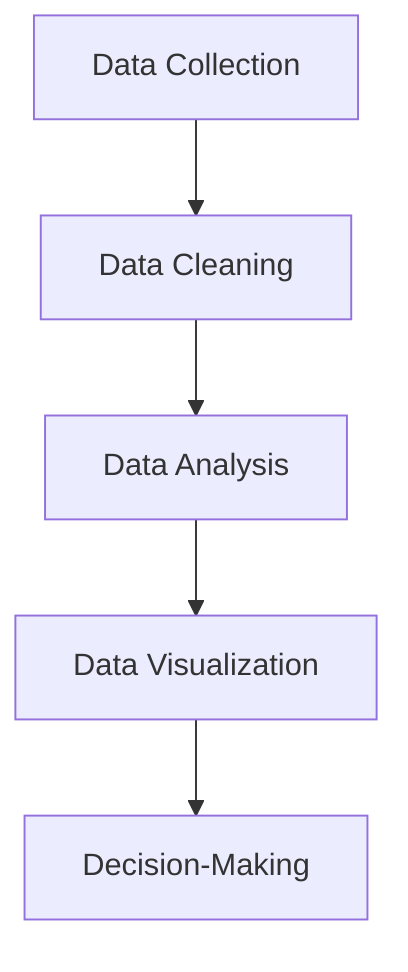

Q what is data science ?  

- An interdisciplinary field combining statistics, computer science, and domain knowledge.

- Involves extracting insights and knowledge from structured and unstructured data.

- Core techniques: machine learning, data mining, predictive analytics

(or)

- Data science is the study of data that helps us derive useful insight for business decision making.

- Data Science is all about using tools, techniques, and creativity to uncover insights hidden within data.

- It combines math, computer science, and domain expertise to tackle real-world challenges in a variety of fields.
---

Why is Data Science Important?

- Helps make data-driven decisions

- Drives innovation across industries

- Powers technologies like AI, recommendation systems, fraud detection, etc.

- Generates value from vast amounts of data

Steps to Data science

**Data Collection:** Gathering raw data from various sources, such as databases, sensors, or user interactions.

**Data Cleaning:** Ensuring the data is accurate, complete, and ready for analysis.

**Data Analysis:** Applying statistical and computational methods to identify patterns, trends, or relationships.

**Data Visualization:** Creating charts, graphs, and dashboards to present findings clearly.

**Decision-Making:** Using insights to inform strategies, create solutions, or predict outcomes.

----

Q Difference Between Data Science and Data Visualization?

**Data Science:** Full pipeline—collecting, cleaning, analyzing, modeling data, extracting insights, and making predictions or decisions. Encompasses stats, ML, programming, and domain knowledge.

**Data Visualization:** Subset/tool of data science—focuses on representing data visually (charts, graphs, dashboards) to communicate insights effectively. Doesn’t inherently analyze or predict.

Importance of Data science

roles in data science

Data science work flow and life cycle

difference between data science and big data

data science and artificial intelligence

data science tools and technologies

data science applications

holistic approach to data science

