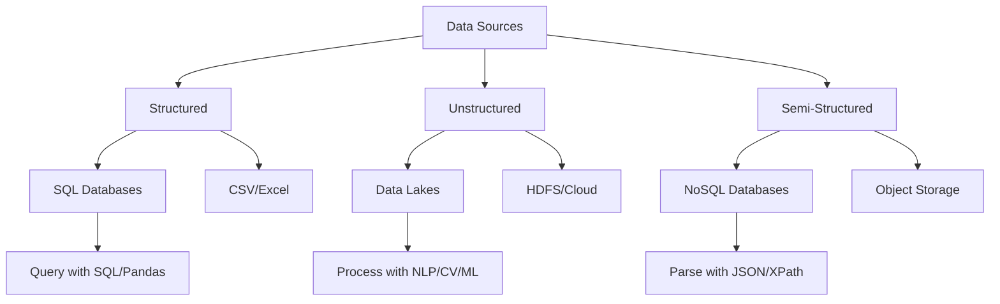
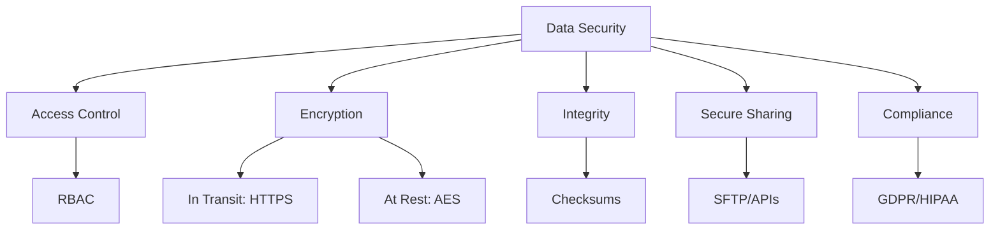
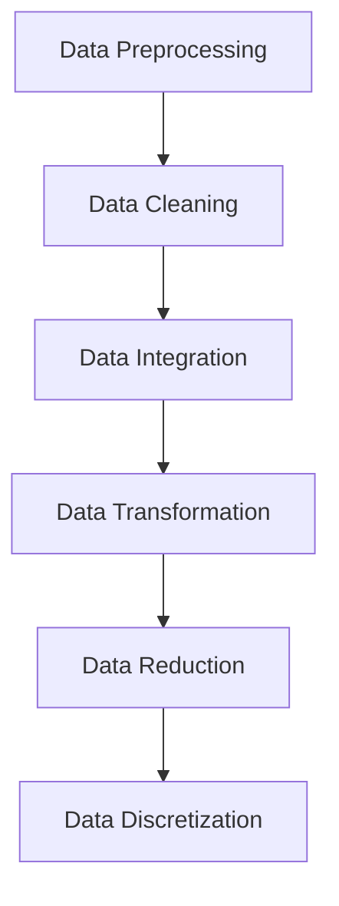
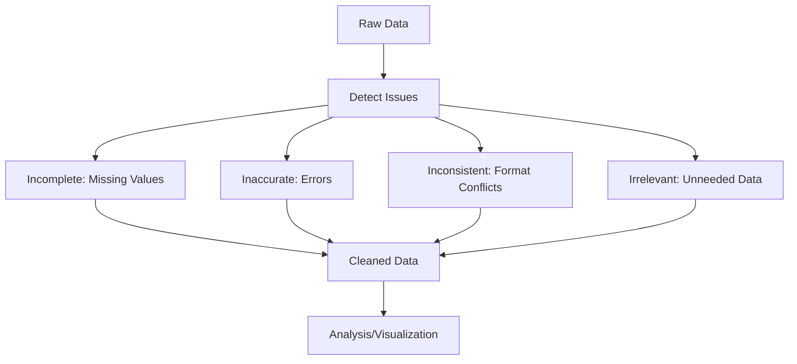
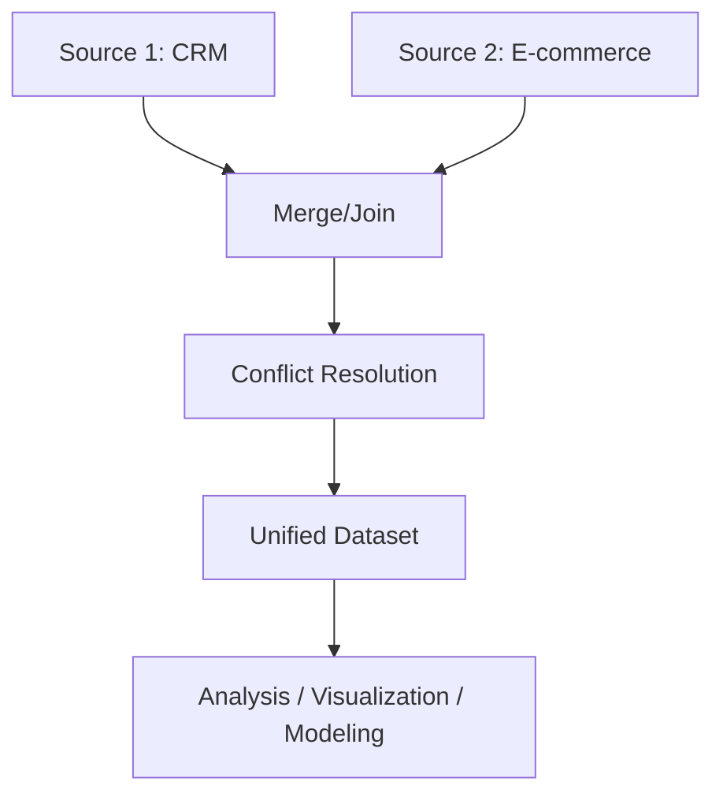
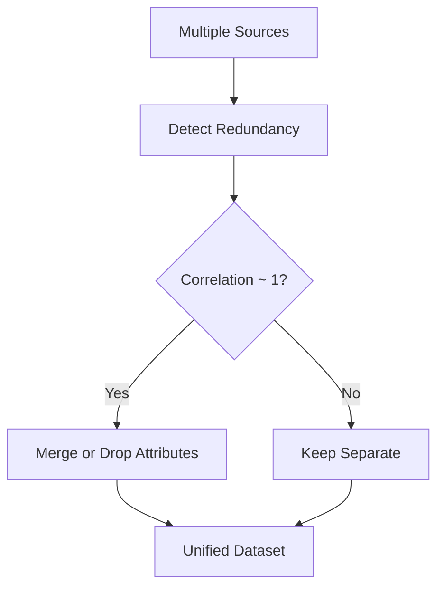
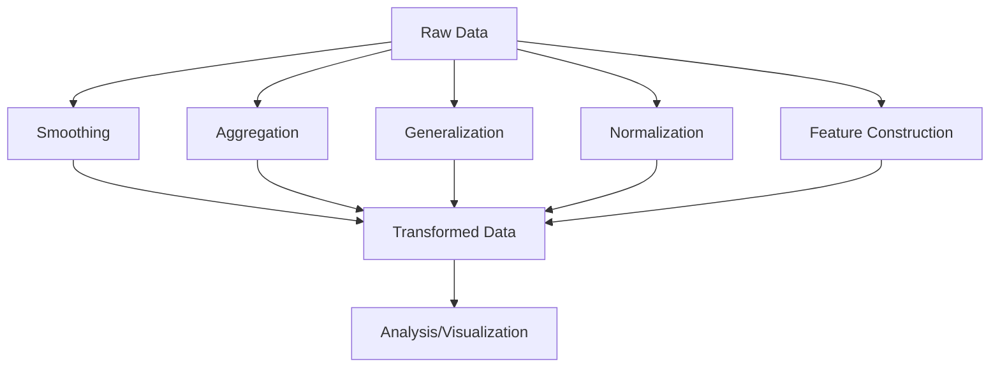
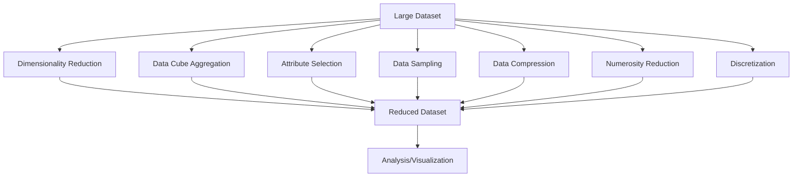
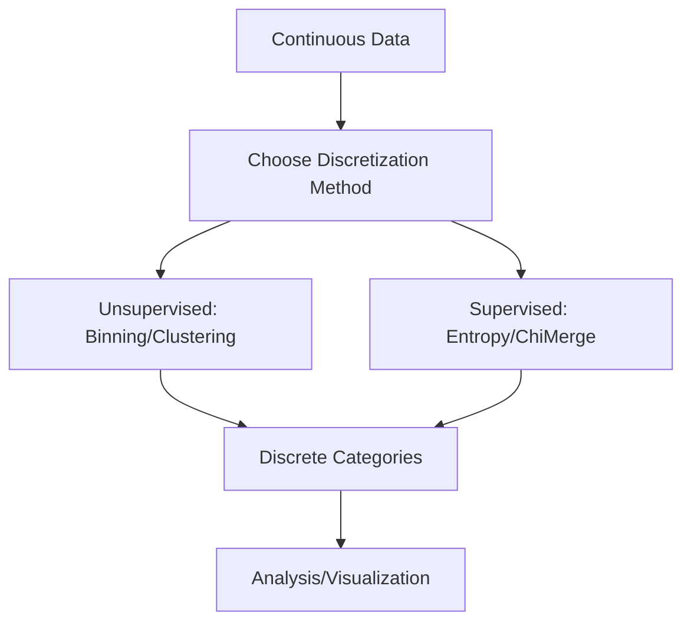
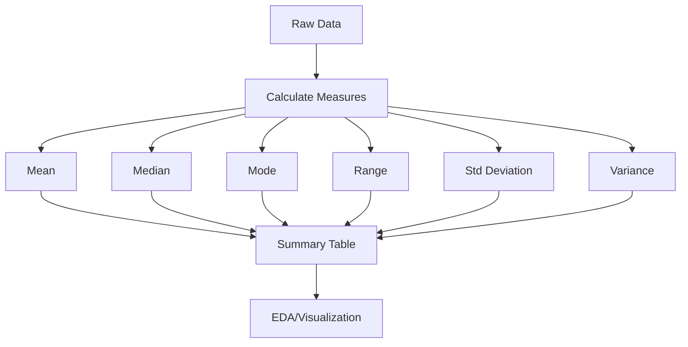

## Types of Data Sources

Data is the backbone of DSV, and its structure determines storage, processing, and analysis methods. We categorize data into three types: structured, unstructured, and semi-structured, each with unique characteristics and applications.

### 1. Structured Data

**Definition**: Structured data is highly organized, typically in tabular formats with predefined schemas (rows and columns). It’s easily searchable and ideal for relational databases.

**Characteristics**:

- Fixed fields: Each data point fits a specific column (e.g., Name, Age).
    
- Consistent format: Enables efficient querying using structured query languages.
    
- Examples: Customer databases, financial records, inventory logs.
    

**Storage**:

- **SQL Databases**: MySQL, PostgreSQL, Oracle for relational data.
    
- **Files**: CSV, Excel, or parquet for portable tabular data.
    

**Examples**:

- **Customer Information**: A table storing names, ages, and emails.
    
- **Financial Data**: Sales transactions with columns for date, amount, and product ID.
    

**Sample Customer Table**:


| Name  | Age | Email           |
|-------|-----|-----------------|
| John  | 28  | john@email.com  |
| Sarah | 34  | sarah@email.com |
| Mike  | 25  | mike@email.com  |


**Processing**:

- Use SQL for queries: SELECT AVG(Age) FROM Customers; yields the average age ($29$).
    
- In Python with Pandas: df['Age'].mean() computes the same.
    
- Example: To filter customers over 30, use SELECT * FROM Customers WHERE Age > 30; or df[df['Age'] > 30].
    

**Use Case**: A retail company tracks sales in a SQL database, querying monthly revenue with SELECT SUM(Revenue) FROM Sales WHERE Month = 'August';.

---

### 2. Unstructured Data

**Definition**: Unstructured data lacks a predefined schema, making it heterogeneous and complex. It includes text, multimedia, and raw sensor outputs.

**Characteristics**:

- No fixed format: Data varies in structure (e.g., free-form text, images).
    
- Large volume: Often dominates big data (e.g., social media posts).
    
- Examples: Tweets, blog posts, videos, IoT sensor streams.
    

**Storage**:

- **Data Lakes**: AWS S3, Azure Data Lake for raw storage.
    
- **Distributed File Systems**: Hadoop HDFS for scalability.
    
- **Cloud Storage**: Google Cloud Storage for multimedia.
    

**Examples**:

- **Text**: Social media posts like “Loving this new phone! 📱 #Tech”.
    
- **Media**: Product photos, customer review videos.
    
- **Sensor Data**: Unlabeled temperature readings from IoT devices.
    

**Sample Social Media Table**:


| Post_ID | Content                                           |
|---------|--------------------------------------------------|
| 101     | "Just had the best coffee ever at the new café downtown ☕🔥" |
| 102     | "Vacation pics from Bali 🌴🏖️"                  |
| 103     | "Can’t believe this movie got 3 hours of my life 😑🎬" |


**Processing**:

- **NLP**: Use NLTK or spaCy for sentiment analysis. Example: Post 101 is “positive” due to “best” and “🔥”.
    
- **Computer Vision**: TensorFlow for image classification (e.g., identify objects in vacation photos).
    
- **Machine Learning**: Train models to process raw sensor data.
    

**Use Case**: A marketing team analyzes Twitter posts for brand sentiment using NLP to classify posts as positive, negative, or neutral, guiding campaign strategies.

---

### 3. Semi-Structured Data

**Definition**: Semi-structured data has partial organization (e.g., tags, key-value pairs) but isn’t strictly tabular, offering flexibility.

**Characteristics**:

- Loose schema: Uses markers like tags or hierarchies.
    
- Flexible: Adapts to evolving data needs.
    
- Examples: JSON, XML, log files, emails.
    

**Storage**:

- **NoSQL Databases**: MongoDB, CouchDB for document storage.
    
- **Object Storage**: JSON/XML files in S3 or local systems.
    

**Examples**:

- **JSON**: API responses like {"user":"alice","action":"login"}.
    
- **Emails**: Structured headers (To, From) with unstructured body.
    
- **Logs**: Server logs with timestamped key-value pairs.
    

**Sample Log Table**:


| Log_ID | Data                                                                 |
|--------|----------------------------------------------------------------------|
| 1      | {"user":"alice","action":"login","time":"2025-08-19T10:30:00Z"}      |
| 2      | {"user":"bob","action":"purchase","item":"book","price":12.99}      |
| 3      | {"user":"carol","action":"logout","time":"2025-08-19T12:15:00Z"}    |


**Processing**:

- Parse with tools: json.loads(data) in Python or XPath for XML.
    
- Query NoSQL: MongoDB query db.logs.find({"action":"purchase"}).
    
- Example: Extract all purchases from logs using df[df['Data'].str.contains('"action":"purchase"')].
    

**Use Case**: An e-commerce platform stores API logs in MongoDB, querying purchase actions to track user behavior.

**Mermaid Diagram: Data Types Workflow**:



## Data Collection Strategies

Effective data collection ensures quality insights. It’s an iterative process requiring clear objectives, source identification, and ethical considerations.

1. **Define Clear Objectives**
    
    - Specify goals: “Understand customer retention drivers.”
        
    - Questions: “What factors reduce churn?”
        
    - Example: A telecom company defines KPIs like “churn rate” to collect call logs and feedback.
        
2. **Identify Relevant Data Sources**
    
    - Sources: Internal (databases), external (APIs, public datasets).
        
    - KPIs: “Customer lifetime value,” “website visits.”
        
    - Example: Use Google Analytics API to fetch click-through rates (ga:pageviews).
        
3. **Data Quality Assessment**
    
    - Evaluate: Completeness (no missing values), accuracy (correct values), consistency (no conflicts).
        
    - Clean: Remove duplicates, fix formats.
        
    - Example: In a dataset, flag rows with missing emails using df[df['Email'].isnull()].
        
4. **Consider Structured and Unstructured Data**
    
    - Combine: Sales data (structured) with reviews (unstructured).
        
    - Example: Merge CRM sales with Twitter sentiment for a holistic customer view.
        
5. **Real-Time Data Collection**
    
    - Use streaming: Kafka for live stock prices.
        
    - Example: IoT sensors stream temperature every second for real-time factory monitoring.
        
6. **Data Privacy and Ethics**
    
    - Comply: GDPR requires consent for EU user data.
        
    - Example: Anonymize names (e.g., “John” → “User123”) before analysis.
        
7. **Sampling Techniques**
    
    - Subsets: Random sample 10% of 1M rows.
        
    - Example: Use df.sample(frac=0.1, random_state=42) to test models efficiently.
        
8. **Surveys and Questionnaires**
    
    - Targeted: Ask “Rate service (1-5)” for feedback.
        
    - Example: Survey 1000 customers, ensuring questions align with “satisfaction” KPIs.
        
9. **Collaboration with Stakeholders**
    
    - Engage experts: Sales team suggests “deal size” as a metric.
        
    - Example: Meet with marketing to prioritize data on campaign conversions.
        
10. **Data Integration**
    
    - Unify: Merge CRM and ERP data.
        
    - Example: Combine customer IDs across platforms, resolving duplicates with df.drop_duplicates('CustomerID').
        

## Data Security in Data Analysis and Visualization

Security is critical to protect data integrity, privacy, and compliance during analysis and visualization.

1. **Data Breaches**
    
    - Risks: Financial loss, reputational damage.
        
    - Example: A hacker accesses credit card data, leading to $1M in fraudulent charges.
        
2. **Data Privacy**
    
    - Protect PII: Use anonymization (e.g., hash emails).
        
    - Differential Privacy: Add noise to aggregates. Example: Report average salary with noise to hide individual values.
        
3. **Data Access Control**
    
    - RBAC: Analysts read, admins write.
        
    - Example: Grant SELECT only to data scientists in SQL DBs.
        
4. **Data Encryption**
    
    - In transit: HTTPS for APIs. At rest: AES-256 for files.
        
    - Example: Encrypt customer data in S3 using aws s3 cp --sse AES256.
        
5. **Data Integrity**
    
    - Verify: Use SHA-256 checksums.
        
    - Example: Check file hash post-transfer with sha256sum data.csv.
        
6. **Secure Data Sharing**
    
    - Methods: SFTP, secure APIs.
        
    - Example: Share reports via expiring links in OneDrive.
        
7. **Data Masking and Redaction**
    
    - Mask: Replace PII (e.g., “1234-5678-9012-3456” → “XXXX-XXXX-XXXX-3456”).
        
    - Example: Redact names in shared datasets using regex in Python.
        
8. **Compliance with Regulations**
    
    - Laws: GDPR, HIPAA.
        
    - Example: Obtain explicit consent for collecting EU customer data.
        
9. **Awareness and Training**
    
    - Educate: Phishing workshops.
        
    - Example: Train staff to avoid sharing passwords.
        
10. **Data Lifecycle Management**
    
    - Secure: Storage to deletion.
        
    - Example: Schedule auto-deletion of logs after 1 year with cron jobs.
        

**Mermaid Diagram: Data Security Workflow**:



---
<p align="center" style="font-size:24px"><b>Data Pre-Processing Overview in Data Science & Visualization (DSV)</b></p> 

Effective data collection is the foundation of meaningful analytics and visualization.  
**Data pre-processing** is a crucial step that involves cleaning, transforming, and organizing raw data into a usable format for analysis and visualization.  

The main steps are:  
- Data Cleaning  
- Data Integration  
- Data Transformation  
- Data Reduction  
- Data Discretization  



# Data Preprocessing

## Why?
Data in the real world is **dirty**:
- **Incomplete**: Missing values, missing attributes of interest, or only aggregate data.  
  *Example: `occupation =` (empty)*  
- **Noisy**: Contains errors or outliers.  
  *Example: `Salary = "- I O"`*  
- **Inconsistent**: Discrepancies in codes or names.  

---

## Sources of Dirty Data

### Incomplete Data
- **n/a values during collection** → Customer survey with `age = n/a`.  
- **Time mismatch between collection and analysis** → Sales data collected daily, but product prices updated monthly → mismatch.  
- **Human, hardware, or software errors** → Sensor stops recording halfway; missing half of temperature readings.  


### Noisy Data
- **Errors in collection** → Microphone picks up static noise instead of clear speech.  
- **Data entry mistakes** → Typing `50000O` instead of `500000` for salary.  
- **Transmission issues** → GPS location gets scrambled during satellite signal loss.  


### Inconsistent Data
- **Conflicts between multiple data sources** → One database has `DOB = 1999-05-10`, another has `DOB = 1998-10-05`.  
- **Functional dependency violations** → `ZIP code = 560001` but `City = Hyderabad` (mismatch; 560001 belongs to Bangalore).  
---

## Importance of Data Preprocessing
- **No quality data → No quality mining results**  
- Quality decisions demand quality data  
  - Duplicate/missing values → Incorrect or misleading statistics  
- Data warehouse requires consistent integration of quality data 
- Data Extraction, cleaning, and transformation = **majority of the work** in building a data warehouse  


---

## Multi-Dimensional Measure of Data Quality

### Core Dimensions
- **Accuracy** → Value correctly represents the real-world fact.  
  *Ex: Recorded temperature = 25°C, actual = 25°C.*  

- **Completeness** → All required data is present.  
  *Ex: Customer record missing phone number → incomplete.*  

- **Consistency** → No contradictions across datasets.  
  *Ex: `DOB = 2000-01-01` in one table, `DOB = 1999-12-31` in another → inconsistent.*  

- **Timeliness** → Data is up-to-date.  
  *Ex: Stock price updated hourly vs real-time feed.*  

- **Believability** → Data is credible and trustworthy.  
  *Ex: Sales data from official ERP vs. an unverified Excel sheet.*  

- **Value Added** → Data contributes to decision-making.  
  *Ex: Adding “Customer Lifetime Value” helps marketing strategy.*  

- **Interpretability** → Data is easy to understand.  
  *Ex: Column named `salary_in_usd` vs. `sal1`.*  

- **Accessibility** → Data is available when needed.  
  *Ex: Secure API access vs. locked in a local machine file.*  

---

### Broad Categories
- **Intrinsic** → Accuracy, Believability, Objectivity.  
- **Contextual** → Completeness, Timeliness, Value Added, Relevance.  
- **Representational** → Interpretability, Consistency, Ease of understanding.  
- **Accessibility** → Accessibility, Security. 

---

# Data Cleaning in Data Science and Visualization

Data cleaning is a foundational step in the data preprocessing pipeline, addressing issues in raw data to ensure it’s suitable for analysis, visualization, or modeling. 

## Definition and Goal

- **Process**: Detecting and correcting **incomplete, inaccurate, inconsistent, or irrelevant data**.
- **Techniques**: Modify or remove corrupt/unusable records.
- **Goal**: Ensure high-quality data before further processing.


**Mermaid Diagram: Data Cleaning Process**:



## Importance

- "Data cleaning is one of the three biggest problems in data processing." — _Ralph Kimball_
- "Data cleaning is the number one problem in data processing." — _DCI Survey_


## Typical Tasks

- Fill in **missing values** (e.g., mean, median, interpolation). Replace or remove gaps to ensure completeness. For example, in a dataset with missing salaries, imputing the mean ($mean = \frac{\sum x_i}{n}$) maintains statistical properties.

- Identify **outliers** and smooth noisy data (e.g., binning, regression). Outliers (e.g., a temperature reading of 100°C in a room) distort analyses; smoothing via binning or regression corrects them.

- Correct **inconsistent data** (e.g., conflicting codes, formats).  Standardizing formats (e.g., dates as YYYY-MM-DD) prevents mismatches in joins or time-series analysis.

- Resolve **redundancy** from data integration (e.g., duplicates).  Duplicates from merging datasets (e.g., same customer in two CRM systems) inflate counts, requiring deduplication.

Each task addresses a specific data quality dimension (completeness, accuracy, consistency), ensuring the dataset is ready for tasks like regression ($Y = \beta_0 + \beta_1 X$) or visualization (e.g., accurate bar charts).

## 1. Data Acquisition

Data acquisition = **getting data from where it lives** (databases, files, etc.) into your analysis/ML pipeline.

### a) Databases (DBMS)

- Systems like **MySQL, PostgreSQL, Oracle** store data in structured tables.
    
- To pull this data into your program, you use connectors:
    
    - **ODBC** → works for many languages, universal.
        
    - **JDBC** → same idea, but only for Java.
        
- Example:
    
    `SELECT * FROM Customers;`
    
    This fetches every row from the `Customers` table. If you run it from Python, you’d use a connector like `pyodbc` to execute the SQL and get the results into a Data Frame.
    

### b) Flat Files

- Instead of being stored in a database, data can just live in text files.
    
- Two styles:
    
    1. **Fixed-column** → Each field has a fixed width.  
        Example:
        
        `John      25NY Alice     30LA`
        
        (Here: first 10 chars = name, next 2 = age, last 2 = city).
        
    2. **Delimited** → Fields separated by a special character.  
        Example (CSV):
        
        `Name,Age,City John,25,NY Alice,30,LA`
        
        Problem: what if someone’s address is `"123, Main Street"`? That extra comma would look like a new column unless it’s wrapped in quotes.
        

### c) ARFF Format (Weka Example)

- ARFF is basically a CSV but with extra headers for ML tools like Weka.
    
- Example:
    
    `@relation dataset @attribute age numeric @attribute city {NY,LA,SF} @data 25,NY 30,LA`
    
- What this means:
    
    - `@relation` names the dataset.
        
    - `@attribute` lines define columns (e.g., `age` is a number, `city` can only be NY/LA/SF).
        
    - `@data` is the actual records.
        
- Why care? Because Weka (and similar ML software) needs metadata about attributes, not just raw numbers, to run algorithms like decision trees.
    

### d) Common Issues to Watch

- Wrong delimiter inside data (extra commas, tabs, etc.).
    
- Field counts not matching the schema.
    
- Quoting errors in CSV (unescaped text like `"O'Brian"`).
    
- **Delimiter Issues**: Commas in strings (e.g., "New York, NY") can break CSV parsing unless escaped (e.g., `"New York, NY"`). Verifying field counts ensures no data is lost (e.g., a row with 5 fields shouldn’t parse to 6 due to unescaped commas).

Consider a CSV with:

```
Customer,Location,Salary
Alice,"Boston, MA",50000
Bob,Chicago,60000
```

If quotes are missing (`Boston, MA`), parsing might split into [Boston, MA, 50000], causing errors. 

---

## 2. Metadata

Metadata = **“data about data.”** It defines the type, meaning, and role of each field, ensuring correct use during cleaning, analysis, and modeling.

### a) Field Types

- **Binary:** A field that takes exactly two distinct values.  
    _Example: `Purchased = Yes/No`._
    
- **Nominal:** A categorical field with more than two values, with no inherent order.  
    _Example: `City = {NY, LA, SF}`._
    
- **Ordinal:** A categorical field whose values follow a meaningful order, but the intervals between them are not numeric.  
    _Example: `Grade = {A > B > C}`._
    
- **Numeric:** A field representing quantitative values where arithmetic operations are valid.
    
    - _Discrete:_ Whole numbers, typically counts.  
        _Example: `OrderCount = 5`._
        
    - _Continuous:_ Real-valued measurements.  
        _Example: `Salary = 50000`._
        

### b) Nominal Translations

Codes must often be mapped to descriptive labels to avoid inconsistencies.  
_Example:_

```
001 → New York  
002 → Los Angeles  
```

This prevents treating “NY” and “New York” as different categories.

### c) Field Roles

- **Input:** Predictor variables used for training (e.g., `Age`, `Income`).
    
- **Target:** The outcome variable to be predicted (e.g., `Purchase`).
    
- **ID/Auxiliary:** Identifiers kept for tracking but excluded from modeling (e.g., `CustomerID`).
    
- **Ignore:** Fields irrelevant to analysis (e.g., `FilePath`, `CreationDate`).
    
- **Weight:** A field that adjusts the relative importance of records, especially in imbalanced datasets.
    

### d) Field Descriptions

Metadata also documents units, ranges, and sources for clarity and validation.  
_Example: `Salary: USD, valid range 0–500000`._

### e) Practical Example (Retail Dataset)

- `CustomerID` → numeric, role = ID
    
- `City` → nominal, role = input
    
- `Income` → numeric, role = input
    
- `Purchase` → binary, role = target
    

**YAML-style documentation:**

```yaml
fields:
  CustomerID: {type: numeric, role: id}
  City: {type: nominal, role: input}
  Income: {type: numeric, role: input}
  Purchase: {type: binary, role: target}
```

---

## 3. Reformatting

Reformatting is the process of **structuring raw data into a clean, standardized form** so that it can be reliably processed by algorithms and tools. Without reformatting, inconsistencies in representation (different date styles, missing values, errors, etc.) can lead to faulty analysis, model errors, or outright incompatibility with software.

### Key Steps in Reformatting

1. **Convert to Standard Format (ARFF, CSV, etc.)**
    
    - **What**: Ensure data is stored in a format readable by analysis tools.
        
    - **Why**: Different tools require specific formats. For example:
        
        - **CSV** (Comma-Separated Values): Universal, simple, human-readable, supported everywhere.
            
        - **ARFF** (Attribute-Relation File Format): Used in Weka; stores both data and metadata (e.g., `@attribute age numeric`).
            
    - **Impact**: Makes your dataset portable, tool-friendly, and easy to share.
        
2. **Handle Missing Values**
    
    - **What**: Replace or remove incomplete records.
        
    - **Why**: Many algorithms cannot process blanks. Missing data can distort results.
        
    - **Methods**:
        
        - **Deletion** (drop records/columns if data is largely missing).
            
        - **Imputation** (fill with mean, median, mode, or predictive models).
            
    - **Example**: If `Salary` is missing, impute with the average salary instead of leaving it blank.
        
3. **Unify Date Formats**
    
    - **What**: Convert all dates into one standard format (e.g., `YYYY-MM-DD`).
        
    - **Why**: Different notations (`9/24/03`, `24.09.2003`, `2003-Sep-24`) can break parsing and cause sorting errors.
        
    - **Impact**: Ensures time-based analysis (e.g., trend detection) is accurate.
        
4. **Binning Numeric Data**
    
    - **What**: Group continuous values into ranges.
        
    - **Why**: Simplifies data for algorithms that prefer categories or reduces noise in data.
        
    - **Example**: Instead of raw `Age` values, group them as:
        
        - `0–18 = Child`, `19–35 = Young Adult`, `36–60 = Adult`, `60+ = Senior`.
            
    - **Impact**: Helps models detect patterns across groups rather than specific numbers.
        
5. **Fix Errors and Outliers**
    
    - **What**: Detect and correct anomalies or invalid entries.
        
    - **Why**: Typos (`Salery=50000000` instead of `50000`) or impossible values (`Age=-5`) can mislead models.
        
    - **Handling**:
        
        - Correct obvious mistakes.
            
        - Cap extreme outliers or replace with reasonable estimates.
            
        - Document any changes made.
            
6. **Convert Nominal (Categorical) to Numeric (If Ordered)**
    
    - **What**: Map categories with a natural order into numeric codes.
        
    - **Why**: Many algorithms only work with numbers.
        
    - **Example**: Education levels: `High School=1, Bachelor=2, Master=3, PhD=4`.
        
    - **Impact**: Preserves the order relationship without losing meaning.
        

---

### Expanded Example

**Raw Dataset**:

`Name,Date,Size,Salary 
Alice,9/24/03,Small,50000 
Bob,24.09.03,Large,-100 
Charlie,2003-09-24,Medium,`

**Step-by-Step Reformatting**:

1. Standardize **date** → `2003-09-24` for all.
    
2. Map **Size** (Small=1, Medium=2, Large=3).
    
3. Fix **Salary**: negative value corrected to 50000 (outlier handling), missing filled with average = 50000.
    

**Clean Dataset**:

`Name,Date,Size,Salary
Alice,2003-09-24,1,50000
Bob,2003-09-24,3,50000 
Charlie,2003-09-24,2,50000`

## 4. Fill in Missing Values

Missing values = **gaps in the dataset** where information should exist but doesn’t. They must be handled because most algorithms can’t process blanks, and ignoring them can bias results.

### a) Why Data Goes Missing

- **Equipment Malfunction** → sensor stops recording (`Temperature = NaN`).
    
- **Inconsistent Data Deleted** → invalid records removed in earlier cleaning.
    
- **User Misunderstanding** → fields skipped during entry (`Income` left blank).
    
- **Not Considered Important** → optional or low-priority fields (e.g., “Middle Name”).
    
- **No History** → new entities without records (`New customer = no purchase history`).
    

---

### b) Strategies to Handle Missing Data

1. **Ignore Tuples**
    
    - Drop rows with missing fields.
        
    - _Risk_: If many rows are dropped, dataset shrinks and becomes biased.
        
2. **Manual Fill**
    
    - Humans fill in missing values.
        
    - _Risk_: Impractical for large datasets.
        
3. **Global Constant**
    
    - Replace with “unknown” or `0`.
        
    - _Risk_: Distorts analysis (e.g., `0` salary reduces averages).
        
4. **Imputation (Smart Replacement)**
    
    - **Mean/Median/Mode**: Fill missing with overall average or most common value.
        
    - **Class-Based Mean**: Fill using averages within a subgroup (e.g., per `Region`).
        
    - **Most Probable Value**: Predict using models (Bayesian inference, decision trees, regression).
        

---

### c) Practical Example

**Raw Dataset:**

| Customer | Income | Region |
| -------- | ------ | ------ |
| Alice    | 20000  | North  |
| Bob      | NaN    | South  |
| Charlie  | 30000  | North  |

**Approaches:**

- **Global Mean**: $(20000 + 30000) / 2 = 25000$ → Bob’s `Income = 25000`.
    
- **Class Mean**: If grouped by `Region`:
    
    - North = $(20000 + 30000)/2 = 25000$
        
    - South = no data → can’t compute, must use fallback.
        
- **Model-Based**: Predict Bob’s income using regression on other attributes.
    

**Result (Global Mean Imputation):**

|Customer|Income|Region|
|---|---|---|
|Alice|20000|North|
|Bob|25000|South|
|Charlie|30000|North|

**Python (Class-Based Fill):**

```python
df['Income'] = df.groupby('Region')['Income'].transform(     lambda x: x.fillna(x.mean()) )
```
---

### d) Key Insight

- **Choice of method depends on data context**:
    
    - If few values are missing → drop rows.
        
    - If categorical → use mode or “unknown.”
        
    - If numeric → use mean/median or class-based mean.
        
    - For critical data → use predictive models.```
---
## Unified Date Format Options

- **Unix system date**: Seconds since `1970-01-01 00:00:00 UTC` (e.g., `1064352000` → 2003-09-24).
    
- **SAS format**: Days since `1960-01-01` (e.g., `15975` → 2003-09-24).
    

---

### Problem with These Formats

- **Non-intuitive**: Numbers like `1064352000` don’t immediately suggest a date.
    
- **Error-prone**: Hard to verify manually; mistakes occur if tools misinterpret formats (e.g., month/day swaps).
    
- **Poor for exploration**: Analysts checking data visually can’t quickly spot trends or validate correctness.
    

---

### Detailed Explanation

- **Unix Timestamp**
    
    - Represents the number of **seconds** since Jan 1, 1970 (UTC).
        
    - Example: `1064352000` = **2003-09-24 00:00:00 UTC**.
        
    - Strength: Good for precise calculations (e.g., differences in seconds).
        
    - Weakness: Requires conversion for human readability.
        
- **SAS Date Format**
    
    - Represents the number of **days** since Jan 1, 1960.
        
    - Example: `15975` = **2003-09-24**.
        
    - Strength: Convenient inside SAS software for time-series work.
        
    - Weakness: Not portable; confusing outside SAS.
        

---

### Example Conversion

``` python
from datetime import datetime  # Unix timestamp timestamp = 1064352000 p
print(datetime.fromtimestamp(timestamp).strftime('%Y-%m-%d')) 
# Output: 2003-09-24  
# SAS date (days since 1960-01-01) 
sas_days = 15975 base = datetime(1960, 1, 1) 
print((base).strftime('%Y-%m-%d'), " + ", sas_days, "days = ",(base + timedelta(days=sas_days)).strftime('%Y-%m-%d'))
 # Output: 2003-09-24
```

| Format             | Base Reference            | Stored As     | Pros                                    | Cons                                    | Human Readable? |
| ------------------ | ------------------------- | ------------- | --------------------------------------- | --------------------------------------- | --------------- |
| **Unix Timestamp** | 1970-01-01 UTC (Epoch)    | Seconds (int) | Universal, fast, widely supported       | Opaque, needs conversion                | ❌ No            |
| **SAS Date**       | 1960-01-01                | Days (int)    | Compact, consistent in SAS              | Non-standard, not intuitive outside SAS | ❌ No            |
| **ISO-8601**       | Calendar date/time string | Text (string) | Clear, human/machine friendly, portable | More storage space, slower for raw math | ✅ Yes           |

---
## 6. Conversion: Nominal to Numeric

Some algorithms (e.g., neural networks, regression, k-NN) **cannot handle categorical text directly**. Nominal fields often contain valuable predictive information, so they must be converted to numeric forms rather than ignored.

---

### a) Why Not Ignore Nominal Fields

- Nominal fields like `City` or `ProductCategory` may **strongly influence the target**.
    
- Ignoring them discards useful signals, reducing model accuracy.
    

---

### b) Strategies for Conversion

1. **Binary Mapping**
    
    - For nominal fields with **2 categories**.
        
    - Map categories to `{0,1}`.
        
    - **Example**: `Gender: Male=0, Female=1`.
        
2. **Ordinal Encoding**
    
    - For **ordered nominal fields** (Low → Medium → High).
        
    - Assign integers reflecting the order.
        
    - **Example**: `Satisfaction: Poor=1, Fair=2, Good=3`.
        
    - _Caution_: Assumes linear spacing; differences may not be truly equal.
        
3. **One-Hot Encoding**
    
    - For **multi-category, unordered fields**.
        
    - Create **binary columns**, one per category.
        
    - **Example**:
        
| City | Sales |
|------|-------|
| NY   | 1000  |
| LA   | 1200  |
        
        → One-hot encoded:
        
| City_NY | City_LA | Sales |
|---------|---------|-------|
| 1       | 0       | 1000  |
| 0       | 1       | 1200  |
        

---

### c) Python Implementation Examples

```python
import pandas as pd  
# Sample DataFrame 
df = pd.DataFrame({'City': ['NY','LA'], 'Sales':[1000,1200]})  
# One-hot encoding
 df_encoded = pd.get_dummies(df['City'], prefix='City') 
 print(df_encoded) 
 # Output: City_NY  City_LA 
 #         1        0 
 #         0        1  
 # Binary mapping (2 categories)
  df['Gender'] = df['Gender'].map({'Male':0, 'Female':1}) 
   # Ordinal encoding
satisfaction_map = {'Poor':1, 'Fair':2, 'Good':3} df['Satisfaction'] = df['Satisfaction'].map(satisfaction_map)
```
---

### d) Quick Comparison Table

| **Strategy**     | **Use Case**              | **Pros**                          | **Cons**                    | **Example**              |
| ---------------- | ------------------------- | --------------------------------- | --------------------------- | ------------------------ |
| Binary Mapping   | 2 categories              | Simple, compact                   | Only works for 2 categories | `Male=0, Female=1`       |
| Ordinal Encoding | Ordered categories        | Preserves rank                    | Imposes linear spacing      | `Poor=1, Fair=2, Good=3` |
| One-Hot Encoding | Multi-category, unordered | No false order, widely compatible | Increases dimensionality    | `NY=[1,0,0], LA=[0,1,0]` |

Here’s a **refined, example-driven, full version** of your Binary → Numeric conversion section, aligned with the style we’ve been using:

---

## 7. Conversion: Binary to Numeric

Binary fields = **categorical fields with exactly two values** (e.g., `Gender`, `Yes/No`, `True/False`).

Most models require numeric inputs to perform mathematical operations, so binary fields must be mapped to `{0,1}`.

---

### a) Why Convert Binary Fields

- Algorithms like **logistic regression** or **neural networks** need numeric inputs to compute equations, e.g.:
    

$$P(Y=1) = \frac{1}{1 + e^{-(\beta_0 + \beta_1 X)}}$$

- Mapping is arbitrary but must be **consistent** across the dataset.
    

---

### b) Conversion Example

**Raw Dataset**:

|Gender|Salary|
|---|---|
|M|50000|
|F|60000|

**Converted**:

|Gender|Salary|
|---|---|
|0|50000|
|1|60000|

---

### c) Python Implementation

```python
import pandas as pd

df = pd.DataFrame({'Gender': ['M', 'F'], 'Salary': [50000, 60000]})

# Map binary categories to numeric
df['Gender'] = df['Gender'].map({'M': 0, 'F': 1})

print(df)
# Output:
#    Gender  Salary
# 0       0   50000
# 1       1   60000
```

---

### d) Notes

- Choose mapping arbitrarily (e.g., M=0, F=1) but **stick to it consistently**.
    
- Binary numeric fields can now be **directly used in any mathematical model**.
    

---


Here’s a **clean, example-driven, expanded version** for **Ordered → Numeric conversion**, consistent with previous sections:

---

## 8. Conversion: Ordered (Ordinal) to Numeric

Ordinal fields = **categorical fields with a clear order** (e.g., `Grades`, `Satisfaction Levels`).

Converting them to numeric allows **mathematical operations** while preserving their order.

---

### a) Why Preserve Order

- Numeric mapping retains **rank information**.
    
- Enables **meaningful comparisons** (e.g., GPA calculations, thresholds).
    
- Arbitrary numeric spacing is acceptable if consistent (e.g., A=4.0, B=3.0).
    

---

### b) Conversion Example

**Raw Dataset**:

|Grade|Credits|
|---|---|
|A|3|
|B+|4|

**Converted (GPA mapping)**:

|Grade|Credits|GPA|
|---|---|---|
|A|3|4.0|
|B+|4|3.3|

---

### c) Python Implementation

```python
import pandas as pd

df = pd.DataFrame({'Grade': ['A', 'B+'], 'Credits':[3,4]})

# Map grades to numeric GPA
grade_map = {'A': 4.0, 'A-': 3.7, 'B+': 3.3, 'B': 3.0}
df['GPA'] = df['Grade'].map(grade_map)

print(df)
# Output:
#   Grade  Credits  GPA
# 0     A        3  4.0
# 1    B+        4  3.3
```

---

### d) Notes

- Mapping must **reflect the standard or agreed scale**.
    
- Enables **aggregations, averages, and comparisons** directly on the numeric values.
    
- Works for **grades, ratings, survey levels, or any ordered category**.
    

---

Here’s a **refined, example-driven version** of your outliers/noise section, consistent with the style we’ve been using:

---

## 9. Identify Outliers and Smooth Noisy Data

Noise = **random errors or fluctuations** in data.  
Outliers = **extreme or incorrect values** that can distort analyses.

---

### a) Why Noise/Outliers Occur

- **Faulty Instruments**: Sensors misread values (e.g., GPS reporting 0,0).
    
- **Data Entry Errors**: Typos, swapped digits (e.g., salary = 1000 instead of 100).
    
- **Transmission Errors**: Network corruption or encoding issues.
    
- **Technology Limitations**: Low-precision devices.
    
- **Naming Inconsistencies**: "NY" vs "New York".
    
- **Other Issues**: Duplicates, missing/inconsistent data.
    

---

### b) Example: Outlier Detection

Dataset:

|Temp|
|---|
|20|
|21|
|100|

Compute **z-score**:

z=x−μσz = \frac{x - \mu}{\sigma}

```python
import numpy as np

temps = np.array([20, 21, 100])
z_scores = (temps - np.mean(temps)) / np.std(temps)
# Flag values with |z| > 3 as outliers
```

Here, `100` would be flagged as an outlier.

---

### c) Methods to Handle Noise/Outliers

| Method         | How It Works                                                                              | Notes                                                |
| -------------- | ----------------------------------------------------------------------------------------- | ---------------------------------------------------- |
| **Binning**    | Sort data, partition into bins, replace values with bin mean/median/boundary              | Reduces random fluctuations, preserves general trend |
| **Clustering** | Group similar points; isolated points are outliers                                        | Good for multi-dimensional data                      |
| **Inspection** | Flag anomalies (e.g., z-score > threshold) and review manually                            | Combines algorithmic detection + human judgment      |
| **Regression** | Fit a model (e.g., $Y = \beta_0 + \beta_1 X$) and replace anomalies with predicted values | Smooths data while preserving trend                  |

---

### d) Binning Example

Original data: `[20, 21, 100, 22]`

```python
import pandas as pd

df = pd.DataFrame({'Temp':[20,21,100,22]})
df['Temp_Bin'] = pd.cut(df['Temp'], bins=2)  
df['Temp_Smooth'] = df.groupby('Temp_Bin')['Temp'].transform('mean')
```

Result: extreme value `100` is smoothed within its bin, reducing impact on analysis.

---
Here’s a **full redo with each smoothing method explained step by step**, showing exactly how values are mapped:

---

## 10. Simple Discretization: Binning

Binning = **grouping continuous numeric data into intervals** to reduce noise and simplify models.

---

### a) Types of Binning

| Method                      | How It Works                                                      | Pros                | Cons                                      |
| --------------------------- | ----------------------------------------------------------------- | ------------------- | ----------------------------------------- |
| **Equal-Width**             | Divide range `[A,B]` into N equal intervals, width = `(B-A)/N`    | Simple to implement | Sensitive to outliers and skewed data     |
| **Equal-Depth (Frequency)** | Divide data into N intervals with roughly equal number of samples | Handles skew better | Complex for categorical or small datasets |

---

### b) Example Dataset

## Binning Explained with Formulas

We have sorted values:

`4, 8, 9, 15, 21, 21, 24, 25, 26, 28, 29, 34`

---

### **1. Equal-Width Binning**

**Formula:**

$$\text{Bin Width} = \frac{\text{Max} - \text{Min}}{N} = \frac{B - A}{N}$$
- A = minimum value, B = maximum value, N = number of bins.
    
- Each bin covers an interval: `[A, A+width), [A+width, A+2*width), …`
    

**Step by Step:**

1. Min = 4, Max = 34, N = 3
    

$\text{Width} = \frac{34 - 4}{3} = \frac{30}{3} = 10$

2. Bins:
    

- Bin 1: 4 ≤ x < 14 → 4, 8, 9
    
- Bin 2: 14 ≤ x < 24 → 15, 21, 21
    
- Bin 3: 24 ≤ x ≤ 34 → 24, 25, 26, 28, 29, 34
    

> Notice: Equal-width can lead to uneven counts per bin if data is skewed.

---

### **2. Equal-Depth (Frequency) Binning**

**Formula:**

$\text{Bin Size} = \frac{\text{Total no. of Values}}{\text{Number of bins}} = \frac{n}{N}$

- n = total number of values, N = number of bins.
    
- Each bin has roughly the same number of samples (floor/ceiling used if n not divisible by N).
    

**Step by Step:**

1. n = 12, N = 3 → Bin size = 12/3 = 4 values per bin
    
2. Assign sorted values:
    

- Bin 1 (first 4 values): 4, 8, 9, 15
    
- Bin 2 (next 4 values): 21, 21, 24, 25
    
- Bin 3 (last 4 values): 26, 28, 29, 34
    

> This ensures each bin has equal frequency, even if value ranges differ.

---

### **Observation**

- **Equal-width** bins preserve the numeric range but may have unbalanced counts.
    
- **Equal-depth** bins balance counts but numeric ranges vary.

---

### c) Smoothing Methods Explained

#### 1. **Mean Smoothing**

- Replace **all values in a bin** with the **average (mean)** of that bin.
    
- Reduces variance but moves every value toward the central tendency.
    

Step by step:

**Bin 1: 4, 8, 9, 15**

- Mean = (4 + 8 + 9 + 15)/4 = 9
    
- All values → 9
    

**Bin 2: 21, 21, 24, 25**

- Mean = (21 + 21 + 24 + 25)/4 = 23
    
- All values → 23
    

**Bin 3: 26, 28, 29, 34**

- Mean = (26 + 28 + 29 + 34)/4 = 29
    
- All values → 29
    

|Original Bin|Smoothed (Mean)|
|---|---|
|4, 8, 9, 15|9, 9, 9, 9|
|21, 21, 24, 25|23, 23, 23, 23|
|26, 28, 29, 34|29, 29, 29, 29|

---

#### 2. **Boundary Smoothing**

- Replace **each value** with the **closest bin boundary** (either min or max of the bin).
    
- Preserves extremes, avoids creating new values.
    

Step by step:

**Bin 1: 4, 8, 9, 15** (min=4, max=15)

|Value|Distance to Min|Distance to Max|Smoothed|
|---|---|---|---|
|4|0|11|4|
|8|4|7|4|
|9|5|6|4|
|15|11|0|15|

**Bin 2: 21, 21, 24, 25** (min=21, max=25)

|Value|Distance to Min|Distance to Max|Smoothed|
|---|---|---|---|
|21|0|4|21|
|21|0|4|21|
|24|3|1|25|
|25|4|0|25|

**Bin 3: 26, 28, 29, 34** (min=26, max=34)

|Value|Distance to Min|Distance to Max|Smoothed|
|---|---|---|---|
|26|0|8|26|
|28|2|6|26|
|29|3|5|26|
|34|8|0|34|

|Original Bin|Smoothed (Boundary)|
|---|---|
|4, 8, 9, 15|4, 4, 4, 15|
|21, 21, 24, 25|21, 21, 25, 25|
|26, 28, 29, 34|26, 26, 26, 34|

---

### d) Python Implementation

```python
import pandas as pd

values = [4, 8, 9, 15, 21, 21, 24, 25, 26, 28, 29, 34]
df = pd.DataFrame({'Values': values})

# Equal-depth binning (3 bins)
df['Equi_Depth'] = pd.qcut(df['Values'], q=3, labels=[1, 2, 3])

# Mean smoothing
df['Mean_Smooth'] = df.groupby('Equi_Depth')['Values'].transform('mean')

# Boundary smoothing (manual mapping example)
def boundary_smooth(x):
    min_val = x.min()
    max_val = x.max()
    return x.apply(lambda v: min_val if abs(v - min_val) < abs(v - max_val) else max_val)

df['Boundary_Smooth'] = df.groupby('Equi_Depth')['Values'].transform(boundary_smooth)

print(df)
```

---

### e) Key Takeaways

- **Mean smoothing** → reduces noise by pulling values toward the average.
    
- **Boundary smoothing** → preserves extremes, only adjusts values toward nearest boundary.
    
- **Equal-width bins** → simpler but sensitive to outliers.
    
- **Equal-depth bins** → more robust with unevenly distributed data.
    

---

## 11. Data Smoothing: Regression

- **Linear Regression**: Fits a straight line to model relation between one predictor ($X$) and target ($Y$):
    
    $Y = \beta_0 + \beta_1 X$
    
- **Multiple Regression**: Extends to multiple predictors:
    
    $Y = \beta_0 + \beta_1 X_1 + \beta_2 X_2 + \dots + \beta_p X_p$

---

### Why it works as smoothing

Regression replaces noisy individual values with **predicted (fitted) values**, which follow a smooth functional form. Instead of raw jagged data, you get a curve/line that captures the trend.

It works by minimizing the **sum of squared errors (SSE)**:

$SSE = \sum_{i=1}^n (y_i - \hat{y}_i)^2$

where $\hat{y}_i$ are predicted values from the regression model.

---

### Example Walkthrough

Dataset: [20, 21, 100, 22]

1. Index the data as $X = [1,2,3,4]$, $Y = [20,21,100,22]$
    
2. Fit a regression line $Y = \beta_0 + \beta_1 X$
    
    - Outlier (100) influences the slope but regression still finds a "best compromise."
        
3. Predicted (smoothed) values become closer to **trend**:
    
    $\hat{Y} \approx [20.5, 21, 21.5, 22]$

```python
from sklearn.linear_model import LinearRegression
import numpy as np

X = np.array([[1],[2],[3],[4]])
y = np.array([20,21,100,22])

model = LinearRegression().fit(X,y)
y_smooth = model.predict(X)
print(y_smooth)
```

Result ≈ `[20.5, 21, 21.5, 22]` → smooths out the spike at 100.

---

![[Pasted image 20250824203539.png]]

## 12. Data Smoothing: Outlier Analysis

- Outliers can be detected using **clustering methods**.
    
- Data points that don’t belong to any dense cluster, or lie far from cluster centroids, are considered **outliers**.
    

**Detailed Explanation:**  
Clustering (e.g., **KMeans**) partitions data into $k$ groups. Each cluster has a **centroid** $c = (c_1, c_2, …, c_n)$ representing its “center.”

- For each data point $x = (x_1, x_2, …, x_n)$, the distance to centroid is:
 $d(x, c) = \sqrt{\sum_{i=1}^n (x_i - c_i)^2}$
- If $d(x, c)$ is **much larger** than the typical distances inside the cluster, or if the cluster containing $x$ has **very few members**, then $x$ is flagged as an **outlier**.
    

**Clarified Example:**  
Dataset: [1, 2, 3, 100]

- KMeans with $k=2$ → cluster 1 = {1, 2, 3}, cluster 2 = {100}.
    
- Since {100} forms a **tiny cluster far away**, it is treated as an outlier.
    
```python
from sklearn.cluster import KMeans 
import numpy as np  
data = np.array([[1], [2], [3], [100]]) 
kmeans = KMeans(n_clusters=2, random_state=0).fit(data)  labels = kmeans.labels_ 
centers = kmeans.cluster_centers_  
# find points in smallest cluster unique, 
counts = np.unique(labels, return_counts=True) outlier_cluster = unique[np.argmin(counts)] 
outliers = data[labels == outlier_cluster]  print("Cluster centers:", centers.ravel()) print("Outliers:", outliers.ravel())
```

**Visualization:**

- Dense cluster → bubble of points (1, 2, 3).
    
- Distant single point (100) → lies outside bubble → flagged as **outlier**.

![[Pasted image 20250824203610.png]]

---

## 13. Data Cleaning: Inconsistent Data Correction

- **Problem**: Different formats, units, or categories for the same attribute.
    
- **Why it matters**: Breaks joins, duplicates values, and skews aggregation (e.g., “NY” ≠ “New York”, “5 ft” ≠ “60 in”).
    
- **Approach**: Standardize to a single format/unit before analysis.
    

**Detailed Explanation**:  
Inconsistent data occurs when the same entity is represented differently. Correction involves:

1. **Normalization** – unify formats (e.g., date `DD-MM-YYYY` → `YYYY-MM-DD`).
    
2. **Unit Conversion** – convert all values into one standard unit.
    
3. **Mapping/Dictionaries** – replace variations with a single label (e.g., “NY” → “New York”).
    

**Formula for unit correction (example: feet → inches):**

$\text{value\_in\_inches} = \text{value\_in\_feet} \times 12$

**Clarified Example**: Dataset contains: `["5ft", "60in", "1.5m"]`

- Convert everything to **inches**.
    
- `"5ft" → 60 in`, `"60in" → 60 in`, `"1.5m" → 59.06 in`.
    

```python
import re

def to_inches(value):
    if "ft" in value:
        return int(re.findall(r'\d+', value)[0]) * 12
    elif "in" in value:
        return int(re.findall(r'\d+', value)[0])
    elif "m" in value:
        return float(re.findall(r'[\d.]+', value)[0]) * 39.37

data = ["5ft", "60in", "1.5m"]
cleaned = [to_inches(v) for v in data]
print(cleaned)  # [60, 60, 59.055]
```


---
# Data Integration in Data Science and Visualization

## Definition and Goal

- **Definition**: Process of combining data from multiple heterogeneous sources into a single, consistent dataset.
    
- **Goal**: Provide a **unified view** for analysis and visualization.
    
- **Challenge**: Resolve conflicts in schema, formats, and semantics.
    

---

## Why It Matters

- **Scientific**: Large genomic/astronomy datasets must be merged for meaningful research.
    
- **Commercial**: Customer, sales, and transaction data must be integrated to get a 360° business view.
    
- **Scalability**: With data growing exponentially, integration prevents silos and ensures accuracy.
    

---

## Core Problems in Integration

1. **Schema conflicts**: Different names for same field (`CustomerID` vs. `ID`).
    
2. **Format conflicts**: Same attribute, different format (`2023-09-24` vs. `09/24/23`).
    
3. **Unit conflicts**: Different measurement units (`kg` vs. `lbs`).
    
4. **Missing/extra attributes**: One source has attributes another doesn’t.
    

---

## Detailed Explanation

Data integration brings together datasets from sources like **databases, CSVs, and APIs**. It aligns schemas, reconciles conflicts, and produces a dataset ready for downstream tasks (statistical modeling, dashboards, ML).

Example:

- **CRM system** has customer identity data.
    
- **E-commerce platform** has purchase transactions.
    
- Integration merges both into a unified dataset where each customer’s profile aligns with their purchases.
    

Formally, integration can be seen as:

$Unified=Merge(Source1,Source2,…,Sourcen)$

subject to: **conflict resolution rules** (naming, format, units).

---

## Clarified Example

**CRM Dataset**

| CustomerID | Name  | Email                                     |
| ---------- | ----- | ----------------------------------------- |
| 1          | Alice | [alice@email.com](mailto:alice@email.com) |
| 2          | Bob   | [bob@email.com](mailto:bob@email.com)     |

**E-commerce Dataset**

| ID  | Purchase_Amount |
| --- | --------------- |
| 1   | 1000            |

**After Integration**

| CustomerID | Name  | Email                                     | Purchase_Amount |
| ---------- | ----- | ----------------------------------------- | --------------- |
| 1          | Alice | [alice@email.com](mailto:alice@email.com) | 1000            |
| 2          | Bob   | [bob@email.com](mailto:bob@email.com)     | NaN             |

Python:

```python
import pandas as pd

crm = pd.DataFrame({
    'CustomerID': [1, 2],
    'Name': ['Alice', 'Bob'],
    'Email': ['alice@email.com', 'bob@email.com']
})

ecom = pd.DataFrame({
    'ID': [1],
    'Purchase_Amount': [1000]
})

unified = pd.merge(
    crm, ecom,
    left_on='CustomerID',
    right_on='ID',
    how='left'
).drop('ID', axis=1)
```

---

## Process Diagram



---

## Challenges in Data Integration

### 1. Entity Identification Problem

- **Definition**: Ensuring the _same real-world entity_ (e.g., a student, customer, or product) is consistently recognized across multiple databases or sources.
    

---

**Detailed Explanation**:  
Different databases may use different identifiers:

- One uses **unique keys** (e.g., `StudentID: 123`).
    
- Another uses **descriptive attributes** (e.g., `Name: John Doe`).
    

The challenge is that:

- Names may vary slightly (`John Doe` vs `Jon Doe`).
    
- IDs may be missing or inconsistent.
    
- No common key exists in some cases.
    

**Resolution Approaches**:

- Direct match on **unique identifiers** (when available).
    
- **String similarity metrics** (Levenshtein distance, cosine similarity).
    
- **Mapping tables** or **manual reconciliation** for edge cases.
    

---

**Clarified Example**:

- **DB1** (uses `StudentID`):
    

|StudentID|Grade|
|---|---|
|123|A|

- **DB2** (uses `Name`):
    

|Name|Score|
|---|---|
|John Doe|85|

Without a direct key, we need a **mapping**:

|StudentID|Grade|Name|Score|
|---|---|---|---|
|123|A|John Doe|85|

---

**Implementation (Python / Pandas):**

```python
import pandas as pd

# DB1
db1 = pd.DataFrame({
    'StudentID': [123],
    'Grade': ['A']
})

# DB2
db2 = pd.DataFrame({
    'Name': ['John Doe'],
    'Score': [85]
})

# Lookup mapping (manual or pre-computed)
lookup = {'John Doe': 123}

# Add StudentID column to DB2
db2['StudentID'] = db2['Name'].map(lookup)

# Merge datasets
unified = pd.merge(db1, db2, on='StudentID')

print(unified)
```

**Output:**

|StudentID|Grade|Name|Score|
|---|---|---|---|
|123|A|John Doe|85|


---

### 2. Schema Integration

- **Definition**: Align and merge metadata (column names, types, structure) from multiple sources into a unified schema.
    

---

**Detailed Explanation**:  
Schemas describe how data is organized. Integration is hard because sources often differ:

- **Naming Conflicts**: Same concept, different labels (`CustomerID` vs. `ID`).
    
- **Type Conflicts**: Same field, different datatypes (`Age = "25"` string vs. `Age = 25` integer).
    
- **Structural Conflicts**: Same concept, different structures (`Address` split into `Street, City` vs. single `Address`).
    

**Resolution Approaches**:

- Rename columns for consistency.
    
- Convert datatypes (string → int, float → decimal).
    
- Parse or merge structural fields.
    

---

**Clarified Example**:

- **DB1: Customers**
    

|CustomerID|Name|Salary|
|---|---|---|
|1|Alice|50000|
|2|Bob|60000|

- **DB2: Customer Info**
    

|ID|FullName|Income|
|---|---|---|
|1|Alice Smith|50000|
|3|Carol|70000|

- **Unified Schema (after resolving conflicts):**
    

|CustomerID|Name|Salary|
|---|---|---|
|1|Alice|50000|
|2|Bob|60000|
|1|Alice Smith|50000|
|3|Carol|70000|

---

**Implementation (Python / Pandas):**

```python
import pandas as pd

# DB1
db1 = pd.DataFrame({
    'CustomerID': [1, 2],
    'Name': ['Alice', 'Bob'],
    'Salary': [50000, 60000]
})

# DB2 with different schema
db2 = pd.DataFrame({
    'ID': [1, 3],
    'FullName': ['Alice Smith', 'Carol'],
    'Income': [50000, 70000]
})

# Standardize DB2 schema to match DB1
db2 = db2.rename(columns={'ID': 'CustomerID', 'FullName': 'Name', 'Income': 'Salary'})

# Merge into unified schema
unified = pd.concat([db1, db2], ignore_index=True)

print(unified)
```

**Output:**

|CustomerID|Name|Salary|
|---|---|---|
|1|Alice|50000|
|2|Bob|60000|
|1|Alice Smith|50000|
|3|Carol|70000|


---

### 3. Data Value Conflicts

- **Definition**: Conflicts occur when the same entity’s attribute values differ due to **representation, scale, or granularity**.
    

---

**Detailed Explanation**

1. **Representation Conflict**
    
    - Same data, different formats.
        
    - Example: `2023-09-24` (ISO) vs. `09/24/23` (US format).
        
    - Fix → Convert all dates into a single standardized format (e.g., ISO `YYYY-MM-DD`).
        
2. **Scale Conflict**
    
    - Same measure, different units.
        
    - Example: Weight in **kg** vs. **lbs**.
        
    - Conversion formula:
        
        $weight_{kg} = weight_{lbs} \times 0.453592$
1. **Granularity Conflict**
    
    - Same concept, but stored at different precision levels.
        
    - Example: Salary = `50000` vs. `50000.25`.
        
    - Fix → Decide a standard precision (e.g., round all salaries to 2 decimal places).
        

---

**Example Dataset (Before):**

|ID|Weight|
|---|---|
|1|150 lbs|
|2|70 kg|

**After Standardization (all in kg):**

|ID|Weight_kg|
|---|---|
|1|68.0388|
|2|70.0|

---

**Python Implementation**

```python
import pandas as pd

data = {'ID': [1, 2], 'Weight': ['150 lbs', '70 kg']}
df = pd.DataFrame(data)

df['Weight_kg'] = df['Weight'].apply(
    lambda x: float(x.split()[0]) * 0.453592 if 'lbs' in x else float(x.split()[0])
)

print(df)
```

---

## Handling Redundant Data

- **Definition**: Redundancy = multiple attributes storing the same information in different forms.
    
- **Causes**: Different names (Sales vs. Revenue), different derivations (gross vs. net).
    
- **Problems**: Wastes storage, risks inconsistency, slows queries/analysis.
    
- **Detection**: Correlation analysis (e.g., Pearson coefficient).
    
    $r = \frac{\sum (x_i - \bar{x})(y_i - \bar{y})}{\sqrt{\sum (x_i - \bar{x})^2 \sum (y_i - \bar{y})^2}}$
    
    If r≈1r \approx 1, attributes are redundant.
    
- **Resolution**: Drop one, merge (e.g., average), or standardize the definition.
    

---

**Clarified Example**

**Dataset (Before):**

|ID|Sales|Revenue|
|---|---|---|
|1|1000|1001|
|2|2000|1999|

**After Resolving Redundancy (Income column kept):**

|ID|Income|
|---|---|
|1|1000.5|
|2|1999.5|

---

**Python Implementation**

```python
import pandas as pd

df = pd.DataFrame({
    'ID': [1, 2],
    'Sales': [1000, 2000],
    'Revenue': [1001, 1999]
})

# Detect redundancy
correlation = df['Sales'].corr(df['Revenue'])  # ~1 → redundant

# Merge into single attribute
df['Income'] = df[['Sales', 'Revenue']].mean(axis=1)
df = df.drop(['Sales', 'Revenue'], axis=1)

print(df, correlation)
```

---

**Mermaid Diagram: Redundancy Handling**




---

# Data Transformation in Data Science and Visualization

Data transformation converts raw data into a structured, understandable form suitable for analysis, visualization, or data mining.

---

## Definition and Goal

- **Purpose**: Convert raw, inconsistent data → structured, analyzable data.
    
- **Key Techniques**:
    
    - **Smoothing**: Remove noise or outliers.
        
    - **Aggregation**: Summarize data for efficiency.
        
    - **Generalization (Roll-Up)**: Abstract low-level detail into higher-level categories.
        
    - **Normalization**: Scale numeric values uniformly.
        
    - **Feature Construction**: Create new attributes for better analysis/models.
        

**Detailed Explanation**:  
Raw data often contains noise, inconsistencies, and excessive detail, which can hinder analysis. Data transformation ensures:

- **Consistency**: Uniform formats (dates, units, categories).
    
- **Efficiency**: Smaller, summarized datasets for faster processing.
    
- **Meaningfulness**: Highlights patterns for statistical analysis ($Y = f(X)$), machine learning, or visualization.
    
- **Normalization**: Scales numeric values to standard ranges (e.g., [0,1]) or restructures tables to eliminate redundancy.
    
- **Aggregation**: Summarizes data (e.g., total sales per month) to reduce size and facilitate insights.
    
- **Generalization**: Converts detailed information into broader categories (e.g., addresses → cities) for high-level analysis.
    

---

## Transformation Process Diagram



---


# Data Transformation 


### 1. Smoothing

- **Definition**: Reduce random variation or noise in data using statistical methods or algorithms.
    

**Detailed Explanation**:  
Smoothing uncovers underlying patterns by eliminating erratic fluctuations or outliers. Noise—like a sudden sales spike from a data entry error—can distort trends. Common methods:

- **Moving Average**: $MA_t = \frac{x_t + x_{t-1} + x_{t-2}}{3}$
    
- **Regression**: $Y = \beta_0 + \beta_1 X$
    
- **Binning or Clustering**: Group data and replace values with a representative measure
    

**Purpose**: Useful in forecasting, trend analysis, and pattern recognition, but may reduce fine-grained details.

---

**Example: Daily Sales with Noise**

**Before (Raw Data)**:

| Day | Sales |
| --- | ----- |
| 1   | 100   |
| 2   | 150   |
| 3   | 500   |
| 4   | 120   |

**After (3-Day Moving Average)**:

|Day|Sales_Smoothed|
|---|---|
|1|-|
|2|250.00|
|3|256.67|
|4|-|

**Calculation**:

- Day 2: $MA = \frac{100 + 150 + 500}{3} = 250.00$
    
- Day 3: $MA = \frac{150 + 500 + 120}{3} = 256.67$
    
- Days 1 & 4 lack sufficient neighbors for a 3-day average → undefined.
    

---
### 2. Aggregation

- **Definition**: Summarize data by combining multiple records into metrics or data cubes.
    

**Steps**:

1. Identify sources (databases, spreadsheets, APIs).
    
2. Extract data (ETL or API).
    
3. Cleanse (remove errors, duplicates).
    
4. Combine into a data warehouse or data lake.
    
5. Compute metrics (sum, average, count).
    
6. Analyze for insights.
    

**Detailed Explanation**:  
Aggregation condenses raw data into summaries to provide faster insights. Daily, weekly, or monthly data can be summarized, e.g., summing daily sales to monthly totals. Data cubes enable multidimensional analysis, like sales by region and month. Metrics formulas:

- Sum: $Sum = \sum x_i$
    
- Mean: $Mean = \frac{\sum x_i}{n}$
    

---

**Example: Daily Sales Across Regions**

**Before (Raw Data)**:

| Date       | Region | Sales |
| ---------- | ------ | ----- |
| 2023-01-01 | North  | 100   |
| 2023-01-02 | North  | 150   |
| 2023-02-01 | South  | 200   |

**After (Monthly Aggregation)**:

| Month   | Region | Total_Sales |
| ------- | ------ | ----------- |
| 2023-01 | North  | 250         |
| 2023-02 | South  | 200         |

**Calculation**:

- January, North: $100 + 150 = 250$
    
- February, South: $200 = 200$

---
### 3. Generalization

- **Definition**: Transform low-level attributes into high-level concepts using hierarchies (e.g., street < city < state < country).

**Detailed Explanation**:  
Generalization abstracts detailed categorical data into broader categories using hierarchies. For example, replacing street addresses with cities reduces unique values, simplifying analysis. The hierarchy `street < city < state < country` supports roll-up operations in data warehouses, enabling summarized reports (e.g., sales by state instead of street). This is useful for high-cardinality categorical data.

**Example with Separate Tables**:  
Consider sales data with detailed addresses.

**Before Table**:

| Address         | Sales |
| --------------- | ----- |
| 123 Main St, NY | 100   |
| 456 Oak St, NY  | 150   |
| 789 Pine St, LA | 200   |

**After Table (Generalized to City)**:

| City             | Total_Sales |
| ---------------- | ----------- |
| NY               | 250         |
| LA               | 200         |
| **Calculation**: |             |

- NY: $100 + 150 = 250$
- LA: $200 = 200$

### 4. Normalization

- **Min-Max**: $v' = \frac{(v - \min A)}{(\max A - \min A)} \times (new_\max - new_\min) + new_\min$
- **Z-score**:$v' = \frac{v - \text{mean}}{\text{std\_dev}}$
- **Decimal scaling**: Scale by powers of 10 to bring values into range.

**Detailed Explanation**:  
Normalization scales numeric data to a standard range for fair comparisons or algorithm compatibility (e.g., neural networks, $Y = W \cdot X + b$).

- **Min-Max**: Scales values to a range (e.g., [0,1]), preserving relative differences.
- **Z-score**: Centers data around the mean ($mean = \frac{\sum x_i}{n}$) with unit standard deviation ($std_dev = \sqrt{\frac{\sum (x_i - \text{mean})^2}{n}}$).
- **Decimal Scaling**: Divides by $10^k$ to bring values into [-1,1], where $k$ is the smallest integer such that $\max(|v'|) < 1$.

**Example with Separate Tables**:  
Consider salary data.

**Before Table**:

|Salary|
|---|
|50000|
|75000|
|100000|

- **Min-Max Normalization (to [0,1])**:  
    Formula: $v' = \frac{(v - \min A)}{(\max A - \min A)} \times (1 - 0) + 0$  
    Here, $\min A = 50000$, $\max A = 100000$.
    - For 50000: $v' = \frac{(50000 - 50000)}{(100000 - 50000)} = 0$
    - For 75000: $v' = \frac{(75000 - 50000)}{(100000 - 50000)} = 0.5$
    - For 100000: $v' = \frac{(100000 - 50000)}{(100000 - 50000)} = 1$

**After Table (Min-Max)**:

|Salary_MinMax|
|---|
|0.0|
|0.5|
|1.0|

- **Z-score Normalization**:  
    Formula: $v' = \frac{v - \text{mean}}{\text{std\_dev}}$  
    Mean: $\text{mean} = \frac{50000 + 75000 + 100000}{3} = 75000$  
    Std Dev:
    $$\displaystyle \text{std\_dev} = \sqrt{\frac{(50000 - 75000)^2 + (75000 - 75000)^2 + (100000 - 75000)^2}{3}} = \sqrt{\frac{6250000000}{3}} \approx 25000$$
    - For 50000: $v' = \frac{(50000 - 75000)}{25000} = -1$
    - For 75000: $v' = \frac{(75000 - 75000)}{25000} = 0$
    - For 100000: $v' = \frac{(100000 - 75000)}{25000} = 1$

**After Table (Z-score)**:

|Salary_Zscore|
|---|
|-1.0|
|0.0|
|1.0|

- **Decimal Scaling**:  
    Formula: $v' = \frac{v}{10^k}$, where $k$ is the smallest integer such that $\max(|v'|) < 1$.  
    Here, $\max(v) = 100000$, so $k = 5$ (since $100000 / 10^5 = 1$).
    - For 50000: $v' = \frac{50000}{100000} = 0.5$
    - For 75000: $v' = \frac{75000}{100000} = 0.75$
    - For 100000: $v' = \frac{100000}{100000} = 1.0$

**After Table (Decimal Scaling)**:

|Salary_Decimal|
|---|
|0.5|
|0.75|
|1.0|

### 5. Attribute/Feature Construction

- **Generate**: New attributes from existing ones (e.g., calculate area from height and width).

**Detailed Explanation**:  
Feature construction creates new attributes by combining existing ones to capture relationships. For example, computing `Area = height \times width` from dimensions provides a new feature that may enhance model performance (e.g., in regression, $Y = \beta_0 + \beta_1 \cdot Area$).

**Example with Separate Tables**:  
Consider dimensions of rectangles.

**Before Table**:

|Height|Width|
|---|---|
|10|5|
|20|3|

**After Table (Add Area)**:

|Height|Width|Area|
|---|---|---|
|10|5|50|
|20|3|60|

**Calculation**:

- Row 1: $Area = 10 \times 5 = 50$
- Row 2: $Area = 20 \times 3 = 60$

---

# Data Reduction

## Introduction

- **Definition**: Shrinks large datasets into smaller, meaningful fragments without major information loss.
    
- **Purpose**: Simplifies processing, reduces complexity.
    
- **Process**: Applies reduction techniques to make datasets manageable for mining, ML, and big data.
    
- **Benefits**:
    
    - Cuts computational cost.
        
    - Removes noise and redundancy.
        
    - Enables faster analysis and model training.
        

**Detailed Explanation**:  
Large datasets are expensive to store and process, often containing redundancy or noise. Data reduction keeps essential information while discarding excess, allowing faster machine learning ($Y = f(X)$), visualization, and analysis. Example: millions of daily transactions can be summarized to monthly totals or reduced via feature selection, yielding the same insights with far less overhead.

---

**Mermaid Diagram: Data Reduction Process**



---

## Why It’s Needed

- **Scale**: Large datasets overwhelm storage and compute.
    
- **Efficiency**: Reduces redundancy and noise.
    
- **Speed**: Faster training and real-time analytics.
    

**Detailed Explanation**:  
Big data (terabytes–petabytes) slows computation and drives up costs. Reducing features, records, or dimensions lightens the load. Example: shrinking 100 features to 10 cuts model training from hours to minutes while preserving predictive power ($Y = \beta_0 + \beta_1X_1 + \dots$).

---

## Core Techniques

- **Dimensionality Reduction**: Fewer features, same variance (e.g., PCA, LDA).
    
- **Data Cube Aggregation**: Summaries across multiple dimensions (e.g., sales by region & month).
    
- **Attribute Selection**: Retain only relevant features, drop noise.
    
- **Data Sampling**: Subset records that represent the whole.
    

**Detailed Explanation**:  
Each method tackles scale differently: PCA condenses features, cubes create summaries, attribute selection drops irrelevancies, and sampling reduces rows.
## Dimensionality Reduction

### **Wavelet Transforms**

- **Discrete Wavelet Transform (DWT)**:
    
    - Linear signal processing method.
        
    - Transforms a data vector X into a **numerically different vector** X′ of **wavelet coefficients**.
        
    - **Length preserved**: ∣X∣=∣X′∣.
        
- **Application to Data Reduction**:
    
    - Treat each tuple as an **n-dimensional vector**:
        
        $X = (x_1, x_2, \dots, x_n)$
        
        where each$x_i​$is a measurement from one of the n attributes.
        
    - DWT captures both **coarse and detailed features**, allowing selective storage or elimination of less significant coefficients.
        
- **Key Benefit**: Enables **numerosity reduction** without losing the overall structure of the data.

### Principal Component Analysis (PCA)

- **Definition**: Transforms high-dimensional data into fewer dimensions while retaining most variance.
- **Steps**:
    1. Standardization: Scale features to mean = 0, variance = 1.
    2. Covariance Matrix Computation: Understand relationships between variables.
    3. Eigenvalue & Eigenvector Computation: Determine principal components.
    4. Sort Eigenvalues: Select top $k$ components.
    5. Projection: Project data onto selected components.
- **Interpretation**:
    - Principal components are linear combinations of original features.
    - Explained variance indicates how much information each component retains.

![[Pasted image 20250824222139.png]]

**Detailed Explanation**:  
PCA reduces dimensionality by transforming data into a new coordinate system where principal components (PCs) capture maximum variance. Each PC is a linear combination ($PC_i = w_{i1}X_1 + w_{i2}X_2 + \dots$), with weights derived from eigenvectors of the covariance matrix. Eigenvalues indicate variance captured by each PC. Selecting the top $k$ components (where $k < n$, the original number of features) reduces dimensionality while retaining most information (e.g., 95% of variance).

**Example with Separate Tables**:  

![[Pasted image 20250824220636.png]]

![[Pasted image 20250824220723.png]]

![[Pasted image 20250824220822.png]]

```python
from sklearn.decomposition import PCA

from sklearn.preprocessing import StandardScaler

from sklearn.datasets import load_iris

import matplotlib.pyplot as plt

# Load dataset

data = load_iris()

X = data.data

# Standardize the data

scaler = StandardScaler()

X_scaled = scaler.fit_transform(X)

# Apply PCA

pca = PCA(n_components=2)  # Reducing to 2 dimensions

X_pca = pca.fit_transform(X_scaled)

# Plotting the reduced dimensions

plt.scatter(X_pca[:, 0], X_pca[:, 1], c=data.target)

plt.xlabel('Principal Component 1')

plt.ylabel('Principal Component 2')

plt.title('PCA on Iris Dataset')

plt.show()
```

- Standardize: Scale `Length` and `Width` to mean = 0, variance = 1.
- Compute covariance matrix, eigenvalues, and eigenvectors.
- Select top PC (e.g., explaining 90% variance).
- Project data: $PC1 = w_1 \cdot Length + w_2 \cdot Width$ (weights from eigenvector).

---
### **Low Variability Feature Removal**

- **Idea**: If a feature shows almost no variation across data points, it contributes little to learning and can be dropped.
    
- **How to Measure**: Use **variance** (or standard deviation) as a measure of spread.
    

$\sigma^2 = \frac{1}{n} \sum_{i=1}^{n} (x_i - \bar{x})^2$

where:

- $x_i$= value of feature for instance ii
    
- $\bar{x}$ = mean of the feature
    
- n = number of instances
    
- **Threshold Rule**: If variance is below a set threshold (e.g., $\sigma^2 < 0.05$), drop the feature.
    
- **Why Useful**:
    
    - Removes attributes that add **noise, not signal**.
        
    - Reduces dimensionality without hurting model performance.

## Example Dataset (2 features, 5 samples)

| Sample | Feature A | Feature B |
|--------|-----------|-----------|
| 1      | 10.0      | 1.00      |
| 2      | 10.1      | 1.02      |
| 3      | 9.9       | 0.98      |
| 4      | 10.0      | 1.01      |
| 5      | 10.0      | 1.00      |

### Step 1: Compute Mean for each Feature  

Feature A mean:  

$$
\bar{x}_A = \frac{10.0 + 10.1 + 9.9 + 10.0 + 10.0}{5} = \frac{50.0}{5} = 10.0

$$
Feature B mean:  

$$
\bar{x}_B = \frac{1.00 + 1.02 + 0.98 + 1.01 + 1.00}{5} = \frac{5.01}{5} = 1.002

$$
---

### Step 2: Compute Variance  


$$\sigma^2 = \frac{1}{n}\sum_{i=1}^{n}(x_i - \bar{x})^2
$$

Feature A variance:  


$$\sigma^2_A = \frac{(10.0-10.0)^2+(10.1-10.0)^2+(9.9-10.0)^2+(10.0-10.0)^2+(10.0-10.0)^2}{5} 
= \frac{0+0.01+0.01+0+0}{5} = \frac{0.02}{5} = 0.004
$$

Feature B variance:  


$$\sigma^2_B = \frac{(1.00-1.002)^2+(1.02-1.002)^2+(0.98-1.002)^2+(1.01-1.002)^2+(1.00-1.002)^2}{5}
= \frac{0.000004+0.000324+0.000484+0.000064+0.000004}{5} = \frac{0.00088}{5} = 0.000176$$


---

### Step 3: Apply Threshold  

Threshold = 0.05  

- Feature A variance = 0.004 < 0.05 → Drop  
- Feature B variance = 0.000176 < 0.05 → Drop  

---

### Step 4: Decision  

➡️ Both features have extremely low variance, meaning they barely change across samples.  
➡️ Both would be dropped as they add little to no signal.  

    

---

## **Data Cube Aggregation**

### 1. **Definition**

- A **multidimensional representation** of data used in **OLAP (Online Analytical Processing)**.
    
- Summarizes detailed data across multiple **dimensions** (e.g., _time, region, product_) to reduce complexity and support fast analysis.
    

---

### 2. **Concept**

- **Raw data**: stored at a fine-grained level (e.g., daily sales).
    
- **Aggregation (roll-up)**: combines detailed values into **higher-level summaries** (e.g., yearly sales).
    
- Purpose: Reduce dataset size while keeping **patterns and trends** intact.
    

---

### 3. **How It Works**

- Choose dimensions → group data along those dimensions → apply aggregation (sum, avg, count, etc.).
    
- Example:
    
    - **Dimension**: Time → Levels: Day → Quarter → Year
        
    - **Query**: “What were annual electronics sales by region?”
        
    - Instead of scanning every transaction, OLAP queries the cube’s pre-computed **aggregates**.
        

---

### 4. **Mathematical Representation**

If quarterly sales data is available:

$Annual\_Sales = \sum_{i=1}^{n} Quarterly\_Sales_i$

Where:

- n = number of quarters in a year (usually 4)
    
- $Quarterly\_Sales_i​$ = sales in each quarter
    

---

### 5. **Key Benefit**

- **Efficiency**: Fast analytical queries on large datasets.
    
- **Scalability**: Handles multiple dimensions (time, product, region) without recomputing from raw data each time.

![[Pasted image 20250824222328.png]]

**Example with Separate Tables**:  
Your example: Quarterly electronics sales from 2018–2022 aggregated annually.

**Before Table**:

|Year|Quarter|Sales|
|---|---|---|
|2018|Q1|400000|
|2018|Q2|390000|
|2018|Q3|378000|
|2018|Q4|400000|
|2019|Q1|900000|
|2019|Q2|895000|

**After Table (Annual Aggregation)**:

| Year             | Annual_Sales |
| ---------------- | ------------ |
| 2018             | 1568000      |
| 2019             | 1795000      |

Calculations

- 2018: $400000 + 390000 + 378000 + 400000 = 1568000$
- 2019 (partial): $900000 + 895000 = 1795000$

```python
import pandas as pd

# Sample sales data

data = {

    'Region': ['East', 'West', 'East', 'West', 'North'],

    'Month': ['Jan', 'Jan', 'Feb', 'Feb', 'Jan'],

    'Sales': [100, 150, 120, 130, 110]

}

df = pd.DataFrame(data)

# Aggregating sales by region and month

aggregation = df.groupby(['Region', 'Month']).agg({'Sales': 'sum'}).reset_index()

print(aggregation)
```
another example result

![[Pasted image 20250824221140.png]]


---

## **Attribute Selection**

### 1. **Definition**

- Selecting a subset of relevant features to reduce dimensionality.
    
- Goal: retain **important information**, remove **irrelevant/redundant** attributes.
    

---

### 2. **Methods**

1. **Filter Methods**
    
    - Use statistical measures independent of ML models.
        
    - Example: **Correlation Coefficient**
        
        $r = \frac{\sum (x_i - \bar{x})(y_i - \bar{y})}{\sqrt{\sum (x_i - \bar{x})^2 \cdot \sum (y_i - \bar{y})^2}}$
        
1. **Wrapper Methods**
    
    - Select feature subsets, test them using a model (e.g., accuracy/F1).
        
    - Example: Recursive Feature Elimination (RFE).
        
2. **Embedded Methods**
    
    - Feature selection happens **during training**.
        
    - Example: **Lasso Regression** with L1 penalty:
        
        $\min \sum (y_i - \hat{y}_i)^2 + \lambda \sum |\beta_i|$

---

### 3. **Why It Matters**

- **Efficiency**: Fewer features → faster training.
    
- **Accuracy**: Reduces noise, prevents overfitting.
    
- **Interpretability**: Simpler models, easier to explain.
    

---

### 4. **Illustration**

**Before Selection**

|Age|Income|Height|
|---|---|---|
|25|50000|170|
|30|60000|165|
|35|55000|168|

**After Selection** (drop irrelevant feature)

|Age|Income|
|---|---|
|25|50000|
|30|60000|
|35|55000|

**Reason**: Correlation analysis shows `Height` is weakly related to the target (e.g., purchase decision).

---

### 5. **Code Example: Correlation Heatmap**

```python
import seaborn as sns
import matplotlib.pyplot as plt

# Load dataset
df = sns.load_dataset('iris')  # replace with your dataset

# Compute correlation matrix
correlation = df.corr(numeric_only=True)

# Visualize correlation
sns.heatmap(correlation, annot=True, cmap="coolwarm")
plt.title("Correlation Heatmap of Iris Dataset")
plt.show()
```
![[Pasted image 20250827005013.png]]

---
# **Data Sampling**

---

## **Definition**

Selecting a smaller, representative subset of the dataset to **reduce storage, computation, and training time** while maintaining essential data characteristics.

---

## **Methods**

### 1. **Random Sampling**

- Pick records **completely at random**.
    
- **Advantage**: Simple, unbiased if dataset is balanced.
    
- **Weakness**: May miss minority/rare classes in skewed data.
    

**Mini Example**  
**Before (Full Data):**

|Feature1|Feature2|Label|
|---|---|---|
|0.5|1.2|0|
|-0.3|0.8|1|
|0.7|-0.4|0|
|-0.1|0.9|1|

**After (Random Sample, 50%)**:

|Feature1|Feature2|Label|
|---|---|---|
|-0.1|0.9|1|
|0.7|-0.4|0|

![[Pasted image 20250824221427.png]]

---

### 2. **Stratified Sampling**

- Data is split into **strata (subgroups)**, and sampling is done **proportionally**.
    
- **Advantage**: Guarantees minority groups are represented.
    
- **Weakness**: Requires knowledge of subgroup labels.
    

**Mini Example**  
Dataset: 2 label=0, 2 label=1 → take 50% → select 1 from each class.

**After (Stratified Sample, 50%)**:

|Feature1|Feature2|Label|
|---|---|---|
|0.5|1.2|0|
|-0.3|0.8|1|

![[Pasted image 20250824221800.png]]

---

### 3. **Systematic Sampling**

- Select **every n-th record** from ordered data.
    
- **Advantage**: Easy to implement, spreads sample evenly.
    
- **Weakness**: Can introduce bias if hidden periodicity exists in data.
    

**Mini Example**  
Step = 2 → pick rows 1, 3, …

**After (Systematic Sample):**

|Feature1|Feature2|Label|
|---|---|---|
|0.5|1.2|0|
|0.7|-0.4|0|
![[Pasted image 20250824221958.png]]

---

## **Comparison Table**

| Method         | How it Works                  | Strength                          | Weakness                 | Best For                              |
| -------------- | ----------------------------- | --------------------------------- | ------------------------ | ------------------------------------- |
| **Random**     | Pick arbitrary rows           | Simple, unbiased in balanced data | Misses rare classes      | Large balanced datasets               |
| **Stratified** | Preserve subgroup proportions | Captures all classes              | Needs class labels       | Classification tasks, imbalanced data |
| **Systematic** | Take every n-th record        | Even spread, simple               | Bias if data is periodic | Time-series, ordered datasets         |

---


![[Pasted image 20250824222303.png]]

![[Pasted image 20250824222248.png]]

![[Pasted image 20250824222355.png]]

---

### **Numerosity Reduction**

Methods to reduce dataset size while retaining key information:

#### A. **Parametric Methods**

- Assume data fits a model.
    
- Estimate and store **model parameters**, discard raw data (except outliers).
    
- Example: **Log-linear models** – value at a point in m-D space = product over marginal subspaces.
    

#### B. **Non-Parametric Methods**

- No assumptions about data distribution.
    
- Main techniques:
    
    1. **Histograms** – summarize frequency distributions.
        
    2. **Clustering** – group similar data points.
        
    3. **Aggregation** – combine data points into summary statistics.
        
    4. **Sampling** – select representative subset.
        
    5. **Data Cubes** – multidimensional summaries for fast queries.


## Parametric Methods: Regression and Log-Linear Models

### Linear Regression

- **Definition**: Models data with a straight line; uses least-squares method.
- **Formula**: $Y = \mu + \beta X$
- **Parameters**: $\mu$ (intercept), $\beta$ (slope) estimated from data.

**Detailed Explanation**:  
Linear regression fits a line to predict $Y$ from $X$, minimizing squared errors: $SSE = \sum (y_i - (\mu + \beta x_i))^2$. It reduces data by storing only $\mu$ and $\beta$ instead of raw points.

**Example with Separate Tables**:  
Predict `Sales` from `Ads`.

**Before Table**:

|Ads|Sales|
|---|---|
|10|110|
|20|210|
|30|310|

**After Table (Parameters)**:

| Parameter | Value |
| --------- | ----- |
| $\mu$     | 10    |
| $\beta$   | 10    |

**Calculation**:

- Fit: $Sales = 10 + 10 \cdot Ads$ (approximate, derived via least-squares).

### Multiple Regression

- **Definition**: Models $Y$ as a linear function of multiple features: $Y = b_0 + b_1 X_1 + b_2 X_2 + \dots$
- **Note**: Many nonlinear functions can be transformed into this form.

**Detailed Explanation**:  
Multiple regression extends linear regression to multiple predictors, reducing data to coefficients ($b_0, b_1, \dots$). Nonlinear relationships (e.g., $Y = \log(X)$) can be linearized (e.g., regress $\log(Y)$ on $X$).

**Example with Separate Tables**:  
Predict `Sales` from `Ads` and `Price`.

**Before Table**:

|Ads|Price|Sales|
|---|---|---|
|10|50|150|
|20|40|240|
|30|30|330|

**After Table (Parameters)**:

|Parameter|Value|
|---|---|
|$b_0$|50|
|$b_1$|8|
|$b_2$|-2|

**Calculation**:

- Fit: $Sales = 50 + 8 \cdot Ads - 2 \cdot Price$ (approximate).

### Log-Linear Models

- **Definition**: Approximate discrete multidimensional probability distributions.
- **Formula**: $P(a,b,c,d) \approx u_{ab} P_{ac} u_{ad} B_{bcd}$
- **Purpose**: Model joint probabilities as products of lower-order tables.

**Detailed Explanation**:  
Log-linear models approximate complex probability distributions (e.g., $P(a,b,c,d)$) using simpler terms, reducing data to parameters of these terms. Used in categorical data analysis to model relationships.

**Example with Separate Tables**:  
Consider a dataset with categorical variables `A, B, C`.

**Before Table**:

| A   | B   | C   | Count |
| --- | --- | --- | ----- |
| a1  | b1  | c1  | 100   |
| a1  | b2  | c1  | 50    |
| a2  | b1  | c2  | 70    |

**After Table (Log-Linear Parameters)**:

| Term             | Parameter |
| ---------------- | --------- |
| $u_{ab}$         | Value1    |
| $P_{ac}$         | Value2    |
| $u_{ad}$         | Value3    |
| $B_{bcd}$        | Value4    |

**Calculation**:
- Approximate $P(a,b,c)$ using products of lower-order terms (simplified for illustration).

## Non-Parametric Methods

### Histograms

- **Definition**: Divide data into buckets, storing averages or sums.
- **Note**: Optimal in 1D via dynamic programming; related to quantization.

**Detailed Explanation**:  
Histograms group data into buckets, storing summary statistics (e.g., mean, sum) to reduce size. For example, ages are binned into ranges, storing the average per bin. Dynamic programming optimizes bin boundaries in 1D.

![[Pasted image 20250824222418.png]]

**Example with Separate Tables**:  
Consider ages.

**Before Table**:

|Age|
|---|
|22|
|25|
|30|
|35|

**After Table (Histogram, 2 Bins)**:

|Bin|Average|
|---|---|
|[22, 27.5)|23.5|
|[27.5, 35]|32.5|
|**Calculation**:||

- Bin 1 (22, 25): $\frac{22 + 25}{2} = 23.5$
- Bin 2 (30, 35): $\frac{30 + 35}{2} = 32.5$

### Clustering

- **Definition**: Partition data into clusters; store cluster representation.
- **Note**: Effective for naturally clustered data; uses hierarchical clustering or index trees.

**Detailed Explanation**:  
Clustering groups similar data points, storing representatives (e.g., centroids) to reduce size. For example, customer data is clustered by purchase behavior, storing only cluster centers. Hierarchical clustering or multi-dimensional index trees enhance efficiency.

**Example with Separate Tables**:  
Consider customer data.

**Before Table**:

|X|Y|
|---|---|
|1.0|1.2|
|1.1|1.3|
|5.0|5.1|

**After Table (2 Clusters)**:

|Cluster|Centroid_X|Centroid_Y|
|---|---|---|
|1|1.05|1.25|
|2|5.0|5.1|
|**Calculation**:|||

- Cluster 1: Mean of (1.0, 1.2), (1.1, 1.3) = (1.05, 1.25)
- Cluster 2: Single point (5.0, 5.1).

# Data compression 

![[Pasted image 20250824222537.png]]

### 1. **String Compression**

- Numerous algorithms exist, mostly **lossless**.
    
- **Limitations:** Direct manipulation on compressed data is limited; expansion often needed.
    

### 2. **Audio/Video Compression**

- Mostly **lossy**, often with **progressive refinement**.
    
- Partial reconstruction is sometimes possible without full decompression.
    
- Key differences from strings:
    
    - Signal is time-sequenced.
        
    - Sequences are short and change slowly over time.

## Discretization and Concept Hierarchy Generation

- **Definition**: Convert continuous attributes into discrete intervals or hierarchies.

**Detailed Explanation**:  
Discretization transforms continuous data (e.g., ages) into discrete bins (e.g., 20-30, 30-40). Concept hierarchies create levels (e.g., `street < city < state`), enabling roll-up operations. This reduces data complexity and supports high-level analysis.

**Example with Separate Tables**:  
Consider salaries.

**Before Table**:

|Salary|
|---|
|52000|
|75000|
|98000|

**After Table (Discretization, 2 Bins)**:

| Salary_Range     |
| ---------------- |
| Low              |
| Medium           |
| High             |
| **Calculation**: |

- Bins: Low [50000, 66666), Medium [66666, 83333), High [83333, 100000].

## Challenges & Applications

- **Challenges**:
    - Loss of information.
    - Computational complexity (e.g., PCA).
    - Reduced interpretability.
- **Applications**:
    - Big data processing.
    - Faster machine learning model training.
    - Efficient OLAP and data warehousing.

**Detailed Explanation**:  
Data reduction risks losing information (e.g., dropping features), requires computation (e.g., PCA’s eigenvalue decomposition), and may reduce interpretability (e.g., PCA components vs. original features). Applications include speeding up big data pipelines, training models ($Y = f(X)$), and supporting OLAP queries in warehouses.

**Example**:  
Reducing a large dataset enables faster training of a model like $Y = b_0 + b_1 X_1$, improving scalability.

---
# Data Discretization

## Definition and Purpose

- **Definition**: Converts continuous numeric data into discrete categories/intervals.
- **Purpose**:
    - Simplifies models and improves interpretability.
    - Reduces overfitting.
    - Required for algorithms that don’t support continuous variables (e.g., Naive Bayes, association rules).
- **Aim**: Achieve simplification with minimal loss of information.

**Detailed Explanation**:  
Data discretization transforms continuous data (e.g., ages like 23.5, 45.2) into discrete categories (e.g., "Young", "Middle-aged") to simplify analysis and make models more interpretable. For example, discretizing blood pressure into "Low", "Normal", "High" aids medical decision-making. It reduces overfitting by grouping similar values, preventing models from fitting noise. Algorithms like Naive Bayes require categorical inputs, as they compute probabilities over discrete values ($P(X | Y)$). The goal is to retain essential patterns while simplifying data.

**Real-World Examples**:

- **Medical**: Blood pressure (e.g., 120.5 mmHg) → "Low", "Normal", "High".
- **Marketing**: Customer age (e.g., 23, 45) → "<18", "18–35", "35–50".

**Mermaid Diagram: Discretization Process**:



## Types of Discretization

|Method|Supervision|Example|
|---|---|---|
|Unsupervised|No class labels|Binning, Clustering|
|Supervised|Uses class labels|Entropy-based, ChiMerge|

**Detailed Explanation**:  
Discretization methods are divided into:

- **Unsupervised**: No class labels needed; focus on data distribution (e.g., binning divides values into intervals, clustering groups similar values).
- **Supervised**: Use class labels to guide bin boundaries, optimizing for classification tasks (e.g., entropy-based methods maximize information gain).

## Unsupervised Discretization Methods

### 1. Equal-Width Binning

- **Definition**: Divide the range of values into $k$ intervals of equal width.
- **Formula**: $\text{Width} = \frac{\max(X) - \min(X)}{k}$
- **Steps**:
    1. Determine min and max values.
    2. Calculate bin width.
    3. Assign each value to a bin.

**Detailed Explanation**:  
Equal-width binning splits the data range into $k$ equal-sized intervals. For example, if ages range from 0 to 100 and $k=4$, each bin spans 25 years. Each value is assigned to the bin covering its range. This is simple but may create uneven bin populations for skewed data, potentially leaving some bins empty.

**Example with Separate Tables**:  
Consider ages: [15, 25, 45, 60].

**Before Table**:

|Age|
|---|
|15|
|25|
|45|
|60|

**After Table (Equal-Width, $k=4$)**:

|Age_Bin|
|---|
|[0, 25)|
|[0, 25)|
|[25, 50)|
|[50, 75)|
|**Calculation**:|

- Range: $\max(X) = 60$, $\min(X) = 15$, so $\text{Width} = \frac{60 - 15}{4} = 11.25$.
- Bins: [15, 26.25), [26.25, 37.5), [37.5, 48.75), [48.75, 60].
- Assign: 15 → [15, 26.25), 25 → [15, 26.25), 45 → [37.5, 48.75), 60 → [48.75, 60].

```python 
import pandas as pd

import numpy as np

data = pd.DataFrame({'value': np.random.randint(0, 100, 15)})

data['equal_width_bin'] = pd.cut(data['value'], bins=4)

print(data)
```

![[Pasted image 20250824223736.png]]

### 2. Equal-Frequency Binning (Quantile Binning)

- **Definition**: Each bin contains approximately the same number of data points.
- **Use**: Useful for skewed distributions.

**Detailed Explanation**:  
Equal-frequency binning divides data so each bin has roughly $n/k$ points, where $n$ is the number of data points and $k$ is the number of bins. This balances bin populations, making it robust for skewed data (e.g., income distributions). Boundaries are set at quantiles (e.g., quartiles for $k=4$).

**Example with Separate Tables**:  
Consider ages: [15, 20, 25, 30, 45, 60].

**Before Table**:

|Age|
|---|
|15|
|20|
|25|
|30|
|45|
|60|

**After Table (Equal-Frequency, $k=3$)**:

|Age_Bin|
|---|
|[15, 20]|
|[15, 20]|
|[21, 30]|
|[21, 30]|
|[31, 60]|
|[31, 60]|
|**Calculation**:|

- Sort ages: [15, 20, 25, 30, 45, 60].
- Divide into 3 bins, each with ~2 points: [15, 20], (20, 30], (30, 60].
- Assign: 15, 20 → [15, 20]; 25, 30 → (20, 30]; 45, 60 → (30, 60].

**Comparison Table**:

| Feature          | Equal Width           | Equal Frequency |
| ---------------- | --------------------- | --------------- |
| Bin Size         | Fixed                 | Varies          |
| Distribution     | Can be skewed         | Balanced        |
| Interpretability | Easy                  | Moderate        |
| Outliers         | May create empty bins | More robust     |
 
![[Pasted image 20250824223804.png]]


## visualizing Binning 
```python
import matplotlib.pyplot as plt

data['value'].hist(bins=10)

plt.title("Original Distribution")

plt.show()
```

![[Pasted image 20250824223904.png]]

## Clustering-Based Discretization

- **Definition**: Use clustering algorithms (e.g., KMeans) to form bins.
- **Steps**:
    1. Apply clustering to continuous values.
    2. Assign cluster labels as discrete bins.
- **Pros**: Finds natural groupings, adapts to data distribution.
- **Cons**: Sensitive to $k$, unstable on small datasets.

**Detailed Explanation**:  
Clustering-based discretization groups similar values into clusters, treating cluster labels as bins. For example, KMeans clusters data points based on proximity ($min \sum (x_i - \mu_j)^2$), assigning each point to the nearest cluster center. This adapts to natural data patterns but requires choosing $k$ and may vary with small datasets.

**Example with Separate Tables**:  
Consider scores: [10, 12, 50, 55, 90].

**Before Table**:

|Score|
|---|
|10|
|12|
|50|
|55|
|90|

**After Table (Clustering, $k=3$)**:

|Cluster_Label|
|---|
|Cluster_1|
|Cluster_1|
|Cluster_2|
|Cluster_2|
|Cluster_3|
|**Calculation**:|

- Cluster centers (approximate): 11 (for 10, 12), 52.5 (for 50, 55), 90 (for 90).
- Assign: 10, 12 → Cluster_1; 50, 55 → Cluster_2; 90 → Cluster_3.

```python 
from sklearn.cluster import KMeans

data = pd.DataFrame({'value': np.random.rand(20) * 100})

kmeans = KMeans(n_clusters=4, random_state=42)

data['cluster'] = kmeans.fit_predict(data[['value']])

print(data.sort_values('value'))
```

![[Pasted image 20250824223940.png]]


## Supervised Discretization

### 1. Entropy-Based (ID3 / C4.5)

- **Definition**: Uses information gain to select bin boundaries, similar to decision tree splits.
- **Formulas**:
    - Entropy: $H(S) = -\sum P_i \log_2 P_i$
    - Information Gain: $\text{Gain}(S, A) = H(S) - \sum \frac{|S_v|}{|S|} H(S_v)$
- **Pros**: Captures class info, good for classification.
- **Cons**: Requires labels, computationally heavier.

**Detailed Explanation**:  
Entropy-based discretization splits data to maximize information gain, as in decision trees. Entropy measures uncertainty ($H(S)$), and information gain quantifies how much a split reduces uncertainty. For example, splitting ages at 30 may separate classes (e.g., "Buy" vs. "Not Buy") effectively. This is ideal for classification but requires labels and more computation.

**Example with Separate Tables**:  
Consider values with labels: [10, 20, 30, 40, 50] with labels [A, A, B, B, B].

**Before Table**:

|Value|Label|
|---|---|
|10|A|
|20|A|
|30|B|
|40|B|
|50|B|

**After Table (Entropy-Based, Split at 25)**:

| Value_Bin        | Label |
| ---------------- | ----- |
| <=25             | A     |
| <=25             | A     |
| >25              | B     |
| >25              | B     |
| >25              | B     |
| **Calculation**: |       |

- Entropy before split: $H(S) = -\left(\frac{2}{5} \log_2 \frac{2}{5} + \frac{3}{5} \log_2 \frac{3}{5}\right) \approx 0.971$.
- Split at 25: $S_1 = {10, 20}$ (all A), $S_2 = {30, 40, 50}$ (all B).
- Entropy after: $H(S_1) = 0$, $H(S_2) = 0$, so $\text{Gain} = 0.971 - \left(\frac{2}{5} \cdot 0 + \frac{3}{5} \cdot 0\right) = 0.971$.
- Best split at 25 (max gain).

this is decision tree its here because the splitting is similar to this 
```python
from sklearn.tree import DecisionTreeClassifier

df = pd.DataFrame({

    'value': [10, 20, 30, 40, 50],

    'label': ['A', 'A', 'B', 'B', 'B']

})

tree = DecisionTreeClassifier(max_depth=1)

tree.fit(df[['value']], df['label'])

threshold = tree.tree_.threshold[0]

print(f"Best split at: {threshold}")
```

## Advanced Supervised Methods

- **ChiMerge**: Merges adjacent bins using Chi-Square test.
- **MDL (Minimum Description Length)**: Balances complexity vs. accuracy.
- **CAIM (Class-Attribute Interdependence Maximization)**: Optimizes discretization based on class information.

**Detailed Explanation**:

- **ChiMerge**: Uses Chi-Square test to merge bins with similar class distributions, reducing bins while preserving class differences.
- **MDL**: Minimizes the combined cost of model complexity and error, selecting optimal bins.
- **CAIM**: Maximizes interdependence between attribute values and classes, ensuring bins align with classification goals.

**Example with Separate Tables (ChiMerge)**:  
Consider scores: [10, 20, 30, 40] with labels [A, A, B, B].

**Before Table**:

|Score|Label|
|---|---|
|10|A|
|20|A|
|30|B|
|40|B|

**After Table (ChiMerge, Merge to 2 Bins)**:

|Score_Bin|Label|
|---|---|
|<=20|A|
|<=20|A|
|>20|B|
|>20|B|
|**Calculation**:||

- Chi-Square test merges [10, 20] (same label A) and [30, 40] (same label B), forming bins <=20 and >20.

## Summary

- **Why Discretize?**
    - Simplifies models, improves interpretability.
    - Reduces overfitting.
    - Needed for algorithms requiring categorical input.
- **Common Methods**:
    1. Equal-width / Equal-frequency binning (unsupervised).
    2. Clustering-based binning (unsupervised).
    3. Entropy-based and ChiMerge (supervised).
- **Key Takeaways**:
    - Equal-frequency is better for skewed data.
    - Clustering adapts to natural distributions.
    - Supervised methods leverage class information for predictive tasks.

**Detailed Explanation**:  
Discretization simplifies data, reduces model complexity, and enables algorithms like Naive Bayes ($P(Y|X)$) or association rules. Equal-frequency handles skewed data better, clustering captures natural groupings, and supervised methods optimize for classification by using class labels.

demo Discretizing with Pandas

```python
#Dataset Preparation:-

import pandas as pd

import numpy as np

np.random.seed(0)

df = pd.DataFrame({'score': np.random.normal(loc=70, scale=10, size=100)})

#Applying Binning Methods:-

df['equal_width'] = pd.cut(df['score'], bins=4)

df['equal_freq'] = pd.qcut(df['score'], q=4)

#Clustering-Based Example:-

from sklearn.cluster import KMeans

kmeans = KMeans(n_clusters=4, random_state=0)

df['cluster'] = kmeans.fit_predict(df[['score']])

#Visualizing Discretized Results:-

import seaborn as sns

sns.histplot(data=df, x='score', hue='equal_freq', multiple='stack')
```


# Statistics and Data Preparation
## 1. Descriptive Statistics

**What It Is**: Summarizes dataset characteristics using measures like mean, median, mode, standard deviation, and variance, often paired with visualizations.

**Why It Matters**: Provides a snapshot of data, helping identify patterns, trends, and anomalies for exploratory data analysis (EDA).

**Example**: Marks of 5 students: [75, 80, 85, 90, 95].

**Table: Summary Measures**

|Measure|Value|
|---|---|
|Mean (Average)|85|
|Median (Middle)|85|
|Mode (Most frequent)|No mode|
|Range (Max-Min)|20|
|Std Deviation|7.91|

**Calculation**:

- **Mean**: $\text{Mean} = \frac{75 + 80 + 85 + 90 + 95}{5} = 85$
- **Median**: Sorted: [75, 80, 85, 90, 95], middle value = 85
- **Mode**: No value repeats, so no mode.
- **Range**: $\text{Range} = 95 - 75 = 20$
- **Std Deviation**: $s = \sqrt{\frac{(75-85)^2 + (80-85)^2 + \dots + (95-85)^2}{5-1}} \approx 7.91$

**Mermaid Diagram: Descriptive Statistics Workflow**:



## 2. Central Tendency

Central tendency measures the "center" of a dataset, summarizing typical values.

### Mean

- **What It Is**: Average of all values.
- **Formula**: $\text{Mean} = \frac{\sum x_i}{n}$
- **Example**:  
    **Before Table**:
    
| Marks |
|-------|
| 75    |
| 80    |
| 85    |
| 90    |
| 95    |
    
    Mean 85
    **Calculation**: $\text{Mean} = \frac{75 + 80 + 85 + 90 + 95}{5} = 85$
    

### Median

- **What It Is**: Middle value of sorted data (odd $n$: middle value; even $n$: average of two middle values).
- **Example**:  
    **Before Table**:
    
| Marks |
|-------|
| 75    |
| 80    |
| 85    |
| 90    |
| 95    |

    
    **After Table (Median)**:

    Median 85
    **Calculation**: Sorted: [75, 80, 85, 90, 95], middle value = 85.
    

### Mode

- **What It Is**: Most frequent value(s); can be unimodal, multimodal, or no mode.
- **Example**:  
    **Before Table**:
    
| Marks |
|-------|
| 75    |
| 80    |
| 85    |
| 90    |
| 95    |
    
    **After Table (Mode)**:
    

    Mode 85
    **Calculation**: 85 appears twice, others once, so mode = 85.
    

## 3. Measures of Dispersion

Dispersion measures how spread out data is around the center.

### Variance

- **What It Is**: Average squared deviation from the mean.
- **Formula**: Sample: $s^2 = \frac{\sum (x_i - \bar{x})^2}{n-1}$, Population: $\sigma^2 = \frac{\sum (x_i - \mu)^2}{N}$
- **Example**:  
    **Before Table**:
    
| Marks |
|-------|
| 75    |
| 80    |
| 85    |
| 90    |
| 95    |
    **After Table (Sample Variance)**:

    Variance 62.5
    **Calculation**: $s^2 = \frac{(75-85)^2 + (80-85)^2 + \dots + (95-85)^2}{5-1} = \frac{250}{4} = 62.5$
    

### Standard Deviation

- **What It Is**: Square root of variance, indicating spread in original units.
- **Formula**: $\text{SD} = \sqrt{\text{Variance}}$
- **Example**:  
    **Before Table**: Same as above.  
    **After Table (Standard Deviation)**:
    

    Std Dev 7.91
    **Calculation**: $\text{SD} = \sqrt{62.5} \approx 7.91$
    

### Range

- **What It Is**: Difference between maximum and minimum values.
- **Formula**: $\text{Range} = \text{Max} - \text{Min}$
- **Example**:  
    **Before Table**: Same as above.  
    **After Table (Range)**:
    

    Range 20
    **Calculation**: $\text{Range} = 95 - 75 = 20$
    

## 4. Measures of Shape & Position

These describe the distribution’s shape and key positions.

**Table: Measures of Shape & Position**

|Statistic|Description|
|---|---|
|Min / Max|Smallest / largest values|
|Percentiles / Quartiles|Values below which a % of data fall (25%, 50%, 75%)|
|Skewness|Asymmetry of distribution|
|Kurtosis|Peakedness of distribution|

**Example**:  
**Before Table**:

|Marks|
|---|
|75|
|80|
|85|
|90|
|95|

**After Table (Position Measures)**:

|Measure|Value|
|---|---|
|Min|75|
|Max|95|
|Q1 (25%)|77.5|
|Q2 (50%)|85|
|Q3 (75%)|92.5|

**Calculation**:

- Min: 75, Max: 95.
- Quartiles: Sorted [75, 80, 85, 90, 95], Q1 = average of 75, 80 = 77.5; Q2 = 85; Q3 = average of 90, 95 = 92.5.

## 5. Data Distribution & Skewness

### Data Distribution

**What It Is**: Shows how values spread across a range.  
**Example**: Student ages mostly 20–22 indicate a central concentration.

**Table: Common Distribution Types**

|Type|Description|
|---|---|
|Normal|Symmetric, bell-shaped, mean ≈ median ≈ mode|
|Right-skewed|Tail on right, few high values, mean > median > mode|
|Left-skewed|Tail on left, few low values, mean < median < mode|
|Uniform|All values roughly equally frequent|
|Bimodal|Two peaks, two dominant groups|
|Multimodal|>2 peaks, multiple clusters|

**Visualization Tools**:

- **Histogram**: Shows numeric distribution.
- **Box Plot**: Displays median, quartiles, spread, outliers.
- **Density Plot**: Smooths histogram for continuous view.
- **Bar Chart**: Shows categorical counts.
- **Scatter Plot**: Reveals relationships, trends, clusters, outliers.

### Outliers & Anomalies

#### Outliers

- **What They Are**: Values far from most data points, skewing analyses.
- **Detection**: Box Plot or Z-Score ($z = \frac{X - \text{Mean}}{\text{Std Dev}}$, $|z| > 3$ indicates potential outlier).
- **Example (Box Plot)**: Marks: [55, 60, 62, 65, 67, 70, 72, 75, 80, 85, 100].  
    **Before Table**:
    
    |Marks|
    |---|
    |55|
    |60|
    |...|
    |100|
    
    **After Table (Box Plot Summary)**:
    
    |Measure|Value|
    |---|---|
    |Median|70|
    |Q1|62|
    |Q3|80|
    |IQR|18|
    |Outlier|100|
    |**Calculation**:||
    
    - Q1 = 62, Q3 = 80, IQR = $80 - 62 = 18$.
    - Outlier bounds: $[Q1 - 1.5 \cdot IQR, Q3 + 1.5 \cdot IQR] = [35, 107]$.
    - 100 is within bounds, but visually distinct; Z-Score confirms if $|z| > 3$.

#### Anomalies

- **Types**:  
    **Table: Anomaly Types**
    
    |Type|Example|
    |---|---|
    |Point|Single unusual value|
    |Contextual|Unusual in context (e.g., 2 AM purchase)|
    |Collective|Group of unusual values (e.g., failed logins)|
    

### Skewness & Pearson’s Median Skewness Coefficient

- **What It Is**: Measures distribution asymmetry.
    - Symmetric: Skewness ≈ 0 (bell curve).
    - Positive (right-skewed): Mean > median > mode.
    - Negative (left-skewed): Mean < median < mode.


![[Pasted image 20250824230350.png]]
![[Pasted image 20250824230407.png]]
![[Pasted image 20250824230417.png]]


- **Formula (Pearson’s Median Skewness)**: $\text{Skewness} = \frac{3(\text{Mean} - \text{Median})}{\text{Std Dev}}$
- **Example**: Marks: [55, 60, 65, 70, 95].  
    **Before Table**:

    
    **After Table (Skewness)**:
    
| Marks |
|-------|
| 55    |
| 60    |
| 65    |
| 70    |
| 95    |

    

    
**Calculation**:
    
- Mean: $\frac{55 + 60 + 65 + 70 + 95}{5} = 69$
- Median: Sorted $\{55, 60, 65, 70, 95\}$ → middle = 65
- Std Dev: $s = \sqrt{\frac{(55-69)^2 + (60-69)^2 + (65-69)^2 + (70-69)^2 + (95-69)^2}{5-1}} \approx 15.97$
- Skewness: $\frac{3(69 - 65)}{15.97} \approx 0.75$ (positive, right-skewed)


| Measure  | Value |
|----------|-------|
| Mean     | 69    |
| Median   | 65    |
| Std Dev  | 15.97 |
| Skewness | 0.75  |


# Handling Missing Values & Data Manipulation

## 1. Missing Values

**Definition:**  
Entries in a dataset where data is absent.

**Example:**

|Name|Age|City|
|---|---|---|
|Alice|20|Delhi|
|Bob|NaN|Mumbai|
|Charlie|22|NaN|

**Representations:**

- **Python:** `NaN` (numeric/mixed), `None` (text/object), `pd.NA` (pandas unified).
    
- **Databases:** `NULL`.
    
- **Spreadsheets:** empty cells, `#N/A`, `NA`.
    

**Detecting Missing Values (Pandas):**

`df.isnull()            # Detect missing df.isnull().sum()      # Count missing per column df[df.isnull().any(axis=1)]  # Rows with missing values`

**Filtering Missing Values:**

`df.dropna()                       # Drop rows with any missing value df.dropna(axis=1)                  # Drop columns with missing values df.dropna(subset=['Age'])          # Drop rows missing specific column df.dropna(thresh=2)                # Keep rows with at least 2 non-null values df[df.isnull().any(axis=1)]        # Select rows with missing df[df.notnull().all(axis=1)]       # Select complete rows`

---

## 2. Replacing & Imputing Missing Values

**Techniques:**

|Method|Description|Pros|Cons|
|---|---|---|---|
|Constant|Fill with fixed value (e.g., 0, 'Unknown')|Simple, keeps dataset size|May introduce bias|
|Mean|Fill with column mean|Easy, retains mean|Distorts relationships, underestimates variance|
|Median|Fill with middle value|Robust to outliers|Less informative if uniform|
|Mode|Most frequent value|Simple for categorical|Frequency bias, not for continuous|
|Forward Fill (`ffill`)|Use previous row|Maintains temporal consistency|Propagates errors|
|Backward Fill (`bfill`)|Use next row|Quick|Not valid for real-time prediction|
|Linear Interpolation|Linear trend estimation|Keeps trend|Only numeric, misleads non-linear trends|
|KNN Imputation|Based on nearest neighbors|Multivariate, non-parametric|Expensive, sensitive to scaling/outliers|
|Regression Imputation|Predict missing via regression|Captures relationships|Needs model, can introduce errors|
|MICE|Iterative regression for multiple variables|More accurate, accounts for uncertainty|Complex, slow|

**Example (Mean Imputation):**

`df['Age'].fillna(df['Age'].mean(), inplace=True)`

---

## 3. Sorting Data

**Definition:** Arrange rows based on column values.

`df.sort_values(by='Age')           # Ascending (default) df.sort_values(by='Age', ascending=False)  # Descending df.sort_values(by=['City','Age'])  # Multi-column sort`

---

## 4. Grouping Data

**Definition:** Split dataset by categories and apply aggregation.

**Example: Average Age by City**

`grouped = df.groupby('City')['Age'].mean() print(grouped)`

**Common Aggregations:** `.mean()`, `.sum()`, `.count()`, `.max()`, `.min()`

---

## 5. Rearranging Data

**Purpose:** Organize dataset structure for analysis.

**Operations:**

1. **Reset Index**
    

`df.reset_index(drop=True, inplace=True)`

2. **Set Index**
    

`df.set_index('Name', inplace=True)`

3. **Reorder Columns**
    

`df = df[['Name','City','Age']]`

4. **Rename Columns**
    

`df.rename(columns={'Age':'Years'}, inplace=True)`

5. **Reshape / Pivot**
    

`df.pivot(index='Name', columns='City', values='Age')`


## 4. Lab Demo: EDA with Pandas & Matplotlib

``` python
import pandas as pd 
import matplotlib.pyplot as plt 
import seaborn as sns 
from scipy.stats import skew  # Sample dataset 
data = pd.DataFrame({     'Student': ['B','D','E','F','G','H'],     'Marks': [55,60,65,70,95,75,80,45],     'Attendance': [85,88,80,82,90,70,95,60] })  
# Exploration 
print(data.head()) 
print(data.describe())  
# Histogram 
sns.histplot(data['Marks'], bins=5, color='skyblue', kde=True) 
plt.show()  
# Boxplot sns.boxplot(y=data['Marks'], color='orange') 
plt.show()  
# Scatter Plot sns.scatterplot(x='Attendance', y='Marks', data=data, color='green') plt.show()  
# Skewness 
print("Skewness of Marks:", skew(data['Marks']))
```