## Types of Data Sources

Data is the backbone of DSV, and its structure determines storage, processing, and analysis methods. We categorize data into three types: structured, unstructured, and semi-structured, each with unique characteristics and applications.

### 1. Structured Data

**Definition**: Structured data is highly organized, typically in tabular formats with predefined schemas (rows and columns). It’s easily searchable and ideal for relational databases.

**Characteristics**:

- Fixed fields: Each data point fits a specific column (e.g., Name, Age).
    
- Consistent format: Enables efficient querying using structured query languages.
    
- Examples: Customer databases, financial records, inventory logs.
    

**Storage**:

- **SQL Databases**: MySQL, PostgreSQL, Oracle for relational data.
    
- **Files**: CSV, Excel, or parquet for portable tabular data.
    

**Examples**:

- **Customer Information**: A table storing names, ages, and emails.
    
- **Financial Data**: Sales transactions with columns for date, amount, and product ID.
    

**Sample Customer Table**:


| Name  | Age | Email           |
|-------|-----|-----------------|
| John  | 28  | john@email.com  |
| Sarah | 34  | sarah@email.com |
| Mike  | 25  | mike@email.com  |


**Processing**:

- Use SQL for queries: SELECT AVG(Age) FROM Customers; yields the average age ($29$).
    
- In Python with Pandas: df['Age'].mean() computes the same.
    
- Example: To filter customers over 30, use SELECT * FROM Customers WHERE Age > 30; or df[df['Age'] > 30].
    

**Use Case**: A retail company tracks sales in a SQL database, querying monthly revenue with SELECT SUM(Revenue) FROM Sales WHERE Month = 'August';.

---

### 2. Unstructured Data

**Definition**: Unstructured data lacks a predefined schema, making it heterogeneous and complex. It includes text, multimedia, and raw sensor outputs.

**Characteristics**:

- No fixed format: Data varies in structure (e.g., free-form text, images).
    
- Large volume: Often dominates big data (e.g., social media posts).
    
- Examples: Tweets, blog posts, videos, IoT sensor streams.
    

**Storage**:

- **Data Lakes**: AWS S3, Azure Data Lake for raw storage.
    
- **Distributed File Systems**: Hadoop HDFS for scalability.
    
- **Cloud Storage**: Google Cloud Storage for multimedia.
    

**Examples**:

- **Text**: Social media posts like “Loving this new phone! 📱 #Tech”.
    
- **Media**: Product photos, customer review videos.
    
- **Sensor Data**: Unlabeled temperature readings from IoT devices.
    

**Sample Social Media Table**:


| Post_ID | Content                                           |
|---------|--------------------------------------------------|
| 101     | "Just had the best coffee ever at the new café downtown ☕🔥" |
| 102     | "Vacation pics from Bali 🌴🏖️"                  |
| 103     | "Can’t believe this movie got 3 hours of my life 😑🎬" |


**Processing**:

- **NLP**: Use NLTK or spaCy for sentiment analysis. Example: Post 101 is “positive” due to “best” and “🔥”.
    
- **Computer Vision**: TensorFlow for image classification (e.g., identify objects in vacation photos).
    
- **Machine Learning**: Train models to process raw sensor data.
    

**Use Case**: A marketing team analyzes Twitter posts for brand sentiment using NLP to classify posts as positive, negative, or neutral, guiding campaign strategies.

---

### 3. Semi-Structured Data

**Definition**: Semi-structured data has partial organization (e.g., tags, key-value pairs) but isn’t strictly tabular, offering flexibility.

**Characteristics**:

- Loose schema: Uses markers like tags or hierarchies.
    
- Flexible: Adapts to evolving data needs.
    
- Examples: JSON, XML, log files, emails.
    

**Storage**:

- **NoSQL Databases**: MongoDB, CouchDB for document storage.
    
- **Object Storage**: JSON/XML files in S3 or local systems.
    

**Examples**:

- **JSON**: API responses like {"user":"alice","action":"login"}.
    
- **Emails**: Structured headers (To, From) with unstructured body.
    
- **Logs**: Server logs with timestamped key-value pairs.
    

**Sample Log Table**:


| Log_ID | Data                                                                 |
|--------|----------------------------------------------------------------------|
| 1      | {"user":"alice","action":"login","time":"2025-08-19T10:30:00Z"}      |
| 2      | {"user":"bob","action":"purchase","item":"book","price":12.99}      |
| 3      | {"user":"carol","action":"logout","time":"2025-08-19T12:15:00Z"}    |


**Processing**:

- Parse with tools: json.loads(data) in Python or XPath for XML.
    
- Query NoSQL: MongoDB query db.logs.find({"action":"purchase"}).
    
- Example: Extract all purchases from logs using df[df['Data'].str.contains('"action":"purchase"')].
    

**Use Case**: An e-commerce platform stores API logs in MongoDB, querying purchase actions to track user behavior.

**Mermaid Diagram: Data Types Workflow**:


## Data Collection Strategies

Effective data collection ensures quality insights. It’s an iterative process requiring clear objectives, source identification, and ethical considerations.

1. **Define Clear Objectives**
    
    - Specify goals: “Understand customer retention drivers.”
        
    - Questions: “What factors reduce churn?”
        
    - Example: A telecom company defines KPIs like “churn rate” to collect call logs and feedback.
        
2. **Identify Relevant Data Sources**
    
    - Sources: Internal (databases), external (APIs, public datasets).
        
    - KPIs: “Customer lifetime value,” “website visits.”
        
    - Example: Use Google Analytics API to fetch click-through rates (ga:pageviews).
        
3. **Data Quality Assessment**
    
    - Evaluate: Completeness (no missing values), accuracy (correct values), consistency (no conflicts).
        
    - Clean: Remove duplicates, fix formats.
        
    - Example: In a dataset, flag rows with missing emails using df[df['Email'].isnull()].
        
4. **Consider Structured and Unstructured Data**
    
    - Combine: Sales data (structured) with reviews (unstructured).
        
    - Example: Merge CRM sales with Twitter sentiment for a holistic customer view.
        
5. **Real-Time Data Collection**
    
    - Use streaming: Kafka for live stock prices.
        
    - Example: IoT sensors stream temperature every second for real-time factory monitoring.
        
6. **Data Privacy and Ethics**
    
    - Comply: GDPR requires consent for EU user data.
        
    - Example: Anonymize names (e.g., “John” → “User123”) before analysis.
        
7. **Sampling Techniques**
    
    - Subsets: Random sample 10% of 1M rows.
        
    - Example: Use df.sample(frac=0.1, random_state=42) to test models efficiently.
        
8. **Surveys and Questionnaires**
    
    - Targeted: Ask “Rate service (1-5)” for feedback.
        
    - Example: Survey 1000 customers, ensuring questions align with “satisfaction” KPIs.
        
9. **Collaboration with Stakeholders**
    
    - Engage experts: Sales team suggests “deal size” as a metric.
        
    - Example: Meet with marketing to prioritize data on campaign conversions.
        
10. **Data Integration**
    
    - Unify: Merge CRM and ERP data.
        
    - Example: Combine customer IDs across platforms, resolving duplicates with df.drop_duplicates('CustomerID').
        

## Data Security in Data Analysis and Visualization

Security is critical to protect data integrity, privacy, and compliance during analysis and visualization.

1. **Data Breaches**
    
    - Risks: Financial loss, reputational damage.
        
    - Example: A hacker accesses credit card data, leading to $1M in fraudulent charges.
        
2. **Data Privacy**
    
    - Protect PII: Use anonymization (e.g., hash emails).
        
    - Differential Privacy: Add noise to aggregates. Example: Report average salary with noise to hide individual values.
        
3. **Data Access Control**
    
    - RBAC: Analysts read, admins write.
        
    - Example: Grant SELECT only to data scientists in SQL DBs.
        
4. **Data Encryption**
    
    - In transit: HTTPS for APIs. At rest: AES-256 for files.
        
    - Example: Encrypt customer data in S3 using aws s3 cp --sse AES256.
        
5. **Data Integrity**
    
    - Verify: Use SHA-256 checksums.
        
    - Example: Check file hash post-transfer with sha256sum data.csv.
        
6. **Secure Data Sharing**
    
    - Methods: SFTP, secure APIs.
        
    - Example: Share reports via expiring links in OneDrive.
        
7. **Data Masking and Redaction**
    
    - Mask: Replace PII (e.g., “1234-5678-9012-3456” → “XXXX-XXXX-XXXX-3456”).
        
    - Example: Redact names in shared datasets using regex in Python.
        
8. **Compliance with Regulations**
    
    - Laws: GDPR, HIPAA.
        
    - Example: Obtain explicit consent for collecting EU customer data.
        
9. **Awareness and Training**
    
    - Educate: Phishing workshops.
        
    - Example: Train staff to avoid sharing passwords.
        
10. **Data Lifecycle Management**
    
    - Secure: Storage to deletion.
        
    - Example: Schedule auto-deletion of logs after 1 year with cron jobs.
        

**Mermaid Diagram: Data Security Workflow**:


---
<p align="center" style="font-size:24px"><b>Data Pre-Processing Overview in Data Science & Visualization (DSV)</b></p> 

Effective data collection is the foundation of meaningful analytics and visualization.  
**Data pre-processing** is a crucial step that involves cleaning, transforming, and organizing raw data into a usable format for analysis and visualization.  

The main steps are:  
- Data Cleaning  
- Data Integration  
- Data Transformation  
- Data Reduction  
- Data Discretization  


---

# Data Cleaning in Data Science and Visualization

Data cleaning is a foundational step in the data preprocessing pipeline, addressing issues in raw data to ensure it’s suitable for analysis, visualization, or modeling. 

## Definition and Goal

- **Process**: Detecting and correcting **incomplete, inaccurate, inconsistent, or irrelevant data**.
- **Techniques**: Modify or remove corrupt/unusable records.
- **Goal**: Ensure high-quality data before further processing.


**Mermaid Diagram: Data Cleaning Process**:


## Importance

- "Data cleaning is one of the three biggest problems in data processing." — _Ralph Kimball_
- "Data cleaning is the number one problem in data processing." — _DCI Survey_


## Typical Tasks

- Fill in **missing values** (e.g., mean, median, interpolation).
- Identify **outliers** and smooth noisy data (e.g., binning, regression).
- Correct **inconsistent data** (e.g., conflicting codes, formats).
- Resolve **redundancy** from data integration (e.g., duplicates).

**Detailed Explanation**:  
These tasks form a systematic approach to cleaning:

- **Missing Values**: Replace or remove gaps to ensure completeness. For example, in a dataset with missing salaries, imputing the mean ($mean = \frac{\sum x_i}{n}$) maintains statistical properties.
- **Outliers/Noise**: Outliers (e.g., a temperature reading of 100°C in a room) distort analyses; smoothing via binning or regression corrects them.
- **Inconsistent Data**: Standardizing formats (e.g., dates as YYYY-MM-DD) prevents mismatches in joins or time-series analysis.
- **Redundancy**: Duplicates from merging datasets (e.g., same customer in two CRM systems) inflate counts, requiring deduplication.

Each task addresses a specific data quality dimension (completeness, accuracy, consistency), ensuring the dataset is ready for tasks like regression ($Y = \beta_0 + \beta_1 X$) or visualization (e.g., accurate bar charts).

## 1. Data Acquisition

- Data can be in DBMS (accessed via ODBC, JDBC protocols) or flat files (fixed-column or delimited formats like tab, comma).
- Example: C4.5 and Weka `arff` use comma-delimited data.
- Attention: Convert field delimiters inside strings (e.g., commas in addresses). Verify the number of fields before and after loading.

**Detailed Explanation**:  
Data acquisition involves retrieving data from various sources:

- **DBMS**: Databases like MySQL or PostgreSQL use ODBC/JDBC for programmatic access. ODBC (Open Database Connectivity) is a standard API for connecting to databases, while JDBC (Java Database Connectivity) is Java-specific. For example, a SQL query `SELECT * FROM Customers` fetches data into a tool like Python.
- **Flat Files**: CSV, TXT, or ARFF (used by Weka for machine learning) store data in text formats. Fixed-column formats align data in set positions (e.g., first 10 characters for name), while delimited formats use separators (e.g., commas in CSV).
- **ARFF Example**: Your example mentions C4.5 (a decision tree algorithm) and Weka’s ARFF format, which is structured as:
    
    ```
    @relation dataset
    @attribute age numeric
    @attribute city {NY,LA,SF}
    @data
    25,NY
    30,LA
    ```
    
    This format is clear for machine learning but requires careful parsing.
- **Delimiter Issues**: Commas in strings (e.g., "New York, NY") can break CSV parsing unless escaped (e.g., `"New York, NY"`). Verifying field counts ensures no data is lost (e.g., a row with 5 fields shouldn’t parse to 6 due to unescaped commas).


**Clarified Example**: Consider a CSV with:

```
Customer,Location,Salary
Alice,"Boston, MA",50000
Bob,Chicago,60000
```

If quotes are missing (`Boston, MA`), parsing might split into [Boston, MA, 50000], causing errors. Use Python to verify:

```python
import csv
with open('data.csv', 'r') as file:
    reader = csv.reader(file)
    for row in reader:
        if len(row) != 3:  # Expect 3 fields
            print(f"Error in row: {row}")
```

## 2. Metadata

- **Field Types**: Binary (e.g., True/False), nominal (categorical, e.g., city), ordinal (ordered, e.g., grade), numeric (e.g., age).
- **For Nominal Fields**: Tables translating codes to descriptions (e.g., "NY" → "New York").
- **Field Roles**:
    - Input: Features for modeling.
    - Target: Output variable.
    - ID/Auxiliary: Keep but don’t model (e.g., CustomerID).
    - Ignore: Exclude from modeling.
    - Weight: Instance weights for imbalanced data.
- **Field Descriptions**: Document units, ranges, or sources.

**Detailed Explanation**:  
Metadata defines the structure and role of each field, guiding cleaning and modeling:

- **Field Types**:
    - Binary: Two categories (e.g., `Purchased: Yes/No`).
    - Nominal: Unordered categories (e.g., `City: NY, LA, SF`).
    - Ordinal: Ordered categories (e.g., `Rating: Poor, Fair, Good`).
    - Numeric: Continuous (e.g., `Salary`) or discrete (e.g., `OrderCount`).
    - Example: In a dataset, `Gender` (binary), `Department` (nominal), `Performance` (ordinal), and `Sales` (numeric) require different handling.
- **Nominal Translations**: A lookup table ensures consistency (e.g., `001=New York, 002=Los Angeles`). This prevents errors like treating "NY" and "New York" as different categories.
- **Field Roles**:
    - Input: Used in model training (e.g., `Age`, `Income` predict `Purchase`).
    - Target: Predicted variable (e.g., `Purchase: Yes/No`).
    - ID: Unique identifiers like `CustomerID` are kept for tracking but excluded from modeling to avoid overfitting.
    - Ignore: Fields like `CreationDate` may be irrelevant for analysis.
    - Weight: In imbalanced datasets (e.g., 90% non-fraud, 10% fraud), weights boost minority class impact.
- **Descriptions**: Metadata like “Salary in USD, range 0-500000” aids validation.
    

**Clarified Example**: In a retail dataset, metadata ensures `City` is treated as nominal (not numeric) and `CustomerID` is excluded from modeling. Python: `df.dtypes` to check types; manually document roles in a YAML

```yaml
---
fields:
  CustomerID: {type: numeric, role: id}
  City: {type: nominal, role: input}
---
```

## 3. Reformatting

- Convert data to a standard format (e.g., ARFF or CSV).
- Handle missing values.
- Unified date format.
- Binning of numeric data.
- Fix errors and outliers.
- Convert nominal fields whose values have order to numeric.

**Detailed Explanation**:  
Reformatting standardizes data for compatibility and consistency:

- **Standard Format**: ARFF for Weka or CSV for general use ensures tools can read data. CSV is universal but simpler than ARFF, which includes metadata like `@attribute`.
- **Missing Values**: Addressed via imputation (detailed below).
- **Unified Dates**: Standardize to avoid mismatches (e.g., "2023-09-24" vs. "09/24/23").
- **Binning**: Discretize numeric data (e.g., ages into ranges) for simpler models.
- **Errors/Outliers**: Correct typos or extreme values (e.g., salary -100).
- **Nominal to Numeric**: Convert ordered categories (e.g., `Low=1, High=3`) for algorithms requiring numbers.


**Clarified Example**: Dataset:

```
Name,Date,Size,Salary
Alice,9/24/03,Small,50000
Bob,24.09.03,Large,-100
```

Reformat to:

```
Name,Date,Size,Salary
Alice,2003-09-24,1,50000
Bob,2003-09-24,3,50000
```


## 4. Fill in Missing Values

- **Data is not always available**: Example: Many tuples have no recorded value for several attributes (e.g., customer income in sales data).
- **Reasons for missing data**:
    - Equipment malfunction.
    - Inconsistent data deleted.
    - Data not entered due to misunderstanding.
    - Certain data not considered important at entry.
    - No history or changes recorded.
- **Missing data may need to be inferred**.

**Detailed Explanation**:  
Missing values occur when data points are absent, disrupting analyses (e.g., mean calculations fail with NaN). Reasons include:

- **Equipment Malfunction**: A sensor stops recording (e.g., IoT device fails, leaving `Temperature=NaN`).
- **Inconsistent Data Deleted**: During prior cleaning, invalid rows are removed.
- **Misunderstanding**: Users skip fields they don’t understand (e.g., "Income" optional in forms).
- **Not Important**: Fields like "Middle Name" are ignored.
- **No History**: New customers lack purchase history.  
    Inference (imputation) estimates missing values to maintain dataset size and avoid bias. For example, in a regression model, missing predictors can reduce the effective sample size, lowering statistical power.


**Clarified Example**: Consider sales data:

|Customer|Income|Region|
|---|---|---|
|Alice|20000|North|
|Bob|NaN|South|
|Charlie|30000|North|

Impute `Income` for Bob using mean: $mean = \frac{20000 + 30000}{2} = 25000$.

| Customer | Income | Region |
|----------|--------|--------|
| Alice    | 20000  | North  |
| Bob      | 25000  | South  |
| Charlie  | 30000  | North  |


```python
df['Income'] = df['Income'].fillna(df['Income'].mean())
```

## Handling Missing Data

- Ignore the tuple (common if class label is missing, but not effective with uneven missingness).
- Fill in manually (tedious, infeasible).
- Use a global constant (e.g., "unknown").
- Imputation:
    - Use attribute mean for all data.
    - Use attribute mean within the same class (smarter).
- Use the most probable value (e.g., Bayesian formula, decision tree).

**Detailed Explanation**:

- **Ignore Tuple**: Dropping rows with missing values is simple but risky if data is Missing Not At Random (MNAR), as it biases results (e.g., dropping high-income missing rows skews averages).
- **Manual Fill**: Entering values by hand is impractical for large datasets (e.g., 1M rows).
- **Global Constant**: Filling with "unknown" or 0 preserves size but can distort analyses (e.g., 0 salaries lower mean).
- **Imputation**:
    - **Mean**: $mean = \frac{\sum x_i}{n}$. Simple but ignores correlations.
    - **Class-Based Mean**: Groups by a categorical variable (e.g., mean salary per region). More accurate for structured data.
    - **Most Probable**: Bayesian methods or decision trees predict values based on patterns, capturing complex relationships.


**Clarified Example**: Dataset:

|Income|Class|
|---|---|
|20000|Low|
|NaN|Low|
|30000|High|
|NaN|High|

- Global mean: $25000$.
- Class mean: Low=$20000$, High=$30000$.
- Bayesian: Predict NaN using patterns (e.g., decision tree on related features).  

| Income | Class |
|--------|-------|
| 20000  | Low   |
| 20000  | Low   |
| 30000  | High  |
| 30000  | High  |

Python:

```python
df['Income'] = df.groupby('Class')['Income'].transform(lambda x: x.fillna(x.mean()))
```

## 5. Unified Date Format

- Transform all dates to the same internal format.
- Examples of input: "Sep 24, 2003", `9/24/03`, `24.09.03`.
- Internal transformation standardizes dates.
- Often only year (YYYY) is sufficient; sometimes need month, day, hour.
- Representing as YYYYMM or YYYYMMDD works but has issues.

**Detailed Explanation**:  
Inconsistent date formats cause errors in time-series analysis or joins (e.g., "2023-09-24" ≠ "09/24/23"). Standardizing to ISO 8601 (YYYY-MM-DD) ensures compatibility. Granularity depends on use case: yearly data (YYYY) for trends, daily (YYYY-MM-DD) for event analysis. YYYYMM or YYYYMMDD formats are compact but ambiguous (e.g., is 202301 January 2023 or something else?).

**Clarified Example**: Dataset:

| Date         | Sales |
| ------------ | ----- |
| Sep 24, 2003 | 1000  |
| 9/24/03      | 1200  |
| 24.09.03     | 1100  |

Transform to YYYY-MM-DD: 

| Date       | Sales |
|------------|-------|
| 2003-09-24 | 1000  |
| 2003-09-24 | 1200  |
| 2003-09-24 | 1100  |


```python
df['Date'] = pd.to_datetime(df['Date'], errors='coerce').dt.strftime('%Y-%m-%d')
```

## Unified Date Format Options

- Unix system date: Seconds since 1970 (e.g., 1064352000 for 2003-09-24).
- SAS format: Days since Jan 1, 1960 (e.g., 15975 for 2003-09-24).

**Problem**:

- Values are non-obvious (e.g., what date is 1064352000?).
- Poor for intuition and knowledge discovery.
- Harder to verify, easier to make mistakes.

**Detailed Explanation**:

- **Unix Timestamp**: Counts seconds since 1970-01-01 00:00:00 UTC. Useful for computations but opaque for humans.
- **SAS Format**: Counts days since 1960-01-01. Common in statistical software but less intuitive.  
    Issues arise in visualization or manual checks, as timestamps (e.g., $1064352000$) require conversion to interpret. Errors occur if tools misparse formats (e.g., swapping month/day).


**Clarified Example**: Convert Unix timestamp to date:

```python
from datetime import datetime
timestamp = 1064352000
date = datetime.fromtimestamp(timestamp).strftime('%Y-%m-%d')  # 2003-09-24
```

## 6. Conversion: Nominal to Numeric

- Some tools handle nominal internally (e.g., decision trees).
- Others (neural nets, regression, nearest neighbor) require numeric inputs.
- Thus, nominal fields must be converted.

**Why not ignore nominal fields?**

- They may contain valuable information.

**Strategies**:

- Binary fields: Map to {0,1}.
- Ordered nominal: Map to integers preserving order.
- Multi-valued nominal: One-hot encoding or similar.

**Detailed Explanation**:  
Nominal fields (categories without order) are common in datasets (e.g., `City: NY, LA`). Algorithms like neural networks require numeric inputs, as they perform mathematical operations (e.g., $Y = W \cdot X + b$). Ignoring nominal fields discards insights (e.g., `City` predicts sales patterns). Conversion strategies:

- **Binary**: Simple mapping for two categories.
- **Ordered**: Assign numbers to reflect order (e.g., `Poor=1, Good=3`).
- **Multi-Valued**: One-hot encoding creates binary columns (e.g., `NY=[1,0,0], LA=[0,1,0]`).


**Clarified Example**: Dataset:

|City|Sales|
|---|---|
|NY|1000|
|LA|1200|

One-hot encode:

| City_NY | City_LA | Sales |
|---------|---------|-------|
| 1       | 0       | 1000  |
| 0       | 1       | 1200  |


```python
pd.get_dummies(df['City'], prefix='City')
# Output: City_NY, City_LA
```

## 7. Conversion: Binary to Numeric

- **Binary fields**: e.g., Gender = M, F.
- Convert to {0,1} values.
    - Example: Gender = M → 0, Gender = F → 1.

**Detailed Explanation**:  
Binary fields have two categories (e.g., `True/False`, `Yes/No`). Converting to {0,1} enables mathematical operations in models like logistic regression ( $P(Y=1) = \frac{1}{1} + e^{-(\beta_0 + \beta_1 X)}$ ). The mapping is arbitrary but consistent (e.g., M=0, F=1 or vice versa).
).

**Clarified Example**:

|Gender|Salary|
|---|---|
|M|50000|
|F|60000|

Convert:

| Gender | Salary |
|--------|--------|
| 0      | 50000  |
| 1      | 60000  |

```python
df['Gender'] = df['Gender'].map({'M': 0, 'F': 1})
```

## 8. Conversion: Ordered to Numeric

- Ordered attributes (e.g., Grade) converted while preserving order:
    - A → 4.0
    - A- → 3.7
    - B+ → 3.3
    - B → 3.0
- **Why preserve order?**: To allow meaningful comparisons (e.g., Grade > 3.5).

**Detailed Explanation**:  
Ordinal fields have inherent order (e.g., `Grade: A > A- > B+`). Mapping to numbers preserves this for comparisons or calculations (e.g., GPA averages). The choice of values (e.g., 4.0, 3.7) reflects standard scales but must be consistent.

**Clarified Example**:

|Grade|Credits|
|---|---|
|A|3|
|B+|4|

Convert:

| Grade | Credits | GPA  |
|-------|--------|------|
| A     | 3      | 4.0  |
| B+    | 4      | 3.3  |


```python
grade_map = {'A': 4.0, 'A-': 3.7, 'B+': 3.3, 'B': 3.0}
df['GPA'] = df['Grade'].map(grade_map)
```

## 9. Identify Outliers and Smooth Noisy Data

- **Noise**: Random error or variance in measured variables.
- **Incorrect values may be due to**:
    - Faulty instruments.
    - Data entry problems.
    - Transmission errors.
    - Technology limitations.
    - Naming inconsistencies.
    - Other issues (duplicates, incomplete/inconsistent data).

**Detailed Explanation**:  
Noise introduces errors that distort analyses (e.g., a salary of -100 skews averages). Causes include:

- **Faulty Instruments**: Sensors misreading (e.g., GPS giving 0,0 coordinates).
- **Data Entry**: Typos (e.g., 1000 instead of 100).
- **Transmission**: Network issues corrupting data.
- **Tech Limits**: Low-precision sensors.
- **Naming**: "NY" vs. "New York".  
    Outliers (extreme values) and noise (random fluctuations) must be identified and smoothed to maintain data quality.


**Clarified Example**: Dataset:

| Temp |
| ---- |
| 20   |
| 21   |
| 100  |

Identify 100 as an outlier using z-score: $z = \frac{x - \mu}{\sigma}$.

```python
import numpy as np
temps = np.array([20, 21, 100])
z_scores = (temps - np.mean(temps)) / np.std(temps)
# Flag |z| > 3
```

## Handling Noisy Data

- **Binning method**: Sort data, partition into bins, smooth by bin means, medians, or boundaries.
- **Clustering**: Detect/remove outliers.
- **Computer + human inspection**: Flag suspicious values.
- **Regression**: Smooth by fitting regression functions.

**Detailed Explanation**:

- **Binning**: Groups data into intervals, reducing noise by replacing values with bin statistics (e.g., mean).
- **Clustering**: Groups similar data; outliers are in small clusters or isolated.
- **Inspection**: Algorithms flag anomalies (e.g., z-score > 3), with human review for context.
- **Regression**: Fits a function (e.g., $Y = \beta_0 + \beta_1 X$) to predict expected values, smoothing anomalies.


**Clarified Example**: 
(will be explained later in detail don't waste time here)
Smooth [20, 21, 100, 22] via binning:

```python
df['Temp_Bin'] = pd.cut(df['Temp'], bins=2)
df['Temp_Smooth'] = df.groupby('Temp_Bin')['Temp'].transform('mean')
```

## 10. Simple Discretization: Binning

- **Equal-width (distance) partitioning**: Divide range into N equal intervals, width = $\frac{B - A}{N}$. Simple but sensitive to outliers and skewed data.
- **Equal-depth (frequency) partitioning**: Divide into N intervals with ~same number of samples. Better scaling, but categorical attributes tricky.

**Detailed Explanation**:  
Binning discretizes numeric data into categories:

- **Equal-Width**: Splits range $[A, B]$ into $N$ intervals of size $\frac{B - A}{N}$. Sensitive to outliers (e.g., one bin captures extreme values).
- **Equal-Depth**: Ensures each bin has roughly equal counts, robust to skew but complex for categorical data.


## Binning Example

Sorted values: 4, 8, 9, 15, 21, 21, 24, 25, 26, 28, 29, 34

- **Bins (equi-depth)**:
    - Bin 1: 4, 8, 9, 15
    - Bin 2: 21, 21, 24, 25
    - Bin 3: 26, 28, 29, 34
- **Smoothing by means**:
    - Bin 1 → 9, 9, 9, 9 (mean: $\frac{4+8+9+15}{4} = 9$)
    - Bin 2 → 23, 23, 23, 23 (mean: $\frac{21+21+24+25}{4} = 23$)
    - Bin 3 → 29, 29, 29, 29 (mean: $\frac{26+28+29+34}{4} = 29$)
- **Smoothing by boundaries**:
    - Bin 1 → 4, 4, 4, 15
    - Bin 2 → 21, 21, 25, 25
    - Bin 3 → 26, 26, 26, 34

**Detailed Explanation**:  
The example shows equi-depth binning, dividing 12 values into 3 bins of ~4 values each. Smoothing by means replaces values with the bin average, reducing noise. Boundary smoothing uses the bin’s min/max, preserving edge values. This is useful for discretizing continuous data for models like decision trees.


**Clarified Example**:

|Values|Equi_Depth|Mean_Smooth|
|---|---|---|
|4|1|7.0|
|8|1|7.0|
|9|1|7.0|
|15|2|20.0|
|21|2|20.0|
|21|2|20.0|
|24|3|27.4|
|25|3|27.4|
|26|3|27.4|
|28|3|27.4|
|29|3|27.4|
|34|3|27.4|

```python
import pandas as pd
values = [4, 8, 9, 15, 21, 21, 24, 25, 26, 28, 29, 34]
df = pd.DataFrame({'Values': values})
df['Equi_Depth'] = pd.qcut(df['Values'], q=3, labels=[1, 2, 3])
df['Mean_Smooth'] = df.groupby('Equi_Depth')['Values'].transform('mean')
```

## 11. Data Smoothing: Regression

- **Linear regression**: Fit best line to two variables → predict one from the other ($Y = \beta_0 + \beta_1 X$).
- **Multiple regression**: Extension with >2 variables, fit to multidimensional surface ($Y = \beta_0 + \beta_1 X_1 + \beta_2 X_2 + \dots$).

![[Pasted image 20250824203539.png]]

**Detailed Explanation**:  
Regression smooths data by fitting a function to predict expected values, reducing noise. Linear regression minimizes the sum of squared errors:  
$$ SSE = \sum (y_i - (\beta_0 + \beta_1 x_i))^2 $$  
Multiple regression extends this to multiple predictors, useful for complex datasets (e.g., predicting sales from ads and region).


**Clarified Example**: Smooth [20, 21, 100, 22]:

```python
from sklearn.linear_model import LinearRegression
X = np.array([[1], [2], [3], [4]])
y = np.array([20, 21, 100, 22])
model = LinearRegression().fit(X, y)
y_smooth = model.predict(X)  # Closer to [20.5, 21, 21.5, 22]
```

## 12. Data Smoothing: Outlier Analysis

- Outliers detected via clustering.
- Values outside clusters considered outliers.

**Detailed Explanation**:  
Clustering groups similar data points (e.g., KMeans with $k$ clusters). Outliers are points in small clusters or far from any cluster center, identified by distance metrics (e.g., Euclidean distance $\sqrt{\sum (x_i - c_i)^2}$).

![[Pasted image 20250824203610.png]]

the dots out side the bubble are outliers

**Clarified Example**: Dataset: [1, 2, 3, 100].

```python
from sklearn.cluster import KMeans
data = np.array([[1], [2], [3], [100]])
kmeans = KMeans(n_clusters=2).fit(data)
outliers = data[kmeans.labels_ == kmeans.labels_[3]]  # 100 is outlier
```

## 13. Correct Inconsistent Data

- **Inconsistencies caused by**:
    - Entry errors (e.g., "Appel" vs. "Apple").
    - Different conventions between sources (e.g., "lbs" vs. "kg").
    - Format changes over time (e.g., ZIP code updates).
- Leads to inaccurate analysis/modeling.
- **Techniques**:
    - Data cleaning.
    - Standardization.
    - Validation.
- **Tasks**: Correct spelling errors, reconcile conflicts, convert units to consistent scale.

**Detailed Explanation**:  
Inconsistencies arise from human or system errors:

- **Entry Errors**: Typos like "NYC" vs. "NY".
- **Conventions**: Different units (e.g., $weight_{kg} = weight_{lbs} \times 0.453592$).
- **Time Changes**: Data evolves (e.g., old ZIP codes).  
    These cause issues like failed joins or skewed statistics. Techniques include:
- **Cleaning**: Remove invalid entries.
- **Standardization**: Unify formats (e.g., all weights in kg).
- **Validation**: Use rules (e.g., regex for emails).

**Clarified Example**:

|City|Weight|
|---|---|
|NYC|150 lbs|
|New York|70 kg|

Standardize:

```python
df['City'] = df['City'].replace({'NYC': 'New York'})
df['Weight_kg'] = df['Weight'].apply(lambda x: float(x.split()[0]) * 0.453592 if 'lbs' in x else float(x.split()[0]))
```

|City|Weight|Weight_kg|
|---|---|---|
|New York|150 lbs|68.039|
|New York|70 kg|70.000|


---
# Data Integration in Data Science and Visualization

Data integration is the process of combining data from multiple sources into a single, unified dataset suitable for analysis or visualization. 

## Definition and Goal

- **Focuses on**: Combining data from different sources into a unified view.
    
- **Resolves**: Conflicts arising from different data representations.
    
- **Critical in**: Large-scale scientific and commercial applications where data volume grows exponentially.
    

**Detailed Explanation**:  
Data integration merges datasets from sources like databases, CSV files, or APIs into one cohesive dataset. For example, combining customer data from a CRM system and an e-commerce platform creates a unified view for analysis, such as predicting churn. Conflicts occur when sources use different formats (e.g., "2023-09-24" vs. "09/24/23") or schemas (e.g., CustomerID vs. ID). In large-scale applications—like scientific research (e.g., merging genomic datasets) or commercial systems (e.g., retail sales across regions)—data volumes can grow exponentially, making integration essential to avoid silos and ensure consistent, accurate analysis. The goal is a dataset where all records are aligned, conflicts are resolved, and the data is ready for tasks like statistical modeling ($Y = \beta_0 + \beta_1 X$) or visualization.


**Clarified Example**:  
Merging two datasets:

**CRM**

|CustomerID|Name|Email|
|---|---|---|
|1|Alice|alice@email.com|
|2|Bob|bob@email.com|

**E-commerce**

|ID|Purchase_Amount|
|---|---|
|1|1000| 


**After Merge (Unified View):**

|CustomerID|Name|Email|Purchase_Amount|
|---|---|---|---|
|1|Alice|alice@email.com|1000|
|2|Bob|bob@email.com|NaN|

Python:
    

```python
import pandas as pd
crm = pd.DataFrame({'CustomerID': [1, 2], 'Name': ['Alice', 'Bob'], 'Email': ['alice@email.com', 'bob@email.com']})
ecom = pd.DataFrame({'ID': [1], 'Purchase_Amount': [1000]})
unified = pd.merge(crm, ecom, left_on='CustomerID', right_on='ID', how='left').drop('ID', axis=1)
```

**Mermaid Diagram: Integration Overview**:


## Challenges in Data Integration


### 1. Entity Identification Problem

- **Definition**: Identify real-world entities across databases (e.g., student ID vs. student name).
    

**Detailed Explanation**:  
Entities (e.g., a student, customer, or product) may be identified differently across sources. For example, one database uses StudentID: 12345, while another uses Name: John Doe. Matching these ensures the same entity is recognized, preventing duplicates or missed records. This is challenging when identifiers are inconsistent (e.g., "John Doe" vs. "Jon Doe") or partial (e.g., missing IDs). Techniques include:

- Matching on unique keys (e.g., StudentID).
    
- Using string similarity for names (e.g., edit distance).
    
- Manual or rule-based reconciliation for complex cases.
    

    

**Clarified Example**:  
Datasets:

- DB1: StudentID, Grade
    

    |---|---|
    |StudentID|Grade|
    |123|A|
    
- DB2: Name, Score

    |---|---|
    |Name|Score|
    |John Doe|85|

Match using a lookup table mapping names to IDs:

|StudentID|Grade|Name|Score|
|---|---|---|---|
|123|A|John Doe|85|

```python
lookup = {'John Doe': 123}
db2['StudentID'] = db2['Name'].map(lookup)
unified = pd.merge(db1, db2, on='StudentID')
```

### 2. Schema Integration

- **Definition**: Combine metadata from different sources while resolving conflicts.
    

**Detailed Explanation**:  
Schemas define data structure (e.g., column names, data types). Different sources may use different schemas (e.g., CustomerID vs. ID, or Salary as integer vs. string). Schema integration aligns these into a unified structure, resolving:

- **Naming Conflicts**: CustomerID vs. ID.
    
- **Type Conflicts**: Age as string ("25") vs. integer (25).
    
- **Structural Conflicts**: One source splits Address into Street, City, another uses a single Address field.  
    This requires mapping schemas (e.g., renaming columns) or transforming data (e.g., parsing Address).
    


    

**Clarified Example**:  
Schemas:

**DB1: Customers**

|CustomerID|Name|Salary|
|---|---|---|
|1|Alice|50000|
|2|Bob|60000|

**DB2: Customer Info**

|ID|FullName|Income|
|---|---|---|
|1|Alice Smith|50000|
|3|Carol|70000|

**Resulting Unified Table:**

|CustomerID|Name|Salary|
|---|---|---|
|1|Alice|50000|
|2|Bob|60000|
|1|Alice Smith|50000|
|3|Carol|70000|


```python
db1 = pd.DataFrame({'CustomerID': [1], 'Name': ['Alice'], 'Salary': [50000]})
db2 = pd.DataFrame({'ID': [1], 'FullName': ['Alice Smith'], 'Income': [50000]})
db2 = db2.rename(columns={'ID': 'CustomerID', 'FullName': 'Name', 'Income': 'Salary'})
unified = pd.concat([db1, db2])
```

### 3. Data Value Conflicts

- **Definition**: For the same entity, attribute values may differ due to different representations or scales (e.g., metric vs. British units).
    

**Detailed Explanation**:  
Even after matching entities and schemas, values for the same attribute may differ. For example:

- **Representation**: Dates as "2023-09-24" vs. "09/24/23".
    
- **Scale**: Weight in kg vs. lbs ($weight_{kg} = weight_{lbs} \times 0.453592$).
    
- **Granularity**: Salary as 50000 vs. 50000.25.  
    These conflicts can lead to errors in calculations (e.g., summing weights in mixed units). Standardization (e.g., converting all to kg) or choosing a consistent representation resolves this.
    
    

**Clarified Example**:  
Dataset:

**Dataset (before):**

| ID  | Weight  |
| --- | ------- |
| 1   | 150 lbs |
| 2   | 70 kg   |


Standardize to kg:

|ID|Weight_kg|
|---|---|
|1|68.0388|
|2|70.0|


```python
df['Weight_kg'] = df['Weight'].apply(lambda x: float(x.split()[0]) * 0.453592 if 'lbs' in x else float(x.split()[0]))
```

## Handling Redundant Data

- Redundancy occurs when attributes have different names or are derived differently across sources.
    
- Can be detected via correlation analysis.
    
- Careful integration reduces redundancy, inconsistency, and improves mining efficiency.
    

**Detailed Explanation**:  
Redundancy happens when multiple attributes represent the same information (e.g., Sales and Revenue both track income). This occurs due to:

- **Different Names**: Sales vs. Revenue.
    
- **Derived Differently**: One source calculates Total_Sales as gross, another as net.  
    Redundancy wastes storage and risks inconsistency (e.g., Sales=1000, Revenue=1001).
    
- **Detection**: Use correlation analysis, like Pearson’s coefficient:  
    $$ r = \frac{\sum (x_i - \bar{x})(y_i - \bar{y})}{\sqrt{\sum (x_i - \bar{x})^2 \sum (y_i - \bar{y})^2}} $$  
    High correlation ($r \approx 1$) suggests redundancy.
    
- **Resolution**: Keep one attribute, merge values (e.g., average), or drop redundant fields. This reduces dataset size, ensures consistency, and speeds up data mining (e.g., faster SQL queries or model training).
    


**Clarified Example**:  
Dataset:


| ID  | Sales | Revenue |
| --- | ----- | ------- |
| 1   | 1000  | 1001    |
| 2   | 2000  | 1999    |

Detect redundancy:

|ID|Income|
|---|---|
|1|1000.5|
|2|1999.5|

```python
correlation = df['Sales'].corr(df['Revenue'])  # ~1 indicates redundancy
df['Income'] = df[['Sales', 'Revenue']].mean(axis=1)
df = df.drop(['Sales', 'Revenue'], axis=1)
```

**Mermaid Diagram: Redundancy Handling**:

```mermaid
flowchart TD
    A[Multiple Sources] --> B[Detect Redundancy]
    B --> C[Correlation Analysis: r ≈ 1]
    C --> D[Merge or Drop Attributes]
    D --> E[Unified Dataset]
```



---


---

# Data Transformation in Data Science and Visualization


## Definition and Goal

- **Converts**: Raw data into an understandable and structured form.
- **Key techniques**:
    - **Normalization**: Minimize redundancy in tables/columns → improves efficiency.
    - **Aggregation**: Create summaries for faster insights.
    - **Generalization (Rolling-up)**: Form higher-level abstractions and layered summaries.

**Detailed Explanation**:  
Data transformation reshapes raw data to make it suitable for tasks like statistical analysis, machine learning ($Y = f(X)$), or visualization. Raw data may have inconsistent formats, redundant fields, or overly detailed values, complicating analysis. For example, sales data with mixed units (e.g., dollars and cents) or detailed addresses (e.g., street-level) can be transformed to ensure consistency and simplicity.

- **Normalization**: Scales values to a standard range (e.g., [0,1]) or restructures tables to eliminate duplicate data, improving storage and processing efficiency.
- **Aggregation**: Summarizes data (e.g., total sales per month) to provide quick insights, reducing dataset size.
- **Generalization**: Abstracts data into broader categories (e.g., addresses to cities) for high-level analysis, such as regional trends.  
    The goal is a dataset that is consistent, efficient, and aligned with analysis needs.

**Example**:  
Raw data with varied scales and detailed addresses can be transformed to normalized values and city-level data for easier analysis.

**Mermaid Diagram: Transformation Process**:


## Data Transformation Strategies

Your content lists five strategies:

### 1. Smoothing

- **Definition**: Remove noise from data using statistical methods or algorithms.

**Detailed Explanation**:  
Smoothing eliminates random variations or outliers to highlight underlying patterns. Noise, such as erratic measurements (e.g., a sales spike due to a data entry error), can obscure trends. Methods like moving averages ($MA_t = \frac{x_t + x_{t-1} + x_{t-2}}{3}$) or regression ($Y = \beta_0 + \beta_1 X$) smooth data to aid forecasting, though they may reduce fine-grained details.

**Example**:  
A dataset of daily temperatures [20, 21, 50, 22] has a noisy value (50). Smoothing with a moving average replaces 50 with an average of surrounding values, revealing a steadier trend.

**Before/After Table**:

|Day|Temp (Before)|Temp (Smoothed, 3-day avg)|
|---|---|---|
|1|20|-|
|2|21|30.33|
|3|50|31.00|
|4|22|-|
|**Calculation**: For Day 2: $\frac{20 + 21 + 50}{3} = 30.33$; for Day 3: $\frac{21 + 50 + 22}{3} = 31.00$.|||

### 2. Aggregation

- **Definition**: Summarize data, construct data cubes, or combine multiple records into metrics.

**Detailed Explanation**:  
Aggregation condenses data into summaries (e.g., sum, average, count) for faster insights. Data cubes enable multidimensional analysis (e.g., sales by region and month). Combining records might involve grouping transactions by customer to compute total purchases, reducing dataset size and enabling quick reporting.

**Example**:  
Daily sales data across regions can be aggregated to monthly totals per region, simplifying trend analysis.

**Before/After Table**:

|Date|Region|Sales (Before)|
|---|---|---|
|2023-01-01|North|100|
|2023-01-02|North|150|
|2023-02-01|South|200|
|**After (Monthly Aggregation)**:|||
|Month|Region|Total_Sales|
|----------|--------|-------------|
|2023-01|North|250|
|2023-02|South|200|
|**Calculation**: For North, January: $100 + 150 = 250$.|||

### 3. Generalization

- **Definition**: Transform low-level attributes into high-level concepts using hierarchies (e.g., street < city < state < country).

**Detailed Explanation**:  
Generalization abstracts detailed categorical data into broader categories using hierarchies. For example, replacing street addresses with cities reduces the number of unique values, simplifying analysis. The hierarchy `street < city < state < country` allows roll-up operations in data warehouses, enabling summarized reports (e.g., sales by state instead of street).

**Example**:  
Addresses like "123 Main St, NY" and "456 Oak St, NY" are generalized to "NY" for regional analysis.

**Before/After Table**:

|Address (Before)|Sales|
|---|---|
|123 Main St, NY|100|
|456 Oak St, NY|150|
|789 Pine St, LA|200|
|**After (Generalized to City)**:||
|City|Total_Sales|
|------|-------------|
|NY|250|
|LA|200|
|**Calculation**: For NY: $100 + 150 = 250$.||

### 4. Normalization

- **Min-Max**: $v' = \frac{(v - \min A)}{(\max A - \min A)} \times (new_max - new_min) + new_min$
- **Z-score**: $v' = \frac{(v - \text{mean})}{\text{std_dev}}$
- **Decimal scaling**: Scale by powers of 10 to bring values into range.

**Detailed Explanation**:  
Normalization scales numeric data to a standard range to ensure fair comparisons or compatibility with algorithms like neural networks ($Y = W \cdot X + b$).

- **Min-Max**: Scales values to a range, typically [0,1], preserving relative differences but sensitive to outliers.
- **Z-score**: Centers data around the mean with unit standard deviation, robust to outliers.
- **Decimal Scaling**: Divides by $10^k$ (where $k$ is the smallest integer to bring values into [-1,1]), simple but less common.

**Example with Before/After Tables**:  
Dataset:

|Salary (Before)|
|---|
|50000|
|75000|
|100000|

- **Min-Max Normalization** (to [0,1]):  
    Formula: $v' = \frac{(v - \min A)}{(\max A - \min A)} \times (1 - 0) + 0$  
    Here, $\min A = 50000$, $\max A = 100000$.
    
    - For 50000: $v' = \frac{(50000 - 50000)}{(100000 - 50000)} = 0$
    - For 75000: $v' = \frac{(75000 - 50000)}{(100000 - 50000)} = 0.5$
    - For 100000: $v' = \frac{(100000 - 50000)}{(100000 - 50000)} = 1$  
        **Table**:
        
        |Salary (Before)|Salary_MinMax (After)|
        |---|---|
        |50000|0.0|
        |75000|0.5|
        |100000|1.0|
        
- **Z-score Normalization**:  
    Formula: $v' = \frac{(v - \text{mean})}{\text{std_dev}}$  
    Mean: $\text{mean} = \frac{50000 + 75000 + 100000}{3} = 75000$  
    Std Dev: $\text{std_dev} = \sqrt{\frac{(50000-75000)^2 + (75000-75000)^2 + (100000-75000)^2}{3}} = \sqrt{\frac{6250000000}{3}} \approx 25000$
    
    - For 50000: $v' = \frac{(50000 - 75000)}{25000} = -1$
    - For 75000: $v' = \frac{(75000 - 75000)}{25000} = 0$
    - For 100000: $v' = \frac{(100000 - 75000)}{25000} = 1$  
        **Table**:
        
        |Salary (Before)|Salary_Zscore (After)|
        |---|---|
        |50000|-1.0|
        |75000|0.0|
        |100000|1.0|
        
- **Decimal Scaling**:  
    Formula: $v' = \frac{v}{10^k}$, where $k$ is the smallest integer such that $\max(|v'|) < 1$.  
    Here, $\max(v) = 100000$, so $k = 5$ (since $100000 / 10^5 = 1$).
    
    - For 50000: $v' = \frac{50000}{100000} = 0.5$
    - For 75000: $v' = \frac{75000}{100000} = 0.75$
    - For 100000: $v' = \frac{100000}{100000} = 1.0$  
        **Table**:
        
        |Salary (Before)|Salary_Decimal (After)|
        |---|---|
        |50000|0.5|
        |75000|0.75|
        |100000|1.0|
        

### 5. Attribute/Feature Construction

- **Generate**: New attributes from existing ones (e.g., calculate area from height and width).

**Detailed Explanation**:  
Feature construction creates new attributes by combining existing ones to capture relationships. For example, calculating `Area = height \times width` from dimensions provides a new feature that may improve model performance (e.g., in regression, $Y = \beta_0 + \beta_1 \cdot Area$). This is common in feature engineering to enhance predictive power.

**Example**:  
From `Height` and `Width`, compute `Area` to simplify analysis of rectangular objects.

**Before/After Table**:

|Height (Before)|Width (Before)|Area (After)|
|---|---|---|
|10|5|50|
|20|3|60|
|**Calculation**: For row 1: $Area = 10 \times 5 = 50$; for row 2: $Area = 20 \times 3 = 60$.|||
---

#### 4) Data Reduction
- Transforms large datasets into **smaller, meaningful fragments** without major information loss.  
- Simplifies processing and reduces storage/analysis complexity.  
- Often derived through **empirical and experimental methods**.  

# Introduction to Data Reduction

Data reduction is the process of reducing dataset size using various techniques. It is essential for data mining, machine learning, and big data processing as it improves performance, reduces computational cost, and helps extract meaningful insights.

**Why Data Reduction is Needed:**

- **Large Datasets:** Reduces computational overhead for big data.
    
- **Improved Efficiency:** Minimizes noise, redundancy, and storage needs.
    
- **Speed:** Enables faster data processing and model training.
    

---

# Overview of Data Reduction Techniques

1. **Dimensionality Reduction** – Reduce the number of features while preserving essential information (e.g., PCA, LDA).
    
2. **Data Cube Aggregation** – Summarize data across multiple dimensions.
    
3. **Attribute Selection** – Choose relevant features and remove irrelevant ones.
    
4. **Data Sampling** – Select representative subsets of data.
    

---

# Dimensionality Reduction

## Principal Component Analysis (PCA)

PCA transforms high-dimensional data into a smaller number of dimensions while retaining most of the variance.

**Steps:**

1. **Standardization:** Scale features to mean = 0, variance = 1.
    
2. **Covariance Matrix Computation:** Understand relationships between variables.
    
3. **Eigenvalue & Eigenvector Computation:** Determine principal components.
    
4. **Sort Eigenvalues:** Select top k components.
    
5. **Projection:** Project data onto selected components.
    

**Interpretation:**

- Principal components are linear combinations of original features.
    
- Explained variance indicates how much information each component retains.
    

`from sklearn.decomposition import PCA from sklearn.preprocessing import StandardScaler from sklearn.datasets import load_iris import matplotlib.pyplot as plt  # Load dataset data = load_iris() X = data.data  # Standardize data scaler = StandardScaler() X_scaled = scaler.fit_transform(X)  # Apply PCA (reduce to 2 dimensions) pca = PCA(n_components=2) X_pca = pca.fit_transform(X_scaled)  # Plot plt.scatter(X_pca[:,0], X_pca[:,1]) plt.xlabel('Principal Component 1') plt.ylabel('Principal Component 2') plt.title('PCA on Iris Dataset') plt.show()`

---

# Data Cube Aggregation

- Multidimensional representation for OLAP.
    
- Aggregation summarizes data across dimensions, reducing complexity.
    

**Example:**

`import pandas as pd  # Sample sales data data = {     'Region': ['East', 'West', 'East', 'West', 'North'],     'Month': ['Jan', 'Jan', 'Feb', 'Feb', 'Jan'],     'Sales': [100, 150, 120, 130, 110] } df = pd.DataFrame(data)  # Aggregate sales by Region and Month aggregation = df.groupby(['Region', 'Month']).agg({'Sales': 'sum'}).reset_index() print(aggregation)`

---

# Attribute Selection

Selecting a subset of relevant features to reduce dimensionality without losing important information.

**Methods:**

- **Filter Methods:** Use statistical measures (correlation, chi-square).
    
- **Wrapper Methods:** Evaluate subsets with machine learning algorithms.
    
- **Embedded Methods:** Feature selection during model training (e.g., Lasso).
    

`import seaborn as sns import matplotlib.pyplot as plt  # Load dataset df = sns.load_dataset('iris')  # Compute correlation matrix correlation = df.corr()  # Plot heatmap sns.heatmap(correlation, annot=True) plt.title("Feature Correlation Heatmap") plt.show()`

---

# Data Sampling

Select a representative subset of the data to reduce size and computational cost.

**Types:**

1. **Random Sampling:** Randomly select data points.
    
2. **Stratified Sampling:** Sample proportionally from subgroups.
    
3. **Systematic Sampling:** Select every nth data point.
    

`import numpy as np import pandas as pd from sklearn.model_selection import train_test_split  # Generate sample data data = pd.DataFrame({     'Feature1': np.random.randn(1000),     'Feature2': np.random.randn(1000),     'Label': np.random.choice([0,1], size=1000) })  # Stratified sampling train, test = train_test_split(data, test_size=0.2, stratify=data['Label']) print(train['Label'].value_counts(), test['Label'].value_counts())`

---

# Summary of Data Reduction Techniques

- **Dimensionality Reduction:** Reduce features while preserving variance (PCA).
    
- **Data Cube Aggregation:** Summarize across multiple dimensions for OLAP.
    
- **Attribute Selection:** Keep only relevant features using statistical or model-based methods.
    
- **Data Sampling:** Reduce dataset size via representative subsets (random, stratified, systematic).
    


# Data Reduction

Reduce data volume while preserving analytical results. Techniques:

1. **Dimensionality Reduction**
    
    - Remove irrelevant or redundant attributes.
        
    - Methods: PCA, Discrete Wavelet Transform (DWT), attribute subset selection.
        
2. **Data Compression**
    
    - Lossless (string/text) or lossy (audio/video).
        
    - Reduces storage and improves processing speed.
        
3. **Numerosity Reduction**
    
    - **Parametric:** model-based, store parameters.
        
    - **Non-parametric:** histograms, clustering, aggregation, sampling, data cubes.
        
4. **Discretization and Concept Hierarchy Generation**
    
    - Convert continuous attributes into discrete intervals or hierarchies.
        


## Dimensionality Reduction Methods

- **Wavelet Transform (DWT):** transform data vector to wavelet coefficients.
    
- **Principal Component Analysis (PCA):** project k-dimensional data to c < k principal components.
    
- Remove attributes with low variability or mostly constant values (e.g., < 0.5–5% variation).

# Parametric Methods: Regression and Log-Linear Models

- **Linear Regression**  
    Models data with a straight line; typically uses the least-squares method.  
    Formula: Y=μ+βXY = \mu + \beta XY=μ+βX
    
    - Parameters μ\muμ and β\betaβ are estimated from the data.
        
- **Multiple Regression**  
    Models a response variable YYY as a linear function of multiple features:  
    Y=b0+b1X1+b2X2+…Y = b_0 + b_1 X_1 + b_2 X_2 + \dotsY=b0​+b1​X1​+b2​X2​+…  
    Many nonlinear functions can be transformed into this form.
    
- **Log-Linear Models**  
    Approximate discrete multidimensional probability distributions.  
    Joint probabilities are modeled as a product of lower-order tables:  
    P(a,b,c,d)≈uabPacuadBbcdP(a,b,c,d) \approx u_{ab} P_{ac} u_{ad} B_{bcd}P(a,b,c,d)≈uab​Pac​uad​Bbcd​
    


# Non-Parametric Methods

## Histograms

- Data is divided into buckets, storing averages or sums for each.
    
- Optimal construction in 1D can use dynamic programming.
    
- Related to quantization.
    

## Clustering

- Partition data into clusters; store cluster representation.
    
- Effective when data is naturally clustered.
    
- Can use hierarchical clustering and multi-dimensional index trees.
    
- Multiple clustering definitions and algorithms exist.
    

## Sampling

- Select representative subsets to reduce computational complexity.
    
- **Simple random sampling:** may perform poorly with skewed data.
    
- **Stratified sampling:** maintains class proportions in skewed datasets.
    
- Does not necessarily reduce I/O costs.
    


# Data Cube Aggregation

- Multidimensional aggregation to reduce data volume.
    
- Example: Quarterly electronics sales from 2018–2022 can be aggregated annually by summing quarters:
    

|Year|Annual Sales|
|---|---|
|2018|$1,568,000|
|2019|$3,594,000|
|2020|$2,568,000|

- Aggregated views reduce complexity while preserving information.
---

# Challenges & Applications

**Challenges:**

- Loss of information.
    
- Computational complexity for techniques like PCA.
    
- Reduced interpretability.
    

**Applications:**

- Big data processing.
    
- Faster machine learning model training.
    
- Efficient OLAP and data warehousing.

---

#### 5) Data Discretization
- Converts **continuous numeric data** into **discrete categories/intervals**.  
- Helps when classification is needed based on nominal values.  
- Aim: achieve simplification with **minimal loss of information**.  

---

# Data Discretization

**Definition:**  
Data discretization transforms continuous attributes into a finite set of intervals (bins or categories).

**Purpose:**

- Simplifies models and improves interpretability.
    
- Reduces overfitting.
    
- Required for algorithms that don’t support continuous variables (e.g., Naive Bayes, association rules).
    

**Real-World Examples:**

- **Medical:** Convert blood pressure into "Low", "Normal", "High".
    
- **Marketing:** Segment customer age into ranges like "<18", "18–35", "35–50".
    

---

# Types of Discretization

|Method|Supervision|Example|
|---|---|---|
|Unsupervised|No class labels|Binning (equal-width, equal-frequency), Clustering|
|Supervised|Uses class labels|Entropy-based, ChiMerge|

---

# Unsupervised Discretization Methods

## 1. Equal-Width Binning

- Divide the range of values into `k` intervals of equal width.
    
- **Bin width formula:**
    

Width=max⁡(X)−min⁡(X)k\text{Width} = \frac{\max(X) - \min(X)}{k}Width=kmax(X)−min(X)​

- Steps:
    
    1. Determine min and max values.
        
    2. Calculate bin width.
        
    3. Assign each value to a bin.
        

## 2. Equal-Frequency Binning (Quantile Binning)

- Each bin contains approximately the same number of data points.
    
- Useful for skewed distributions.
    

**Python Example:**

`import pandas as pd import numpy as np  data = pd.DataFrame({'value': np.random.randint(0, 100, 15)}) # Equal-width bins data['equal_width'] = pd.cut(data['value'], bins=4) # Equal-frequency bins data['equal_freq'] = pd.qcut(data['value'], q=4) print(data)`

**Comparison:**

|Feature|Equal Width|Equal Frequency|
|---|---|---|
|Bin Size|Fixed|Varies|
|Distribution|Can be skewed|Balanced|
|Interpretability|Easy|Moderate|
|Outliers|May create empty bins|More robust|

**Visualization:**

`import matplotlib.pyplot as plt data['value'].hist(bins=10) plt.title("Distribution") plt.show()`

---

# Clustering-Based Discretization

- Use clustering algorithms (e.g., KMeans) to form bins.
    
- Steps:
    
    1. Apply clustering to continuous values.
        
    2. Assign cluster labels as discrete bins.
        

`from sklearn.cluster import KMeans  data = pd.DataFrame({'value': np.random.rand(20)*100}) kmeans = KMeans(n_clusters=4, random_state=42) data['cluster'] = kmeans.fit_predict(data[['value']]) print(data.sort_values('value'))`

**Pros:**

- Finds natural groupings, adapts to data distribution.  
    **Cons:**
    
- Sensitive to `k`, unstable on small datasets.
    

---

# Supervised Discretization

## 1. Entropy-Based (ID3 / C4.5)

- Uses **information gain** to select bin boundaries, similar to decision tree splits.
    

**Formulas:**

- Entropy:
    

H(S)=−∑Pilog⁡2PiH(S) = - \sum P_i \log_2 P_iH(S)=−∑Pi​log2​Pi​

- Information Gain:
    

Gain(S,A)=H(S)−∑∣Sv∣∣S∣H(Sv)\text{Gain}(S, A) = H(S) - \sum \frac{|S_v|}{|S|} H(S_v)Gain(S,A)=H(S)−∑∣S∣∣Sv​∣​H(Sv​)

**Python Example:**

`from sklearn.tree import DecisionTreeClassifier import pandas as pd  df = pd.DataFrame({'value':[10,20,30,40,50],'label':['A','A','B','B','B']}) tree = DecisionTreeClassifier(max_leaf_nodes=3) tree.fit(df[['value']], df['label']) threshold = tree.tree_.threshold[0] print(f'Best split at: {threshold}')`

- **Output:** Best split at: 25.0
    

**Pros:** Captures class info, good for classification tasks.  
**Cons:** Requires labels, computationally heavier than simple binning.

---

# Advanced Supervised Methods

- **ChiMerge:** Merges adjacent bins using Chi-Square test.
    
- **MDL (Minimum Description Length):** Balances complexity vs. accuracy.
    
- **CAIM (Class-Attribute Interdependence Maximization):** Optimizes discretization based on class information.
    

---

# Discretization with Pandas

`import pandas as pd import numpy as np from sklearn.cluster import KMeans import seaborn as sns  # Dataset df = pd.DataFrame({'score': np.random.normal(70, 10, 100)})  # Equal-width df['equal_width'] = pd.cut(df['score'], bins=4) # Equal-frequency df['equal_freq'] = pd.qcut(df['score'], q=4) # Clustering-based kmeans = KMeans(n_clusters=4, random_state=0) df['cluster'] = kmeans.fit_predict(df[['score']])  # Visualize sns.histplot(data=df, x='score', hue='equal_freq', multiple='stack')`

---

# Summary

**Why Discretize?**

- Simplifies models, improves interpretability.
    
- Reduces overfitting.
    
- Needed for algorithms that require categorical input.
    

**Common Methods:**

1. Equal-width / Equal-frequency binning (unsupervised)
    
2. Clustering-based binning (unsupervised)
    
3. Entropy-based and ChiMerge (supervised)
    

**Key Takeaways:**

- Equal-frequency is better for skewed data.
    
- Clustering adapts to natural distributions.
    
- Supervised methods leverage class information for predictive tasks.


# Data Preprocessing

## Why?
Data in the real world is **dirty**:
- **Incomplete**: Missing values, missing attributes of interest, or only aggregate data.  
  *Example: `occupation =` (empty)*  
- **Noisy**: Contains errors or outliers.  
  *Example: `Salary = "- I O"`*  
- **Inconsistent**: Discrepancies in codes or names.  

---

## Sources of Dirty Data

### Incomplete Data
- **n/a values during collection** → Customer survey with `age = n/a`.  
- **Time mismatch between collection and analysis** → Sales data collected daily, but product prices updated monthly → mismatch.  
- **Human, hardware, or software errors** → Sensor stops recording halfway; missing half of temperature readings.  


### Noisy Data
- **Errors in collection** → Microphone picks up static noise instead of clear speech.  
- **Data entry mistakes** → Typing `50000O` instead of `500000` for salary.  
- **Transmission issues** → GPS location gets scrambled during satellite signal loss.  


### Inconsistent Data
- **Conflicts between multiple data sources** → One database has `DOB = 1999-05-10`, another has `DOB = 1998-10-05`.  
- **Functional dependency violations** → `ZIP code = 560001` but `City = Hyderabad` (mismatch; 560001 belongs to Bangalore).  
---

## Importance of Data Preprocessing
- **No quality data → No quality mining results**  
- Quality decisions demand quality data  
  - Duplicate/missing values → Incorrect or misleading statistics  
- Data warehouse requires consistent integration of quality data 
- Data Extraction, cleaning, and transformation = **majority of the work** in building a data warehouse  


---

## Multi-Dimensional Measure of Data Quality

### Core Dimensions
- **Accuracy** → Value correctly represents the real-world fact.  
  *Ex: Recorded temperature = 25°C, actual = 25°C.*  

- **Completeness** → All required data is present.  
  *Ex: Customer record missing phone number → incomplete.*  

- **Consistency** → No contradictions across datasets.  
  *Ex: `DOB = 2000-01-01` in one table, `DOB = 1999-12-31` in another → inconsistent.*  

- **Timeliness** → Data is up-to-date.  
  *Ex: Stock price updated hourly vs real-time feed.*  

- **Believability** → Data is credible and trustworthy.  
  *Ex: Sales data from official ERP vs. an unverified Excel sheet.*  

- **Value Added** → Data contributes to decision-making.  
  *Ex: Adding “Customer Lifetime Value” helps marketing strategy.*  

- **Interpretability** → Data is easy to understand.  
  *Ex: Column named `salary_in_usd` vs. `sal1`.*  

- **Accessibility** → Data is available when needed.  
  *Ex: Secure API access vs. locked in a local machine file.*  

---

### Broad Categories
- **Intrinsic** → Accuracy, Believability, Objectivity.  
- **Contextual** → Completeness, Timeliness, Value Added, Relevance.  
- **Representational** → Interpretability, Consistency, Ease of understanding.  
- **Accessibility** → Accessibility, Security. 


# Handling Missing Values & Data Manipulation

## 1. Missing Values

**Definition:**  
Entries in a dataset where data is absent.

**Example:**

|Name|Age|City|
|---|---|---|
|Alice|20|Delhi|
|Bob|NaN|Mumbai|
|Charlie|22|NaN|

**Representations:**

- **Python:** `NaN` (numeric/mixed), `None` (text/object), `pd.NA` (pandas unified).
    
- **Databases:** `NULL`.
    
- **Spreadsheets:** empty cells, `#N/A`, `NA`.
    

**Detecting Missing Values (Pandas):**

`df.isnull()            # Detect missing df.isnull().sum()      # Count missing per column df[df.isnull().any(axis=1)]  # Rows with missing values`

**Filtering Missing Values:**

`df.dropna()                       # Drop rows with any missing value df.dropna(axis=1)                  # Drop columns with missing values df.dropna(subset=['Age'])          # Drop rows missing specific column df.dropna(thresh=2)                # Keep rows with at least 2 non-null values df[df.isnull().any(axis=1)]        # Select rows with missing df[df.notnull().all(axis=1)]       # Select complete rows`

---

## 2. Replacing & Imputing Missing Values

**Techniques:**

|Method|Description|Pros|Cons|
|---|---|---|---|
|Constant|Fill with fixed value (e.g., 0, 'Unknown')|Simple, keeps dataset size|May introduce bias|
|Mean|Fill with column mean|Easy, retains mean|Distorts relationships, underestimates variance|
|Median|Fill with middle value|Robust to outliers|Less informative if uniform|
|Mode|Most frequent value|Simple for categorical|Frequency bias, not for continuous|
|Forward Fill (`ffill`)|Use previous row|Maintains temporal consistency|Propagates errors|
|Backward Fill (`bfill`)|Use next row|Quick|Not valid for real-time prediction|
|Linear Interpolation|Linear trend estimation|Keeps trend|Only numeric, misleads non-linear trends|
|KNN Imputation|Based on nearest neighbors|Multivariate, non-parametric|Expensive, sensitive to scaling/outliers|
|Regression Imputation|Predict missing via regression|Captures relationships|Needs model, can introduce errors|
|MICE|Iterative regression for multiple variables|More accurate, accounts for uncertainty|Complex, slow|

**Example (Mean Imputation):**

`df['Age'].fillna(df['Age'].mean(), inplace=True)`

---

## 3. Sorting Data

**Definition:** Arrange rows based on column values.

`df.sort_values(by='Age')           # Ascending (default) df.sort_values(by='Age', ascending=False)  # Descending df.sort_values(by=['City','Age'])  # Multi-column sort`

---

## 4. Grouping Data

**Definition:** Split dataset by categories and apply aggregation.

**Example: Average Age by City**

`grouped = df.groupby('City')['Age'].mean() print(grouped)`

**Common Aggregations:** `.mean()`, `.sum()`, `.count()`, `.max()`, `.min()`

---

## 5. Rearranging Data

**Purpose:** Organize dataset structure for analysis.

**Operations:**

1. **Reset Index**
    

`df.reset_index(drop=True, inplace=True)`

2. **Set Index**
    

`df.set_index('Name', inplace=True)`

3. **Reorder Columns**
    

`df = df[['Name','City','Age']]`

4. **Rename Columns**
    

`df.rename(columns={'Age':'Years'}, inplace=True)`

5. **Reshape / Pivot**
    

`df.pivot(index='Name', columns='City', values='Age')`


# Statistics and Data Preparation

## 1. Descriptive Statistics

**Definition:** Summarizes dataset characteristics using measures (mean, median, mode, std, variance) and visual tools.

**Example: Marks of 5 students**  
Data: `[75, 80, 85, 90, 95]`

|Measure|Value|
|---|---|
|Mean (Average)|85|
|Median (Middle)|85|
|Mode (Most frequent)|No mode|
|Range (Max-Min)|20|
|Std Deviation|7.91|

---

## 2. Central Tendency

### Mean

Mean=∑xin\text{Mean} = \frac{\sum x_i}{n}Mean=n∑xi​​

Python: `statistics.mean(data)` or `np.mean(data)`

### Median

- Middle value of sorted data
    
- Odd n → middle value, Even n → average of two middle values  
    Python: `statistics.median(data)` or `np.median(data)`
    

### Mode

- Most frequent value(s)
    
- Types: unimodal, multimodal, no mode  
    Python: `statistics.mode(data)` or `df.mode()`
    

---

## 3. Measures of Dispersion

### Variance

Sample Variance s2=∑(xi−xˉ)2n−1,Population σ2=∑(xi−μ)2N\text{Sample Variance } s^2 = \frac{\sum (x_i - \bar{x})^2}{n-1}, \quad \text{Population } \sigma^2 = \frac{\sum (x_i - \mu)^2}{N}Sample Variance s2=n−1∑(xi​−xˉ)2​,Population σ2=N∑(xi​−μ)2​

Python: `statistics.variance(data)` or `np.var(data, ddof=1)`

### Standard Deviation

SD=Variance\text{SD} = \sqrt{\text{Variance}}SD=Variance​

Python: `statistics.stdev(data)` or `np.std(data, ddof=1)`

### Range

Range=Max−Min\text{Range} = \text{Max} - \text{Min}Range=Max−Min

---

## 4. Measures of Shape & Position

|Statistic|Description|
|---|---|
|Min / Max|Smallest / largest values|
|Percentiles / Quartiles|Values below which a % of data fall (25%, 50%, 75%)|
|Skewness|Asymmetry of distribution|
|Kurtosis|Peakedness of distribution|

---

## 5. Summary Statistics in Python

### Using NumPy

`import numpy as np np.mean(data) np.median(data) np.std(data, ddof=1) np.var(data, ddof=1) np.min(data), np.max(data) np.percentile(data, [25,50,75])`

### Using Pandas

`import pandas as pd df.describe()         # count, mean, std, min, 25%, 50%, 75%, max df.mean(), df.median(), df.mode() df.std(), df.var()`

**Use Case:** Efficiently analyze large datasets, identify outliers, and prepare for EDA.


# Data Distribution & Skewness

## 1. Data Distribution

Shows how values are spread across a range.  
**Example:** Most students aged 20–22 → concentration around center.

**Common Types:**

|Type|Description|
|---|---|
|Normal|Symmetric, bell-shaped, mean ≈ median ≈ mode|
|Right-skewed|Tail on right, few high values, mean > median > mode|
|Left-skewed|Tail on left, few low values, mean < median < mode|
|Uniform|All values roughly equally frequent|
|Bimodal|Two peaks → two dominant groups|
|Multimodal|>2 peaks → multiple clusters|

**Visualization:**

- Histogram → numeric distribution
    
- Box Plot → median, quartiles, spread, outliers
    
- Density Plot → smooth histogram
    
- Bar Chart → categorical counts
    
- Scatter Plot → relationships, trends, clusters, outliers
    

---

## 2. Outliers & Anomalies

### Outliers

- Far from most data points
    
- Skew analyses
    
- Detected via **Box Plot** or **Z-Score**
    

**Box Plot Example:**

- Marks: `[55, 60, 62, 65, 67, 70, 72, 75, 80, 85, 100]`
    
- Median = 70, Q1 = 62, Q3 = 80, Min = 55, Max = 100
    
- Middle 50% = 62–80
    

**Z-Score Method:**

z=X−MeanStd Devz = \frac{X - \text{Mean}}{\text{Std Dev}}z=Std DevX−Mean​

- |z| > 3 → potential outlier
    

### Anomalies

|Type|Example|
|---|---|
|Point|Single unusual value|
|Contextual|Unusual in context (e.g., 2 AM purchase)|
|Collective|Group of unusual values (e.g., failed logins)|

---

## 3. Skewness & Pearson’s Median Skewness Coefficient

### Skewness

- Measures asymmetry of distribution
    
- **Symmetric:** 0 → bell curve
    
- **Positive (right):** mean > median > mode
    
- **Negative (left):** mean < median < mode
    

**Pearson’s Median Skewness:**

Skewness=3(Mean−Median)Std Dev\text{Skewness} = \frac{3(\text{Mean} - \text{Median})}{\text{Std Dev}}Skewness=Std Dev3(Mean−Median)​

- > 0 → Right-skewed
    
- <0 → Left-skewed
    
- 0 → Symmetric
    

**Example:** Mean = 70, Median = 65, SD = 10 → Skewness = +1.5 → strongly right-skewed

---

## 4. Lab Demo: EDA with Pandas & Matplotlib

`import pandas as pd import matplotlib.pyplot as plt import seaborn as sns from scipy.stats import skew  # Sample dataset data = pd.DataFrame({     'Student': ['B','D','E','F','G','H'],     'Marks': [55,60,65,70,95,75,80,45],     'Attendance': [85,88,80,82,90,70,95,60] })  # Exploration print(data.head()) print(data.describe())  # Histogram sns.histplot(data['Marks'], bins=5, color='skyblue', kde=True) plt.show()  # Boxplot sns.boxplot(y=data['Marks'], color='orange') plt.show()  # Scatter Plot sns.scatterplot(x='Attendance', y='Marks', data=data, color='green') plt.show()  # Skewness print("Skewness of Marks:", skew(data['Marks']))`