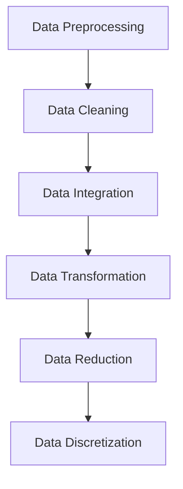

<b>Types of data</b>

### Types of Data Sources

#### **1. Structured Data**

- **Definition**: Organized in predefined formats (tables, rows, columns).
    
- **Storage**: SQL databases, CSV, Excel.
    
- **Examples**:
    
    - Customer info: Name, Age, Email
        
    - Financial data: Sales, Revenue, Profit
	
	| Name  | Age | Email             |
	|-------|-----|-------------------|
	| John  | 28  | john@email.com    |
	| Sarah | 34  | sarah@email.com   |
	| Mike  | 25  | mike@email.com    |

        
- **Processing**: Straightforward, can use SQL queries or Pandas.
    

---

#### **2. Unstructured Data**

- **Definition**: No predefined schema; raw and heterogeneous.
    
- **Storage**: Data lakes, distributed file systems, cloud storage.
    
- **Examples**:
    
    - Text: Social media posts, articles
        
    - Media: Photos, videos, audio
        
    - Sensor data without labels
	
	| Post_ID | Content                                                       |
	| ------- | ------------------------------------------------------------- |
	| 101     | "Just had the best coffee ever at the new café downtown ☕🔥" |
	| 102     | "Vacation pics from Bali 🌴🏖️"                                |
	| 103     | "Can’t believe this movie got 3 hours of my life 😑🎬"        |

	
- **Processing**: Requires NLP, computer vision, or ML techniques.
    
- **Use cases**: Image classification, speech recognition, sentiment analysis.
    

---

#### **3. Semi-structured Data**

- **Definition**: Not fully tabular but has some structure via tags/markers.
    
- **Storage**: NoSQL databases (MongoDB, CouchDB), object storage.
    
- **Examples**:
    
    - XML, JSON
        
    - Emails (headers + body)
        
    - Log files
    
	| Log_ID | Data                                                             |
	| ------ | ---------------------------------------------------------------- |
	| 1      | {"user":"alice","action":"login","time":"2025-08-19T10:30:00Z"}  |
	| 2      | {"user":"bob","action":"purchase","item":"book","price":12.99}   |
	| 3      | {"user":"carol","action":"logout","time":"2025-08-19T12:15:00Z"} |

- **Processing**: Tools like XPath, XQuery, JSON parsers.
    
- **Use case**: Flexible datasets that evolve but need organization.
    

---

<b>Data Collection Strategies</b>

Data collection is a fundamental step in the data science and visualization process.  
The quality and relevance of the collected data significantly impact the insights and decisions derived from the analysis.  

Effective data collection and visualization strategies are essential for extracting valuable insights and enabling data-driven decision-making.  
It is a dynamic process that requires continuous refinement based on user feedback and changing business needs.  

---

#### 1) Define Clear Objectives
- Clearly outline the goals and objectives of your data analytics and visualization project.  
- Understand the questions you want to answer and the insights you aim to derive.  
- Knowing what insights you aim to gain will guide your data collection efforts.  

#### 2) Identify Relevant Data Sources
- Determine the sources of data that are relevant to your objectives (databases, spreadsheets, APIs, external datasets, etc.).  
- Identify the **key performance indicators (KPIs)** and metrics relevant to your goals.  
- These metrics will drive the selection of data sources and variables.  

#### 3) Data Quality Assessment
- Assess the quality of available data: completeness, accuracy, consistency, and relevance.  
- Perform cleaning and preprocessing to resolve quality issues.  

#### 4) Consider Structured and Unstructured Data
- Collect both structured data (e.g., databases, spreadsheets) and unstructured data (e.g., text, images) for comprehensive analysis.  

#### 5) Real-time Data Collection
- If real-time insights are required, implement systems for collecting and processing data continuously.  
- This is critical for dynamic datasets.  

#### 6) Data Privacy and Ethics
- Ensure compliance with data privacy regulations.  
- Obtain permissions when dealing with personal or sensitive information.  

#### 7) Sampling Techniques
- Use sampling when working with very large datasets.  
- Select a representative subset to reduce time and resource costs while maintaining reliability.  

#### 8) Surveys and Questionnaires
- Design and deploy surveys or questionnaires to gather targeted information from users or stakeholders.  
- Ensure questions are aligned with project objectives.  

#### 9) Collaboration with Stakeholders
- Work with domain experts and stakeholders to understand data context.  
- Their input helps refine data collection strategies.  

#### 10) Data Integration
- Integrate data from multiple sources into a unified dataset.  
- Ensure compatibility and consistency across platforms.  

---

<b> Data Security in Data Analysis and Visualization</b>

Data security is a critical concern in the field of data analysis and visualization.  
As organizations collect and analyze large volumes of data to gain insights and make informed decisions, they also face significant challenges related to the security and privacy of this data.  

#### 1) Data Breaches
- One of the most significant concerns is the potential for unauthorized access.  
- Breaches can cause **financial losses, reputational damage, and legal consequences**.  

#### 2) Data Privacy
- Protecting the privacy of individuals is crucial, especially with **personally identifiable information (PII)**.  
- Techniques such as **anonymization** and **differential privacy** mitigate risks when analyzing or visualizing sensitive data.  

#### 3) Data Access Control
- Strict access controls are necessary to limit access to sensitive datasets.  
- **Role-Based Access Control (RBAC)** and other protocols regulate who can view, edit, or analyze data.  

#### 4) Data Encryption
- Data must be encrypted both **in transit** and **at rest**.  
- Encryption ensures intercepted or stolen data remains unreadable without decryption keys.  

#### 5) Data Integrity
- Data should remain unaltered during storage, analysis, and visualization.  
- **Checksums** and **digital signatures** detect unauthorized changes.  

#### 6) Secure Data Sharing
- Organizations often need to share data with external partners or vendors.  
- Secure methods include **SFTP**, **secure APIs**, or even **blockchain** for ensuring safe transfers.  

#### 7) Data Masking and Redaction
- When sharing sensitive data, masking or redacting replaces, encrypts, or removes critical information.  
- This allows analysis without exposing private details.  

#### 8) Compliance with Regulations
- Organizations must comply with laws such as **GDPR (EU)** or **HIPAA (US)**.  
- Non-compliance can result in heavy fines and legal action.  

#### 9) Awareness and Training
- Human error is a major cause of breaches.  
- Regular **training and awareness programs** help employees understand and uphold security responsibilities.  

#### 10) Data Lifecycle Management
- Data must be managed securely throughout its lifecycle: **storage, archival, and deletion**.  
- Outdated or unused data, if not securely removed, becomes a potential security risk.  

---

<b>Data Pre-Processing Overview in Data Science & Visualization (DSV)</b>
 

Effective data collection is the foundation of meaningful analytics and visualization.  
**Data pre-processing** is a crucial step that involves cleaning, transforming, and organizing raw data into a usable format for analysis and visualization.  

The main steps are:  
- Data Cleaning  
- Data Integration  
- Data Transformation  
- Data Reduction  
- Data Discretization  

---

#### 1) Data Cleaning

- Process of detecting and correcting **incomplete, inaccurate, inconsistent, or irrelevant data**.
    
- Techniques: modify or remove corrupt/unusable records.
    
- **Goal:** Ensure high-quality data before further processing.
    

**Importance:**

- "Data cleaning is one of the three biggest problems in data processing." — _Ralph Kimball_
    
- "Data cleaning is the number one problem in data processing." — _DCI Survey_
    

**Typical Tasks:**

- Fill in **missing values** (e.g., mean, median, interpolation).
    
- Identify **outliers** and smooth noisy data (e.g., binning, regression).
    
- Correct **inconsistent data** (e.g., conflicting codes, formats).
    
- Resolve **redundancy** from data integration (e.g., duplicates).

# 1. Data Acquisition
- Data can be in DBMS
- ODBC, JDBC protocols
- Data in a flat file
  - Fixed-column format
  - Delimited format: tab, comma, other
- Example: C4.5 and Weka `arff` use comma-delimited data
- Attention: Convert field delimiters inside strings
- Verify the number of fields before and after

# 2. Metadata
- **Field types:**
  - binary, nominal (categorical), ordinal, numeric
- **For nominal fields:** tables translating codes to full descriptions
- **Field role:**
  - input: inputs for modelling
  - target: output
  - id/auxiliary: keep, but not use for modelling
  - ignore: don't use for modelling
  - weight: instance weight
- Field descriptions

# 3. Reformatting
- Convert data to a standard format (e.g. arff or csv)
- Handle missing values
- Unified date format
- Binning of numeric data
- Fix errors and outliers
- Convert nominal fields whose values have order to numeric

# 4. Fill in Missing Values
- Data is not always available  
  Example: many tuples have no recorded value for several attributes (e.g. customer income in sales data)
- **Reasons for missing data:**
  - Equipment malfunction
  - Inconsistent data deleted
  - Data not entered due to misunderstanding
  - Certain data not considered important at entry
  - No history or changes recorded
- Missing data may need to be inferred

## Handling Missing Data
- Ignore the tuple (common if class label is missing, but not effective with uneven missingness)
- Fill in manually (tedious, infeasible)
- Use a global constant (e.g. "unknown")
- Imputation:
  - Use attribute mean for all data
  - Use attribute mean within the same class (smarter)
- Use the most probable value (e.g. Bayesian formula, decision tree)

# 5. Unified Date Format
- Transform all dates to the same internal format
- Examples of input: "Sep 24, 2003", `9/24/03`, `24.09.03`
- Internal transformation standardizes dates
- Often only year (YYYY) is sufficient; sometimes need month, day, hour
- Representing as YYYYMM or YYYYMMDD works but has issues

## Unified Date Format Options
- Unix system date: seconds since 1970
- SAS format: days since Jan 1, 1960

**Problem:**  
- Values are non-obvious  
- Poor for intuition and knowledge discovery  
- Harder to verify, easier to make mistakes

# 6. Conversion: Nominal to Numeric
- Some tools handle nominal internally
- Others (neural nets, regression, nearest neighbor) require numeric inputs
- Thus, nominal fields must be converted

**Why not ignore nominal fields?**  
- They may contain valuable information

**Strategies:**
- Binary fields: map to {0,1}
- Ordered nominal: map to integers preserving order
- Multi-valued nominal: one-hot encoding or similar

# 7. Conversion: Binary to Numeric
- **Binary fields:** e.g. Gender = M, F
- Convert to {0,1} values
  - Example: Gender = M → 0, Gender = F → 1

# 8. Conversion: Ordered to Numeric
- Ordered attributes (e.g. Grade) converted while preserving order:
  - A → 4.0
  - A- → 3.7
  - B+ → 3.3
  - B → 3.0
- **Why preserve order?**
  - To allow meaningful comparisons (e.g. Grade > 3.5)

# 9. Identify Outliers and Smooth Noisy Data
- **Noise:** random error or variance in measured variables
- Incorrect values may be due to:
  - Faulty instruments
  - Data entry problems
  - Transmission errors
  - Technology limitations
  - Naming inconsistencies
  - Other issues (duplicates, incomplete/inconsistent data)

## Handling Noisy Data
- **Binning method:**
  - Sort data, partition into bins
  - Smooth by bin means, medians, or boundaries
- **Clustering:** detect/remove outliers
- **Computer + human inspection:** flag suspicious values
- **Regression:** smooth by fitting regression functions

# 10. Simple Discretization: Binning
- **Equal-width (distance) partitioning:**
  - Divide range into N equal intervals
  - Interval width = (B-A)/N
  - Simple but sensitive to outliers and skewed data
- **Equal-depth (frequency) partitioning:**
  - Divide range into N intervals with ~same number of samples
  - Better scaling, but categorical attributes tricky

## Binning Example
Sorted values: 4, 8, 9, 15, 21, 21, 24, 25, 26, 28, 29, 34

- **Bins (equi-depth):**
  - Bin 1: 4, 8, 9, 15
  - Bin 2: 21, 21, 24, 25
  - Bin 3: 26, 28, 29, 34
- **Smoothing by means:**
  - Bin 1 → 9, 9, 9, 9
  - Bin 2 → 23, 23, 23, 23
  - Bin 3 → 29, 29, 29, 29
- **Smoothing by boundaries:**
  - Bin 1 → 4, 4, 4, 15
  - Bin 2 → 21, 21, 25, 25
  - Bin 3 → 26, 26, 26, 34

# 11. Data Smoothing: Regression
- **Linear regression:** fit best line to two variables → predict one from the other
- **Multiple regression:** extension with >2 variables, fit to multidimensional surface

# 12. Data Smoothing: Outlier Analysis
- Outliers detected via clustering
- Values outside clusters considered outliers

# 13. Correct Inconsistent Data
- Inconsistencies caused by:
  - Entry errors
  - Different conventions between sources
  - Format changes over time
- Leads to inaccurate analysis/modelling
- **Techniques:**
  - Data cleaning
  - Standardization
  - Validation
- Tasks: correct spelling errors, reconcile conflicts, convert units to consistent scale

---

#### 2) Data Integration
- Focuses on **combining data from different sources** into a unified view.  
- Resolves conflicts arising from different data representations.  
- Critical in large-scale scientific and commercial applications where **data volume grows exponentially**.  

# Data Integration

Process of combining multiple sources into a single dataset. Challenges include:

1. **Entity Identification Problem**  
    Identify real-world entities across databases (e.g., student ID vs. student name).
    
2. **Schema Integration**  
    Combine metadata from different sources while resolving conflicts.
    
3. **Data Value Conflicts**  
    For the same entity, attribute values may differ due to different representations or scales (e.g., metric vs. British units).
    

**Handling Redundant Data**

- Redundancy occurs when attributes have different names or are derived differently across sources.
    
- Can be detected via correlation analysis.
    
- Careful integration reduces redundancy, inconsistency, and improves mining efficiency.
    

---

# Data Reduction

Reduce data volume while preserving analytical results. Techniques:

1. **Dimensionality Reduction**
    
    - Remove irrelevant or redundant attributes.
        
    - Methods: PCA, Discrete Wavelet Transform (DWT), attribute subset selection.
        
2. **Data Compression**
    
    - Lossless (string/text) or lossy (audio/video).
        
    - Reduces storage and improves processing speed.
        
3. **Numerosity Reduction**
    
    - **Parametric:** model-based, store parameters.
        
    - **Non-parametric:** histograms, clustering, aggregation, sampling, data cubes.
        
4. **Discretization and Concept Hierarchy Generation**
    
    - Convert continuous attributes into discrete intervals or hierarchies.
        

## Dimensionality Reduction Methods

- **Wavelet Transform (DWT):** transform data vector to wavelet coefficients.
    
- **Principal Component Analysis (PCA):** project k-dimensional data to c < k principal components.
    
- Remove attributes with low variability or mostly constant values (e.g., < 0.5–5% variation).

# Parametric Methods: Regression and Log-Linear Models

- **Linear Regression**  
    Models data with a straight line; typically uses the least-squares method.  
    Formula: Y=μ+βXY = \mu + \beta XY=μ+βX
    
    - Parameters μ\muμ and β\betaβ are estimated from the data.
        
- **Multiple Regression**  
    Models a response variable YYY as a linear function of multiple features:  
    Y=b0+b1X1+b2X2+…Y = b_0 + b_1 X_1 + b_2 X_2 + \dotsY=b0​+b1​X1​+b2​X2​+…  
    Many nonlinear functions can be transformed into this form.
    
- **Log-Linear Models**  
    Approximate discrete multidimensional probability distributions.  
    Joint probabilities are modeled as a product of lower-order tables:  
    P(a,b,c,d)≈uabPacuadBbcdP(a,b,c,d) \approx u_{ab} P_{ac} u_{ad} B_{bcd}P(a,b,c,d)≈uab​Pac​uad​Bbcd​
    

# Non-Parametric Methods

## Histograms

- Data is divided into buckets, storing averages or sums for each.
    
- Optimal construction in 1D can use dynamic programming.
    
- Related to quantization.
    

## Clustering

- Partition data into clusters; store cluster representation.
    
- Effective when data is naturally clustered.
    
- Can use hierarchical clustering and multi-dimensional index trees.
    
- Multiple clustering definitions and algorithms exist.
    

## Sampling

- Select representative subsets to reduce computational complexity.
    
- **Simple random sampling:** may perform poorly with skewed data.
    
- **Stratified sampling:** maintains class proportions in skewed datasets.
    
- Does not necessarily reduce I/O costs.
    

# Data Cube Aggregation

- Multidimensional aggregation to reduce data volume.
    
- Example: Quarterly electronics sales from 2018–2022 can be aggregated annually by summing quarters:
    

|Year|Annual Sales|
|---|---|
|2018|$1,568,000|
|2019|$3,594,000|
|2020|$2,568,000|

- Aggregated views reduce complexity while preserving information.
---

#### 3) Data Transformation
- Converts raw data into an **understandable and structured form**.  
- Key techniques:  
  - **Normalization**: minimize redundancy in tables/columns → improves efficiency.  
  - **Aggregation**: create summaries for faster insights.  
  - **Generalization (Rolling-up)**: form higher-level abstractions and layered summaries.  

# Data Transformation

Convert or consolidate data into forms suitable for mining. Key strategies:

1. **Smoothing**  
    Remove noise from data using statistical methods or algorithms.
    
2. **Aggregation**  
    Summarize data, construct data cubes, or combine multiple records into metrics.
    
3. **Generalization**  
    Transform low-level attributes into high-level concepts using hierarchies (e.g., street < city < state < country).
    
4. **Normalization**  
    Scale values within a small range:
    
    - Min-Max normalization
        
    - Z-score normalization
        
    - Decimal scaling
        
5. **Attribute/Feature Construction**  
    Create new features from existing ones (e.g., area = height × width).
    

## Data Smoothing

- Eliminates outliers to highlight patterns.
    
- Methods: random smoothing, moving averages, regression.
    
- Helps forecast trends but may reduce detail in the dataset.
    

## Data Aggregation

Steps:

1. Identify sources (databases, spreadsheets, APIs).
    
2. Extract data (ETL or API).
    
3. Cleanse (remove errors, duplicates).
    
4. Combine into a warehouse or data lake.
    
5. Summarize metrics (sum, average, count).
    
6. Analyze for insights.
    

## Data Generalization

- Used for categorical data with many values.
    
- Example hierarchy: street < city < state < country.
    

## Normalization

- **Min-Max:** v′=(v−min⁡A)(max⁡A−min⁡A)×(new_max−new_min)+new_minv' = \frac{(v - \min A)}{(\max A - \min A)} \times (new\_max - new\_min) + new\_minv′=(maxA−minA)(v−minA)​×(new_max−new_min)+new_min
    
- **Z-score:** v′=(v−mean)std_devv' = \frac{(v - \text{mean})}{\text{std\_dev}}v′=std_dev(v−mean)​
    
- **Decimal scaling:** scale by powers of 10 to bring values into range.
    

## Attribute/Feature Construction

- Generate new attributes from existing ones (e.g., calculate area from height and width).
    

---

#### 4) Data Reduction
- Transforms large datasets into **smaller, meaningful fragments** without major information loss.  
- Simplifies processing and reduces storage/analysis complexity.  
- Often derived through **empirical and experimental methods**.  

# Introduction to Data Reduction

Data reduction is the process of reducing dataset size using various techniques. It is essential for data mining, machine learning, and big data processing as it improves performance, reduces computational cost, and helps extract meaningful insights.

**Why Data Reduction is Needed:**

- **Large Datasets:** Reduces computational overhead for big data.
    
- **Improved Efficiency:** Minimizes noise, redundancy, and storage needs.
    
- **Speed:** Enables faster data processing and model training.
    

---

# Overview of Data Reduction Techniques

1. **Dimensionality Reduction** – Reduce the number of features while preserving essential information (e.g., PCA, LDA).
    
2. **Data Cube Aggregation** – Summarize data across multiple dimensions.
    
3. **Attribute Selection** – Choose relevant features and remove irrelevant ones.
    
4. **Data Sampling** – Select representative subsets of data.
    

---

# Dimensionality Reduction

## Principal Component Analysis (PCA)

PCA transforms high-dimensional data into a smaller number of dimensions while retaining most of the variance.

**Steps:**

1. **Standardization:** Scale features to mean = 0, variance = 1.
    
2. **Covariance Matrix Computation:** Understand relationships between variables.
    
3. **Eigenvalue & Eigenvector Computation:** Determine principal components.
    
4. **Sort Eigenvalues:** Select top k components.
    
5. **Projection:** Project data onto selected components.
    

**Interpretation:**

- Principal components are linear combinations of original features.
    
- Explained variance indicates how much information each component retains.
    

`from sklearn.decomposition import PCA from sklearn.preprocessing import StandardScaler from sklearn.datasets import load_iris import matplotlib.pyplot as plt  # Load dataset data = load_iris() X = data.data  # Standardize data scaler = StandardScaler() X_scaled = scaler.fit_transform(X)  # Apply PCA (reduce to 2 dimensions) pca = PCA(n_components=2) X_pca = pca.fit_transform(X_scaled)  # Plot plt.scatter(X_pca[:,0], X_pca[:,1]) plt.xlabel('Principal Component 1') plt.ylabel('Principal Component 2') plt.title('PCA on Iris Dataset') plt.show()`

---

# Data Cube Aggregation

- Multidimensional representation for OLAP.
    
- Aggregation summarizes data across dimensions, reducing complexity.
    

**Example:**

`import pandas as pd  # Sample sales data data = {     'Region': ['East', 'West', 'East', 'West', 'North'],     'Month': ['Jan', 'Jan', 'Feb', 'Feb', 'Jan'],     'Sales': [100, 150, 120, 130, 110] } df = pd.DataFrame(data)  # Aggregate sales by Region and Month aggregation = df.groupby(['Region', 'Month']).agg({'Sales': 'sum'}).reset_index() print(aggregation)`

---

# Attribute Selection

Selecting a subset of relevant features to reduce dimensionality without losing important information.

**Methods:**

- **Filter Methods:** Use statistical measures (correlation, chi-square).
    
- **Wrapper Methods:** Evaluate subsets with machine learning algorithms.
    
- **Embedded Methods:** Feature selection during model training (e.g., Lasso).
    

`import seaborn as sns import matplotlib.pyplot as plt  # Load dataset df = sns.load_dataset('iris')  # Compute correlation matrix correlation = df.corr()  # Plot heatmap sns.heatmap(correlation, annot=True) plt.title("Feature Correlation Heatmap") plt.show()`

---

# Data Sampling

Select a representative subset of the data to reduce size and computational cost.

**Types:**

1. **Random Sampling:** Randomly select data points.
    
2. **Stratified Sampling:** Sample proportionally from subgroups.
    
3. **Systematic Sampling:** Select every nth data point.
    

`import numpy as np import pandas as pd from sklearn.model_selection import train_test_split  # Generate sample data data = pd.DataFrame({     'Feature1': np.random.randn(1000),     'Feature2': np.random.randn(1000),     'Label': np.random.choice([0,1], size=1000) })  # Stratified sampling train, test = train_test_split(data, test_size=0.2, stratify=data['Label']) print(train['Label'].value_counts(), test['Label'].value_counts())`

---

# Summary of Data Reduction Techniques

- **Dimensionality Reduction:** Reduce features while preserving variance (PCA).
    
- **Data Cube Aggregation:** Summarize across multiple dimensions for OLAP.
    
- **Attribute Selection:** Keep only relevant features using statistical or model-based methods.
    
- **Data Sampling:** Reduce dataset size via representative subsets (random, stratified, systematic).
    

---

# Challenges & Applications

**Challenges:**

- Loss of information.
    
- Computational complexity for techniques like PCA.
    
- Reduced interpretability.
    

**Applications:**

- Big data processing.
    
- Faster machine learning model training.
    
- Efficient OLAP and data warehousing.

---

#### 5) Data Discretization
- Converts **continuous numeric data** into **discrete categories/intervals**.  
- Helps when classification is needed based on nominal values.  
- Aim: achieve simplification with **minimal loss of information**.  

---

# Data Discretization

**Definition:**  
Data discretization transforms continuous attributes into a finite set of intervals (bins or categories).

**Purpose:**

- Simplifies models and improves interpretability.
    
- Reduces overfitting.
    
- Required for algorithms that don’t support continuous variables (e.g., Naive Bayes, association rules).
    

**Real-World Examples:**

- **Medical:** Convert blood pressure into "Low", "Normal", "High".
    
- **Marketing:** Segment customer age into ranges like "<18", "18–35", "35–50".
    

---

# Types of Discretization

|Method|Supervision|Example|
|---|---|---|
|Unsupervised|No class labels|Binning (equal-width, equal-frequency), Clustering|
|Supervised|Uses class labels|Entropy-based, ChiMerge|

---

# Unsupervised Discretization Methods

## 1. Equal-Width Binning

- Divide the range of values into `k` intervals of equal width.
    
- **Bin width formula:**
    

Width=max⁡(X)−min⁡(X)k\text{Width} = \frac{\max(X) - \min(X)}{k}Width=kmax(X)−min(X)​

- Steps:
    
    1. Determine min and max values.
        
    2. Calculate bin width.
        
    3. Assign each value to a bin.
        

## 2. Equal-Frequency Binning (Quantile Binning)

- Each bin contains approximately the same number of data points.
    
- Useful for skewed distributions.
    

**Python Example:**

`import pandas as pd import numpy as np  data = pd.DataFrame({'value': np.random.randint(0, 100, 15)}) # Equal-width bins data['equal_width'] = pd.cut(data['value'], bins=4) # Equal-frequency bins data['equal_freq'] = pd.qcut(data['value'], q=4) print(data)`

**Comparison:**

|Feature|Equal Width|Equal Frequency|
|---|---|---|
|Bin Size|Fixed|Varies|
|Distribution|Can be skewed|Balanced|
|Interpretability|Easy|Moderate|
|Outliers|May create empty bins|More robust|

**Visualization:**

`import matplotlib.pyplot as plt data['value'].hist(bins=10) plt.title("Distribution") plt.show()`

---

# Clustering-Based Discretization

- Use clustering algorithms (e.g., KMeans) to form bins.
    
- Steps:
    
    1. Apply clustering to continuous values.
        
    2. Assign cluster labels as discrete bins.
        

`from sklearn.cluster import KMeans  data = pd.DataFrame({'value': np.random.rand(20)*100}) kmeans = KMeans(n_clusters=4, random_state=42) data['cluster'] = kmeans.fit_predict(data[['value']]) print(data.sort_values('value'))`

**Pros:**

- Finds natural groupings, adapts to data distribution.  
    **Cons:**
    
- Sensitive to `k`, unstable on small datasets.
    

---

# Supervised Discretization

## 1. Entropy-Based (ID3 / C4.5)

- Uses **information gain** to select bin boundaries, similar to decision tree splits.
    

**Formulas:**

- Entropy:
    

H(S)=−∑Pilog⁡2PiH(S) = - \sum P_i \log_2 P_iH(S)=−∑Pi​log2​Pi​

- Information Gain:
    

Gain(S,A)=H(S)−∑∣Sv∣∣S∣H(Sv)\text{Gain}(S, A) = H(S) - \sum \frac{|S_v|}{|S|} H(S_v)Gain(S,A)=H(S)−∑∣S∣∣Sv​∣​H(Sv​)

**Python Example:**

`from sklearn.tree import DecisionTreeClassifier import pandas as pd  df = pd.DataFrame({'value':[10,20,30,40,50],'label':['A','A','B','B','B']}) tree = DecisionTreeClassifier(max_leaf_nodes=3) tree.fit(df[['value']], df['label']) threshold = tree.tree_.threshold[0] print(f'Best split at: {threshold}')`

- **Output:** Best split at: 25.0
    

**Pros:** Captures class info, good for classification tasks.  
**Cons:** Requires labels, computationally heavier than simple binning.

---

# Advanced Supervised Methods

- **ChiMerge:** Merges adjacent bins using Chi-Square test.
    
- **MDL (Minimum Description Length):** Balances complexity vs. accuracy.
    
- **CAIM (Class-Attribute Interdependence Maximization):** Optimizes discretization based on class information.
    

---

# Discretization with Pandas

`import pandas as pd import numpy as np from sklearn.cluster import KMeans import seaborn as sns  # Dataset df = pd.DataFrame({'score': np.random.normal(70, 10, 100)})  # Equal-width df['equal_width'] = pd.cut(df['score'], bins=4) # Equal-frequency df['equal_freq'] = pd.qcut(df['score'], q=4) # Clustering-based kmeans = KMeans(n_clusters=4, random_state=0) df['cluster'] = kmeans.fit_predict(df[['score']])  # Visualize sns.histplot(data=df, x='score', hue='equal_freq', multiple='stack')`

---

# Summary

**Why Discretize?**

- Simplifies models, improves interpretability.
    
- Reduces overfitting.
    
- Needed for algorithms that require categorical input.
    

**Common Methods:**

1. Equal-width / Equal-frequency binning (unsupervised)
    
2. Clustering-based binning (unsupervised)
    
3. Entropy-based and ChiMerge (supervised)
    

**Key Takeaways:**

- Equal-frequency is better for skewed data.
    
- Clustering adapts to natural distributions.
    
- Supervised methods leverage class information for predictive tasks.

# Data Preprocessing

## Why?
Data in the real world is **dirty**:
- **Incomplete**: Missing values, missing attributes of interest, or only aggregate data.  
  *Example: `occupation =` (empty)*  
- **Noisy**: Contains errors or outliers.  
  *Example: `Salary = "- I O"`*  
- **Inconsistent**: Discrepancies in codes or names.  

---

## Sources of Dirty Data

### Incomplete Data
- **n/a values during collection** → Customer survey with `age = n/a`.  
- **Time mismatch between collection and analysis** → Sales data collected daily, but product prices updated monthly → mismatch.  
- **Human, hardware, or software errors** → Sensor stops recording halfway; missing half of temperature readings.  

### Noisy Data
- **Errors in collection** → Microphone picks up static noise instead of clear speech.  
- **Data entry mistakes** → Typing `50000O` instead of `500000` for salary.  
- **Transmission issues** → GPS location gets scrambled during satellite signal loss.  

### Inconsistent Data
- **Conflicts between multiple data sources** → One database has `DOB = 1999-05-10`, another has `DOB = 1998-10-05`.  
- **Functional dependency violations** → `ZIP code = 560001` but `City = Hyderabad` (mismatch; 560001 belongs to Bangalore).  
---

## Importance of Data Preprocessing
- **No quality data → No quality mining results**  
- Quality decisions demand quality data  
  - Duplicate/missing values → Incorrect or misleading statistics  
- Data warehouse requires consistent integration of quality data 
- Data Extraction, cleaning, and transformation = **majority of the work** in building a data warehouse  

---

## Multi-Dimensional Measure of Data Quality

### Core Dimensions
- **Accuracy** → Value correctly represents the real-world fact.  
  *Ex: Recorded temperature = 25°C, actual = 25°C.*  

- **Completeness** → All required data is present.  
  *Ex: Customer record missing phone number → incomplete.*  

- **Consistency** → No contradictions across datasets.  
  *Ex: `DOB = 2000-01-01` in one table, `DOB = 1999-12-31` in another → inconsistent.*  

- **Timeliness** → Data is up-to-date.  
  *Ex: Stock price updated hourly vs real-time feed.*  

- **Believability** → Data is credible and trustworthy.  
  *Ex: Sales data from official ERP vs. an unverified Excel sheet.*  

- **Value Added** → Data contributes to decision-making.  
  *Ex: Adding “Customer Lifetime Value” helps marketing strategy.*  

- **Interpretability** → Data is easy to understand.  
  *Ex: Column named `salary_in_usd` vs. `sal1`.*  

- **Accessibility** → Data is available when needed.  
  *Ex: Secure API access vs. locked in a local machine file.*  

---

### Broad Categories
- **Intrinsic** → Accuracy, Believability, Objectivity.  
- **Contextual** → Completeness, Timeliness, Value Added, Relevance.  
- **Representational** → Interpretability, Consistency, Ease of understanding.  
- **Accessibility** → Accessibility, Security. 

# Handling Missing Values & Data Manipulation

## 1. Missing Values

**Definition:**  
Entries in a dataset where data is absent.

**Example:**

|Name|Age|City|
|---|---|---|
|Alice|20|Delhi|
|Bob|NaN|Mumbai|
|Charlie|22|NaN|

**Representations:**

- **Python:** `NaN` (numeric/mixed), `None` (text/object), `pd.NA` (pandas unified).
    
- **Databases:** `NULL`.
    
- **Spreadsheets:** empty cells, `#N/A`, `NA`.
    

**Detecting Missing Values (Pandas):**

`df.isnull()            # Detect missing df.isnull().sum()      # Count missing per column df[df.isnull().any(axis=1)]  # Rows with missing values`

**Filtering Missing Values:**

`df.dropna()                       # Drop rows with any missing value df.dropna(axis=1)                  # Drop columns with missing values df.dropna(subset=['Age'])          # Drop rows missing specific column df.dropna(thresh=2)                # Keep rows with at least 2 non-null values df[df.isnull().any(axis=1)]        # Select rows with missing df[df.notnull().all(axis=1)]       # Select complete rows`

---

## 2. Replacing & Imputing Missing Values

**Techniques:**

|Method|Description|Pros|Cons|
|---|---|---|---|
|Constant|Fill with fixed value (e.g., 0, 'Unknown')|Simple, keeps dataset size|May introduce bias|
|Mean|Fill with column mean|Easy, retains mean|Distorts relationships, underestimates variance|
|Median|Fill with middle value|Robust to outliers|Less informative if uniform|
|Mode|Most frequent value|Simple for categorical|Frequency bias, not for continuous|
|Forward Fill (`ffill`)|Use previous row|Maintains temporal consistency|Propagates errors|
|Backward Fill (`bfill`)|Use next row|Quick|Not valid for real-time prediction|
|Linear Interpolation|Linear trend estimation|Keeps trend|Only numeric, misleads non-linear trends|
|KNN Imputation|Based on nearest neighbors|Multivariate, non-parametric|Expensive, sensitive to scaling/outliers|
|Regression Imputation|Predict missing via regression|Captures relationships|Needs model, can introduce errors|
|MICE|Iterative regression for multiple variables|More accurate, accounts for uncertainty|Complex, slow|

**Example (Mean Imputation):**

`df['Age'].fillna(df['Age'].mean(), inplace=True)`

---

## 3. Sorting Data

**Definition:** Arrange rows based on column values.

`df.sort_values(by='Age')           # Ascending (default) df.sort_values(by='Age', ascending=False)  # Descending df.sort_values(by=['City','Age'])  # Multi-column sort`

---

## 4. Grouping Data

**Definition:** Split dataset by categories and apply aggregation.

**Example: Average Age by City**

`grouped = df.groupby('City')['Age'].mean() print(grouped)`

**Common Aggregations:** `.mean()`, `.sum()`, `.count()`, `.max()`, `.min()`

---

## 5. Rearranging Data

**Purpose:** Organize dataset structure for analysis.

**Operations:**

1. **Reset Index**
    

`df.reset_index(drop=True, inplace=True)`

2. **Set Index**
    

`df.set_index('Name', inplace=True)`

3. **Reorder Columns**
    

`df = df[['Name','City','Age']]`

4. **Rename Columns**
    

`df.rename(columns={'Age':'Years'}, inplace=True)`

5. **Reshape / Pivot**
    

`df.pivot(index='Name', columns='City', values='Age')`

# Statistics and Data Preparation

## 1. Descriptive Statistics

**Definition:** Summarizes dataset characteristics using measures (mean, median, mode, std, variance) and visual tools.

**Example: Marks of 5 students**  
Data: `[75, 80, 85, 90, 95]`

|Measure|Value|
|---|---|
|Mean (Average)|85|
|Median (Middle)|85|
|Mode (Most frequent)|No mode|
|Range (Max-Min)|20|
|Std Deviation|7.91|

---

## 2. Central Tendency

### Mean

Mean=∑xin\text{Mean} = \frac{\sum x_i}{n}Mean=n∑xi​​

Python: `statistics.mean(data)` or `np.mean(data)`

### Median

- Middle value of sorted data
    
- Odd n → middle value, Even n → average of two middle values  
    Python: `statistics.median(data)` or `np.median(data)`
    

### Mode

- Most frequent value(s)
    
- Types: unimodal, multimodal, no mode  
    Python: `statistics.mode(data)` or `df.mode()`
    

---

## 3. Measures of Dispersion

### Variance

Sample Variance s2=∑(xi−xˉ)2n−1,Population σ2=∑(xi−μ)2N\text{Sample Variance } s^2 = \frac{\sum (x_i - \bar{x})^2}{n-1}, \quad \text{Population } \sigma^2 = \frac{\sum (x_i - \mu)^2}{N}Sample Variance s2=n−1∑(xi​−xˉ)2​,Population σ2=N∑(xi​−μ)2​

Python: `statistics.variance(data)` or `np.var(data, ddof=1)`

### Standard Deviation

SD=Variance\text{SD} = \sqrt{\text{Variance}}SD=Variance​

Python: `statistics.stdev(data)` or `np.std(data, ddof=1)`

### Range

Range=Max−Min\text{Range} = \text{Max} - \text{Min}Range=Max−Min

---

## 4. Measures of Shape & Position

|Statistic|Description|
|---|---|
|Min / Max|Smallest / largest values|
|Percentiles / Quartiles|Values below which a % of data fall (25%, 50%, 75%)|
|Skewness|Asymmetry of distribution|
|Kurtosis|Peakedness of distribution|

---

## 5. Summary Statistics in Python

### Using NumPy

`import numpy as np np.mean(data) np.median(data) np.std(data, ddof=1) np.var(data, ddof=1) np.min(data), np.max(data) np.percentile(data, [25,50,75])`

### Using Pandas

`import pandas as pd df.describe()         # count, mean, std, min, 25%, 50%, 75%, max df.mean(), df.median(), df.mode() df.std(), df.var()`

**Use Case:** Efficiently analyze large datasets, identify outliers, and prepare for EDA.

# Data Distribution & Skewness

## 1. Data Distribution

Shows how values are spread across a range.  
**Example:** Most students aged 20–22 → concentration around center.

**Common Types:**

|Type|Description|
|---|---|
|Normal|Symmetric, bell-shaped, mean ≈ median ≈ mode|
|Right-skewed|Tail on right, few high values, mean > median > mode|
|Left-skewed|Tail on left, few low values, mean < median < mode|
|Uniform|All values roughly equally frequent|
|Bimodal|Two peaks → two dominant groups|
|Multimodal|>2 peaks → multiple clusters|

**Visualization:**

- Histogram → numeric distribution
    
- Box Plot → median, quartiles, spread, outliers
    
- Density Plot → smooth histogram
    
- Bar Chart → categorical counts
    
- Scatter Plot → relationships, trends, clusters, outliers
    

---

## 2. Outliers & Anomalies

### Outliers

- Far from most data points
    
- Skew analyses
    
- Detected via **Box Plot** or **Z-Score**
    

**Box Plot Example:**

- Marks: `[55, 60, 62, 65, 67, 70, 72, 75, 80, 85, 100]`
    
- Median = 70, Q1 = 62, Q3 = 80, Min = 55, Max = 100
    
- Middle 50% = 62–80
    

**Z-Score Method:**

z=X−MeanStd Devz = \frac{X - \text{Mean}}{\text{Std Dev}}z=Std DevX−Mean​

- |z| > 3 → potential outlier
    

### Anomalies

|Type|Example|
|---|---|
|Point|Single unusual value|
|Contextual|Unusual in context (e.g., 2 AM purchase)|
|Collective|Group of unusual values (e.g., failed logins)|

---

## 3. Skewness & Pearson’s Median Skewness Coefficient

### Skewness

- Measures asymmetry of distribution
    
- **Symmetric:** 0 → bell curve
    
- **Positive (right):** mean > median > mode
    
- **Negative (left):** mean < median < mode
    

**Pearson’s Median Skewness:**

Skewness=3(Mean−Median)Std Dev\text{Skewness} = \frac{3(\text{Mean} - \text{Median})}{\text{Std Dev}}Skewness=Std Dev3(Mean−Median)​

- > 0 → Right-skewed
    
- <0 → Left-skewed
    
- 0 → Symmetric
    

**Example:** Mean = 70, Median = 65, SD = 10 → Skewness = +1.5 → strongly right-skewed

---

## 4. Lab Demo: EDA with Pandas & Matplotlib

`import pandas as pd import matplotlib.pyplot as plt import seaborn as sns from scipy.stats import skew  # Sample dataset data = pd.DataFrame({     'Student': ['B','D','E','F','G','H'],     'Marks': [55,60,65,70,95,75,80,45],     'Attendance': [85,88,80,82,90,70,95,60] })  # Exploration print(data.head()) print(data.describe())  # Histogram sns.histplot(data['Marks'], bins=5, color='skyblue', kde=True) plt.show()  # Boxplot sns.boxplot(y=data['Marks'], color='orange') plt.show()  # Scatter Plot sns.scatterplot(x='Attendance', y='Marks', data=data, color='green') plt.show()  # Skewness print("Skewness of Marks:", skew(data['Marks']))`