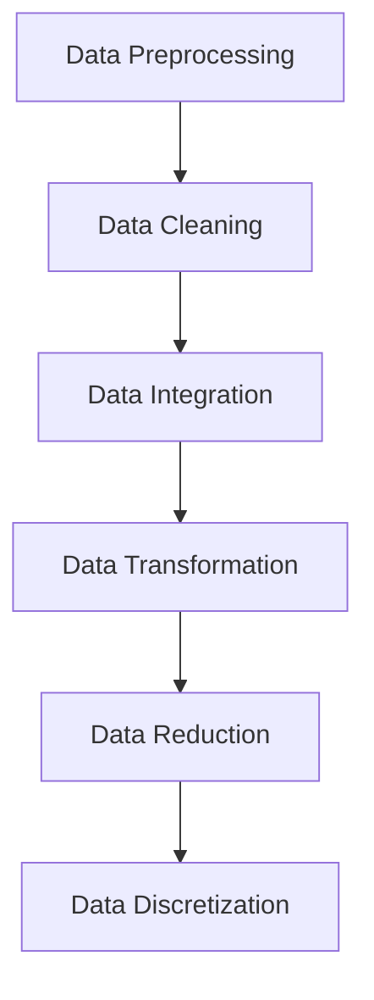

<b>Types of data</b>

### Types of Data Sources

#### **1. Structured Data**

- **Definition**: Organized in predefined formats (tables, rows, columns).
    
- **Storage**: SQL databases, CSV, Excel.
    
- **Examples**:
    
    - Customer info: Name, Age, Email
        
    - Financial data: Sales, Revenue, Profit
	
	| Name  | Age | Email             |
	|-------|-----|-------------------|
	| John  | 28  | john@email.com    |
	| Sarah | 34  | sarah@email.com   |
	| Mike  | 25  | mike@email.com    |

        
- **Processing**: Straightforward, can use SQL queries or Pandas.
    

---

#### **2. Unstructured Data**

- **Definition**: No predefined schema; raw and heterogeneous.
    
- **Storage**: Data lakes, distributed file systems, cloud storage.
    
- **Examples**:
    
    - Text: Social media posts, articles
        
    - Media: Photos, videos, audio
        
    - Sensor data without labels
	
	| Post_ID | Content                                                       |
	| ------- | ------------------------------------------------------------- |
	| 101     | "Just had the best coffee ever at the new café downtown ☕🔥" |
	| 102     | "Vacation pics from Bali 🌴🏖️"                                |
	| 103     | "Can’t believe this movie got 3 hours of my life 😑🎬"        |

	
- **Processing**: Requires NLP, computer vision, or ML techniques.
    
- **Use cases**: Image classification, speech recognition, sentiment analysis.
    

---

#### **3. Semi-structured Data**

- **Definition**: Not fully tabular but has some structure via tags/markers.
    
- **Storage**: NoSQL databases (MongoDB, CouchDB), object storage.
    
- **Examples**:
    
    - XML, JSON
        
    - Emails (headers + body)
        
    - Log files
    
	| Log_ID | Data                                                             |
	| ------ | ---------------------------------------------------------------- |
	| 1      | {"user":"alice","action":"login","time":"2025-08-19T10:30:00Z"}  |
	| 2      | {"user":"bob","action":"purchase","item":"book","price":12.99}   |
	| 3      | {"user":"carol","action":"logout","time":"2025-08-19T12:15:00Z"} |

- **Processing**: Tools like XPath, XQuery, JSON parsers.
    
- **Use case**: Flexible datasets that evolve but need organization.
    

---

<b>Data Collection Strategies</b>

Data collection is a fundamental step in the data science and visualization process.  
The quality and relevance of the collected data significantly impact the insights and decisions derived from the analysis.  

Effective data collection and visualization strategies are essential for extracting valuable insights and enabling data-driven decision-making.  
It is a dynamic process that requires continuous refinement based on user feedback and changing business needs.  

---

#### 1) Define Clear Objectives
- Clearly outline the goals and objectives of your data analytics and visualization project.  
- Understand the questions you want to answer and the insights you aim to derive.  
- Knowing what insights you aim to gain will guide your data collection efforts.  

#### 2) Identify Relevant Data Sources
- Determine the sources of data that are relevant to your objectives (databases, spreadsheets, APIs, external datasets, etc.).  
- Identify the **key performance indicators (KPIs)** and metrics relevant to your goals.  
- These metrics will drive the selection of data sources and variables.  

#### 3) Data Quality Assessment
- Assess the quality of available data: completeness, accuracy, consistency, and relevance.  
- Perform cleaning and preprocessing to resolve quality issues.  

#### 4) Consider Structured and Unstructured Data
- Collect both structured data (e.g., databases, spreadsheets) and unstructured data (e.g., text, images) for comprehensive analysis.  

#### 5) Real-time Data Collection
- If real-time insights are required, implement systems for collecting and processing data continuously.  
- This is critical for dynamic datasets.  

#### 6) Data Privacy and Ethics
- Ensure compliance with data privacy regulations.  
- Obtain permissions when dealing with personal or sensitive information.  

#### 7) Sampling Techniques
- Use sampling when working with very large datasets.  
- Select a representative subset to reduce time and resource costs while maintaining reliability.  

#### 8) Surveys and Questionnaires
- Design and deploy surveys or questionnaires to gather targeted information from users or stakeholders.  
- Ensure questions are aligned with project objectives.  

#### 9) Collaboration with Stakeholders
- Work with domain experts and stakeholders to understand data context.  
- Their input helps refine data collection strategies.  

#### 10) Data Integration
- Integrate data from multiple sources into a unified dataset.  
- Ensure compatibility and consistency across platforms.  

---

<b> Data Security in Data Analysis and Visualization</b>

Data security is a critical concern in the field of data analysis and visualization.  
As organizations collect and analyze large volumes of data to gain insights and make informed decisions, they also face significant challenges related to the security and privacy of this data.  

#### 1) Data Breaches
- One of the most significant concerns is the potential for unauthorized access.  
- Breaches can cause **financial losses, reputational damage, and legal consequences**.  

#### 2) Data Privacy
- Protecting the privacy of individuals is crucial, especially with **personally identifiable information (PII)**.  
- Techniques such as **anonymization** and **differential privacy** mitigate risks when analyzing or visualizing sensitive data.  

#### 3) Data Access Control
- Strict access controls are necessary to limit access to sensitive datasets.  
- **Role-Based Access Control (RBAC)** and other protocols regulate who can view, edit, or analyze data.  

#### 4) Data Encryption
- Data must be encrypted both **in transit** and **at rest**.  
- Encryption ensures intercepted or stolen data remains unreadable without decryption keys.  

#### 5) Data Integrity
- Data should remain unaltered during storage, analysis, and visualization.  
- **Checksums** and **digital signatures** detect unauthorized changes.  

#### 6) Secure Data Sharing
- Organizations often need to share data with external partners or vendors.  
- Secure methods include **SFTP**, **secure APIs**, or even **blockchain** for ensuring safe transfers.  

#### 7) Data Masking and Redaction
- When sharing sensitive data, masking or redacting replaces, encrypts, or removes critical information.  
- This allows analysis without exposing private details.  

#### 8) Compliance with Regulations
- Organizations must comply with laws such as **GDPR (EU)** or **HIPAA (US)**.  
- Non-compliance can result in heavy fines and legal action.  

#### 9) Awareness and Training
- Human error is a major cause of breaches.  
- Regular **training and awareness programs** help employees understand and uphold security responsibilities.  

#### 10) Data Lifecycle Management
- Data must be managed securely throughout its lifecycle: **storage, archival, and deletion**.  
- Outdated or unused data, if not securely removed, becomes a potential security risk.  

---

<b>Data Pre-Processing Overview in Data Science & Visualization (DSV)</b>
 

Effective data collection is the foundation of meaningful analytics and visualization.  
**Data pre-processing** is a crucial step that involves cleaning, transforming, and organizing raw data into a usable format for analysis and visualization.  

The main steps are:  
- Data Cleaning  
- Data Integration  
- Data Transformation  
- Data Reduction  
- Data Discretization  

---

#### 1) Data Cleaning
- Process of detecting and correcting **incomplete, inaccurate, inconsistent, or irrelevant data**.  
- Techniques: modification or removal of corrupt/unusable records.  
- Goal: ensure data quality before further processing.  

---

#### 2) Data Integration
- Focuses on **combining data from different sources** into a unified view.  
- Resolves conflicts arising from different data representations.  
- Critical in large-scale scientific and commercial applications where **data volume grows exponentially**.  

---

#### 3) Data Transformation
- Converts raw data into an **understandable and structured form**.  
- Key techniques:  
  - **Normalization**: minimize redundancy in tables/columns → improves efficiency.  
  - **Aggregation**: create summaries for faster insights.  
  - **Generalization (Rolling-up)**: form higher-level abstractions and layered summaries.  

---

#### 4) Data Reduction
- Transforms large datasets into **smaller, meaningful fragments** without major information loss.  
- Simplifies processing and reduces storage/analysis complexity.  
- Often derived through **empirical and experimental methods**.  

---

#### 5) Data Discretization
- Converts **continuous numeric data** into **discrete categories/intervals**.  
- Helps when classification is needed based on nominal values.  
- Aim: achieve simplification with **minimal loss of information**.  

# Data Preprocessing

## Why?
Data in the real world is **dirty**:
- **Incomplete**: Missing values, missing attributes of interest, or only aggregate data.  
  *Example: `occupation =` (empty)*  
- **Noisy**: Contains errors or outliers.  
  *Example: `Salary = "- I O"`*  
- **Inconsistent**: Discrepancies in codes or names.  

---

## Sources of Dirty Data

### Incomplete Data
- **n/a values during collection** → Customer survey with `age = n/a`.  
- **Time mismatch between collection and analysis** → Sales data collected daily, but product prices updated monthly → mismatch.  
- **Human, hardware, or software errors** → Sensor stops recording halfway; missing half of temperature readings.  

---

### Noisy Data
- **Errors in collection** → Microphone picks up static noise instead of clear speech.  
- **Data entry mistakes** → Typing `50000O` instead of `500000` for salary.  
- **Transmission issues** → GPS location gets scrambled during satellite signal loss.  

---

### Inconsistent Data
- **Conflicts between multiple data sources** → One database has `DOB = 1999-05-10`, another has `DOB = 1998-10-05`.  
- **Functional dependency violations** → `ZIP code = 560001` but `City = Hyderabad` (mismatch; 560001 belongs to Bangalore).  
---

## Importance of Data Preprocessing
- **No quality data → No quality mining results**  
- Quality decisions demand quality data  
  - Duplicate/missing values → Incorrect or misleading statistics  
- Data warehouse requires consistent integration of quality data 
- Extraction, cleaning, and transformation = **majority of the work** in building a data warehouse  
