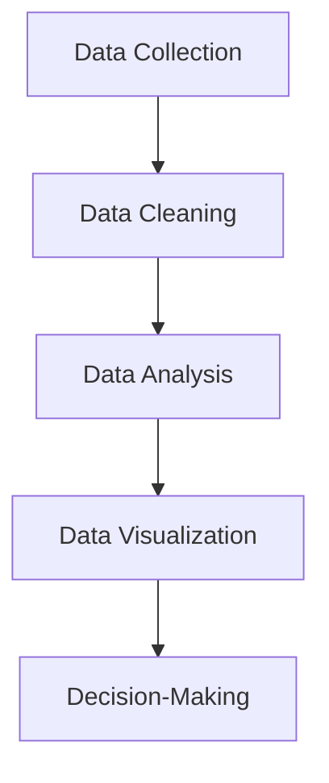
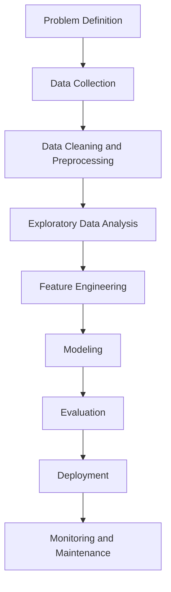

Q what is data science ?  

- An interdisciplinary field combining statistics, computer science, and domain knowledge.

- Involves extracting insights and knowledge from structured and unstructured data.

- Core techniques: machine learning, data mining, predictive analytics

<p align="center" style="font-size:18px">(or)</p>

- Data science is the study of data that helps us derive useful insight for business decision making.

- Data Science is all about using tools, techniques, and creativity to uncover insights hidden within data.

- It combines math, computer science, and domain expertise to tackle real-world challenges in a variety of fields.
---

Why is Data Science Important?

- Helps make data-driven decisions

- Drives innovation across industries

- Powers technologies like AI, recommendation systems, fraud detection, etc.

- Generates value from vast amounts of data

**Steps to Data science**




**Data Collection:** Gathering raw data from various sources, such as databases, sensors, or user interactions.

**Data Cleaning:** Ensuring the data is accurate, complete, and ready for analysis.

**Data Analysis:** Applying statistical and computational methods to identify patterns, trends, or relationships.

**Data Visualization:** Creating charts, graphs, and dashboards to present findings clearly.

**Decision-Making:** Using insights to inform strategies, create solutions, or predict outcomes.

----

Q Difference Between Data Science and Data Visualization?

**Data Science:** Full pipeline—collecting, cleaning, analyzing, modeling data, extracting insights, and making predictions or decisions. Encompasses stats, ML, programming, and domain knowledge.

**Data Visualization:** Subset/tool of data science—focuses on representing data visually (charts, graphs, dashboards) to communicate insights effectively. Doesn’t inherently analyze or predict.


<p align="center" style="font-size:18px">(or)</p>

**Data Science:** Data science is study of data. It involves developing methods of recording, storing, and analyzing data to extract useful information

**Data Visualization:** Data visualization is the graphical representation of information and data in a pictorial or graphical format(Example: charts, graphs, and maps).

---

<p align="center" style="font-size:24px"><b>IMPORTANCE OF DATA SCIENCE</b></p>


<p align="center" style="font-size:24px"><b>ROLES IN DATA SCIENCE<b></p>

### 1. Data Scientist

**Responsibilities:**

- Analyze and interpret complex data sets to extract insights
    
- Build predictive models and machine learning algorithms
    
- Preprocess, clean, and engineer features
    
- Communicate findings to non-technical stakeholders
    

### 2. Machine Learning Engineer

**Responsibilities:**

- Develop and deploy machine learning models
    
- Optimize models for performance and scalability
    
- Collaborate with data scientists to operationalize work
    
- Manage and maintain model infrastructure
    

### 3. Data Analyst

**Responsibilities:**

- Analyze data to provide actionable insights
    
- Create visualizations and reports for decision-making
    
- Identify trends and patterns in data
    
- Collaborate with business stakeholders to understand data needs
    

### 4. Data Engineer

**Responsibilities:**

- Build and maintain data pipelines and ETL processes
    
- Manage data infrastructure and databases
    
- Ensure data quality, reliability, and availability
    
- Support data scientists and analysts with clean, accessible data
    

### 5. Business Intelligence (BI) Analyst

**Responsibilities:**

- Create dashboards and reports for business performance tracking
    
- Design data visualization tools for end-users
    
- Identify key performance indicators (KPIs) and metrics
    
- Collaborate with business teams to support decision-making
    

### 6. Data Architect

**Responsibilities:**

- Design and maintain data architectures
    
- Define data storage, integration, and processing strategies
    
- Ensure data security and compliance
    
- Collaborate with data engineers to implement data solutions
    

### 7. Statistician

**Responsibilities:**

- Apply statistical techniques to analyze data
    
- Conduct hypothesis testing and experiments
    
- Design surveys and experiments to gather data
    
- Provide statistical insights to support decision-making
    

### 8. AI/ML Researcher

**Responsibilities:**

- Conduct research to advance machine learning and AI
    
- Develop novel algorithms and models
    
- Publish research papers and contribute to conferences
    
- Collaborate with data scientists and engineers on cutting-edge solutions
    

### 9. Quantitative Analyst (Quant)

**Responsibilities:**

- Apply quantitative and mathematical methods to financial data
    
- Develop trading strategies and risk models
    
- Analyze market data to inform investment decisions
    
- Implement algorithms for trading and risk management
    

### 10. Chief Data Officer (CDO)

**Responsibilities:**

- Set organizational data strategy and governance
    
- Oversee data management, privacy, and compliance
    
- Align data initiatives with business goals
    
- Manage data-related teams and resources

---

<p align="center" style="font-size:24px"><b>DATA SCIENCE WORK FLOW AND LIFE CYCLE</b></p>

The Data Science lifecycle is designed for Big Data problems and data science projects. The cycle is iterative to represent real project. To address the distinct requirements for performing analysis on Big Data, step – by – step methodology is needed to organize the activities and tasks involved with acquiring, processing, analyzing, and repurposing data





- **Problem Definition:** Clarify business/analytical objective.
    
- **Data Collection:** Gather data from internal and external sources.
    
- **Data Cleaning & Preprocessing:** Handle missing values, outliers, formatting, and normalization.
    
- **Exploratory Data Analysis (EDA):** Understand distributions, correlations, patterns, and anomalies.
    
- **Feature Engineering:** Create, select, or transform features to improve model performance.
    
- **Modeling:** Apply statistical or ML algorithms to build predictive or descriptive models.
    
- **Evaluation:** Assess model performance using metrics, cross-validation, and testing.
    
- **Deployment:** Integrate model into production or decision-making systems.
    
- **Monitoring & Maintenance:** Track performance, update models with new data, ensure reliability.

<p align="center" style="font-size:18px">(or)</p>

![[Pasted image 20250815131505.png]]

# Data Science Project Workflow

## 1. Understanding the Problem
- The data science team learns and investigates the problem.
- Develops context and understanding.
- Identifies data sources needed and available for the project.
- Formulates initial hypotheses that can be later tested with data.

## 2. Gathering Relevant Data
- Steps to explore, preprocess, and condition data prior to modeling and analysis.
- Requires an analytic sandbox where the team executes, loads, and transforms data.
- Data preparation tasks are iterative and not necessarily in a fixed order.
- **Common tools:** Hadoop, Alpine Miner, OpenRefine, etc.

## 3. Data Preparation
- Team explores data to learn relationships between variables.
- Selects key variables and the most suitable models.
- Develops datasets for training, testing, and production purposes.
- Builds and executes models based on planning.
- **Common tools:** MATLAB, STATISTICA.

## 4. Feature Engineering and Feature Extraction
- Develops datasets for testing, training, and production.
- Assesses whether existing tools suffice or if a more robust environment is needed.
- **Free/Open-source tools:** R, PL/R, Octave, WEKA.
- **Commercial tools:** MATLAB, STATISTICA.

## 5. Model Building and Deployment
- Executes models and compares outcomes against success/failure criteria.
- Articulates findings and outcomes to team members and stakeholders, considering warnings and assumptions.
- Identifies key findings, quantifies business value, and develops a narrative to summarize and convey results.

---

<p align="center" style="font-size:24px"><b>DIFFERENCE BETWEEN DATA SCIENCE AND BIG DATA</b></p>

- **Data Science:** Focused on **analyzing data** to extract insights, build models, and make decisions. Uses statistics, ML, and visualization.
    
- **Big Data:** Refers to **massive, complex datasets** (volume, velocity, variety, veracity) that traditional tools can’t handle efficiently. Focus is on **storage, processing, and management**.

<p align="center" style="font-size:18px">(or)</p>

**Data Science:**

1. Extracts insights from structured and unstructured data.
    
2. Uses statistics, machine learning, and visualization.
    
3. Focuses on solving problems and making predictions.
    
4. Works with datasets of any size, not necessarily huge.
    

**Big Data:**

1. Deals with massive, high-velocity, and diverse datasets.
    
2. Focuses on storage, processing, and management.
    
3. Enables scalable analysis, often using distributed systems.
    
4. Infrastructure-centric; insights require additional tools like data science.

---

<p align="center" style="font-size:24px"><b>DATA SCIENCE AND ARTIFICIAL INTELLIGENCE</b></p>

![[Pasted image 20250815123836.png]]

---

<p align="center" style="font-size:24px"><b>DATA SCIENCE TOOLS AND TECHNOLOGIES</b></p>

- **Programming Languages:** Python, R, SQL, Julia.
    
- **Data Handling & Analysis:** Pandas, NumPy, Spark, Hadoop.
    
- **Visualization:** Matplotlib, Seaborn, Tableau, Power BI, Plotly.
    
- **Machine Learning & AI:** Scikit-learn, TensorFlow, PyTorch, XGBoost, Keras.
    
- **Big Data & Cloud:** Hadoop, Spark, AWS, Azure, Google Cloud.
    
- **Databases:** MySQL, PostgreSQL, MongoDB, Cassandra.
    
- **Collaboration & Versioning:** Git, Jupyter Notebooks, VS Code.
    
- **ETL & Data Pipelines:** Apache Airflow, Talend, Luigi.

| Toolbox        | Purpose                          | Example Use Case                           |
|----------------|----------------------------------|-------------------------------------------|
| NumPy          | Numerical computing              | Fast array operations, linear algebra     |
| Pandas         | Data manipulation and analysis   | DataFrames for tabular data               |
| Matplotlib     | Data visualization (2D plots)    | Line graphs, bar charts, scatter plots   |
| Seaborn        | Statistical data visualization   | Boxplots, correlation graphs              |
| Scikit-learn   | Machine learning                 | Classification, regression, clustering   |
| TensorFlow     | Deep learning                     | Neural networks and deep learning models |
| Statsmodels    | Statistical modeling             | Regression, hypothesis testing           |
| Plotly         | Interactive visualization        | Dashboards, real-time plots               |


---

<p align="center" style="font-size:24px"><b>DATA SCIENCE APPLICATIONS</b></p>

**Healthcare:** Data science improves patient outcomes by using predictive analytics to detect diseases early, creating personalized treatment plans and optimizing hospital operations for efficiency.

**Finance:** Data science helps detect fraudulent activities, assess and manage financial risks, and provide tailored financial solutions to customers.

**Retail:** Data science enhances customer experiences by delivering targeted marketing campaigns, optimizing inventory management, and forecasting sales trends accurately.

**Technology:** Data science powers cutting-edge AI applications such as voice assistants, intelligent search engines, and smart home devices.

**Transportation:** Data science optimizes travel routes, manages vehicle fleets effectively, and enhances traffic management systems for smoother journeys.

**Manufacturing:** Data science predicts potential equipment failures, streamlines supply chain processes, and improves production efficiency through data-driven decisions.

**Energy:** Data science forecasts energy demand, optimizes energy consumption, and facilitates the integration of renewable energy resources.

**Agriculture:** Data science drives precision farming practices by monitoring crop health, managing resources efficiently, and boosting agricultural yields.

<p align="left" style="font-size:16px">examples of applications</p>

--- 

**Fraud Detection **

- **Goal:** Identify fraudulent activity **before it causes major damage**.
    
- **Approach:** Analyze historical data to detect patterns and anomalies.
    
- **Challenges:** Real-time detection is **harder than post-fact**, requires **high precision**.
    
- **Trade-offs:** Both false positives (innocent flagged) and false negatives (fraud missed) are costly.
    
- **Tech:** Stream processing, anomaly detection models, real-time dashboards, ML algorithms.

---

**Recommender Systems:**

- **Purpose:** Deliver **personalized suggestions** to users.
    
- **Impact:** Boosts sales, click-throughs, conversions.
    
- **Examples:**
    
    - **Netflix:** ~$1B/year value from recommendations.
        
    - **Amazon:** 20–35% annual sales lift.
        
- **Technique:** Collaborative filtering at scale, content-based methods, hybrid approaches.

---

**Patient Readmission Prediction:**

- **Goal:** Identify why patients return to the hospital.
    
- **Benefits:** Cut costs, improve population health.
    
- **Focus:** Understand **underlying causes** for specific populations.
    
- **Data:** Integrate multiple sources—EHRs, socioeconomic info, genetics, patient history.
    
- **Approach:** Analyze correlations between readmissions and health/social factors to enable targeted interventions.

---

**Smart Cities:**

- **Definition:** Use data + ICT to optimize urban living.
    
- **Goals:**
    
    - Plan communities efficiently
        
    - Manage infrastructure/assets effectively
        
    - Reduce operational costs
        
    - Use open data to engage citizens

---

<p align="center" style="font-size:24px"><b>HOLISTIC APPROACH TO DATA SCIENCE</b></p>

![[Pasted image 20250815123547.png]]


---

### import
In Python, the `import` statement brings external modules or libraries into your code, giving access to their functions, classes, and variables so you don’t have to rewrite common functionality.

Examples:

```python
import math         # full module 
from math import pi # specific item 
import numpy as np   # alias for convenience
```

It’s essential for code reuse, modularity, and leveraging Python’s ecosystem.

---

### dir Function in Python

The `dir()` function is used to list all the attributes (variables, functions, classes, etc.) of a module or object. It helps you explore what a module contains.

Example with the `math` module

```python
import math
print(dir(math))
```

---

<p align="center" style="font-size:24px"><b>NUMPY</b></p>

What is NumPy?

NumPy (short for Numerical Python ) is one of the most fundamental libraries in Python for scientific computing. It provides support for large, multi-dimensional arrays and matrices along with a collection of mathematical functions to operate on arrays.

<p align="center" style="font-size:16px">(or)</p>

NumPy provides high-performance tools for working with arrays and matrices. Unlike standard Python lists, it supports multi-dimensional data and a rich collection of mathematical operations, making it a foundational library in the data science ecosystem.

It provides support for:

- Multi-dimensional arrays (called ndarray)

- Mathematical operations (linear algebra, statistics, etc.)

- Vectorization for fast computation (avoids Python loops)


#### CREATING AN ARRAY 

 NumPy `array()` Function

The `numpy.array()` function is used to create a NumPy array from a Python list, tuple, or other sequence-like objects. It converts data into an `ndarray` for efficient numerical operations.


Syntax 


```python

import numpy as np                                       
arr = np.array ( [1,2,3,4,5])  
# Displaying ID array
print (arr)
```
**output:**
```
[1 2 3 4 5]
```

```python
import numpy as np
arr = np.array ( [1,2,3,4,5])
# Displaying ID array
for item in arr:
    print (item)
```

#### Understanding NumPy Array Indexing

In NumPy, you can access array elements using **positive indices** (from start) or **negative indices** (from end).

 Example

```python
import numpy as np

arr = np.array([10, 25, 13, 64, 57])

# Positive indexing
print(arr[0])  # 10
print(arr[1])  # 25
print(arr[2])  # 13
print(arr[3])  # 64
print(arr[4])  # 57

# Negative indexing
print(arr[-1])  # 57
print(arr[-2])  # 64
print(arr[-3])  # 13
print(arr[-4])  # 25
print(arr[-5])  # 10


# Access all elements using a loop
for index in range(len(arr)):
    print(arr[index])

```
**output:**

```
10
25
13
64
57

57
64
13
25
10

10
25
13
64
57

```
#### Creating Arrays of Zeros and Ones in NumPy

- `np.zeros(n)` → Creates a NumPy array of size `n` filled with zeros (`0.0`).
    
- `np.ones(n)` → Creates a NumPy array of size `n` filled with ones (`1.0`).
    

> Both are basic array-creation functions used for initializing arrays quickly, often for placeholders or computations.

```python
import numpy as np

# Create an array with five zeros
zeros_array = np.zeros(5)

# Create an array with five ones
ones_array = np.ones(5)

print(zeros_array)  # [0. 0. 0. 0. 0.]
print(ones_array)   # [1. 1. 1. 1. 1.]

```

**Key Point:**
    
- Both return arrays of type `float` by default.
    
You can also specify a different `dtype` if needed, e.g., `np.zeros(5, dtype=int)`.


#### Slicing of an Array in NumPy

Slicing allows you to **access a subset of elements** from a NumPy array.

 Syntax
 
```python

array[start:stop:step]

```

start: Index to begin the slice (inclusive, default 0)

stop: Index to end the slice (exclusive)

step: Step size between elements (default 1)

Examples
```python
import numpy as np

arr = np.array([10, 20, 30, 40, 50, 60])

# Slice from index 1 to 4 (excluding 4)
print(arr[1:4])  # [20 30 40]

# Slice from start to index 3
print(arr[:3])   # [10 20 30]

# Slice from index 2 to end
print(arr[2:])   # [30 40 50 60]

# Slice every 2nd element
print(arr[::2])  # [10 30 50]

# Reverse array
print(arr[::-1]) # [60 50 40 30 20 10]

```

Key Points:

- Omitting start assumes 0.

- Omitting stop goes to the end.

- Negative step reverses the order.


#### Negative Indexing to Access Elements in a 2D Array

Negative indices count from the end (`-1` = last element, `-2` = second last, etc.).

 Example:
```python
import numpy as np

a = np.array([[10, 20, 30],
              [40, 50, 60],
              [70, 80, 90]])

print("Matrix a:\n", a)

# Last row
print("Last row:", a[-1])

# Last element of last row
print("Last element of last row:", a[-1, -1])

# Second last row
print("Second last row:", a[-2])

# Second last element of first row
print("Second last element of first row:", a[0, -2])
````

 Output:

```
Matrix a:
[[10 20 30]
 [40 50 60]
 [70 80 90]]

Last row: [70 80 90]
Last element of last row: 90
Second last row: [40 50 60]
Second last element of first row: 20
```

 Dummy Version:

Think of **`-1` as pointing from the back**.  
So `a[-1]` = last row, `a[-1, -1]` = bottom-right corner.


#### Mathematical Operations on NumPy Arrays

NumPy allows element-wise mathematical operations directly on arrays.

 Example
```python
import numpy as np

k = np.array([1, 2, 3, 4, 5])
print("Original array:", k)

# Addition
k = k + 5
print("After addition operation:", k)

# Subtraction
k = k - 5
print("After subtraction operation:", k)

# Multiplication
k = k * 5
print("After multiplication:", k)

# Division
k = k / 5
print("After division:", k)
```

output:
```
Original array: [1 2 3 4 5]
After addition operation: [ 6  7  8  9 10]
After subtraction operation: [1 2 3 4 5]
After multiplication: [ 5 10 15 20 25]
After division: [1. 2. 3. 4. 5.]


```

#### Searching Elements in a NumPy Array

You can use `np.where()` to find the indices of elements that meet a condition.

Example
```python
import numpy as np

arr = np.array([10, 20, 30, 40, 50, 60])

# Find indices where element is greater than 30
indices = np.where(arr > 30)
print(indices)          # (array([3, 4, 5]),)

# Get the matching elements
print(arr[indices])     # [40 50 60]

```

**Key Points:**

- `np.where(condition)` returns a tuple of index arrays.
    
- You can use these indices to directly extract matching elements.
    
- Useful for filtering arrays without loops.

#### Filtering a NumPy Array

Filtering an array means selecting elements that meet a certain condition using **boolean indexing**.

Example

```python
import numpy as np

arr = np.array([10, 25, 30, 45, 60])

# Create a boolean mask for elements greater than 30
mask = arr > 30
print(mask)        # [False False False  True  True]

# Use the mask to filter elements
filtered = arr[mask]
print(filtered)    # [45 60]
```
#### Checking Whether a NumPy Array is Empty

You can check if an array is empty by using the `.size` attribute, which returns the total number of elements.

Example 1 – Non-empty array
```python
import numpy as np

arr = np.array([1, 2, 3, 4, 5])

if arr.size == 0:
    print("Array is empty")
else:
    print("Array is not empty")

print(arr)
```
Output:
```
Array is not empty
[1 2 3 4 5]
```
Example 2 – Empty array
```python
import numpy as np
arr = np.array([])
if arr.size == 0:
    print("Array is empty")
else:
    print("Array is not empty")
print(arr)
```
Output:

```
Array is empty
[]
```
Key Point:

- .size returns the number of elements in the array; 0 means the array is empty.

#### Creating and Displaying a 2D NumPy Array

 Example 1 – Direct print
```python
import numpy as np

# Create a 2D array
arr = np.array([[1, 2, 3], [4, 5, 6]])

# Display entire 2D array
print(arr)
```

output;
```
[[1 2 3]
 [4 5 6]]
```

Example 2 – Row by row

``` python
import numpy as np

arr = np.array([[1, 2, 3], [4, 5, 6]])

# Display each row
for row in arr:
    print(row)

```

output:
```
[1 2 3]
[4 5 6]

```

**Key Point:**

- Printing the array directly shows it in matrix form.
    
- Iterating with a loop prints each row separately.

#### NumPy `ndim` Attribute

The `.ndim` attribute returns the **number of dimensions** (axes) of a NumPy array.

 Example
```python
import numpy as np

# 1D array
A = np.array([1, 2, 3, 4])
print("Dimension of A is:", A.ndim)

# 2D array
B = np.array([[1, 2, 3], [4, 5, 6]])
print("Dimension of B is:", B.ndim)

```

output:
```
Dimension of A is: 1
Dimension of B is: 2

```

**Key Point:**

- `.ndim` gives how many dimensions an array has.
    
- Example: 1D (vector), 2D (matrix), 3D (tensor).


#### NumPy `size` Attribute

The `.size` attribute returns the **total number of elements** in a NumPy array.

Example 1 – 1D array
```python
import numpy as np

Arr = np.array([1, 2, 3, 4])
print(Arr.size)

```

output:
```
4
```

 Example 2 – 2D array

```python
import numpy as np 

Arr = np.array([[1, 2, 3, 4], [5, 6, 7, 8]]) 
print("Number of elements are:", Arr.size)
```

output:
```
8
```

#### Shape and Reshape in NumPy

`.shape` Attribute
- Returns the **dimensions (rows, columns, …)** of an array as a tuple.

`.reshape()` Method
- Changes the shape of an array **without changing its data**.


Example
```python
import numpy as np

# Create a 2D array
Arr = np.array([[1, 2, 3, 4],
                [5, 6, 7, 8],
                [9, 10, 11, 12]])

print("Original shape:", Arr.shape)   # (3, 4)

# Reshape to 2 rows × 6 columns
Arr1 = Arr.reshape(2, 6)
print("Reshaped to (2,6):")
print(Arr1)

# Reshape to 1 row × 12 columns
Arr2 = Arr.reshape(1, 12)
print("Reshaped to (1,12):")
print(Arr2)

# Reshape to 12 rows × 1 column
Arr3 = Arr.reshape(12, 1)
print("Reshaped to (12,1):")
print(Arr3)

```
output:

```
Original shape: (3, 4)

Reshaped to (2,6):
[[ 1  2  3  4  5  6]
 [ 7  8  9 10 11 12]]

Reshaped to (1,12):
[[ 1  2  3  4  5  6  7  8  9 10 11 12]]

Reshaped to (12,1):
[[ 1]
 [ 2]
 [ 3]
 [ 4]
 [ 5]
 [ 6]
 [ 7]
 [ 8]
 [ 9]
 [10]
 [11]
 [12]]

```

**Key Points:**

- `.shape` shows the current dimensions.
    
- `.reshape(a, b)` rearranges elements into the given dimensions.
    
- The total number of elements must remain the same (`rows × cols = total elements`).


#### Creating an Identity Matrix

```python
import numpy as np

# Creates an identity matrix (must be square)
x = np.eye(5)
print(x)
```

**Output:**

```
[[1. 0. 0. 0. 0.]
 [0. 1. 0. 0. 0.]
 [0. 0. 1. 0. 0.]
 [0. 0. 0. 1. 0.]
 [0. 0. 0. 0. 1.]]
```


#### Using `np.arange()`

`np.arange()` works like Python’s built-in `range()`, but returns a NumPy array.

**Syntax:**

```python
np.arange([start,] stop[, step], dtype=None)
```


 Example 1 – Default step (1)

```python
import numpy as np

x = np.arange(1, 10)   # from 1 to 9
print(x)
```

**Output:**

```
[1 2 3 4 5 6 7 8 9]
```


 Example 2 – Custom step (2)

```python
import numpy as np

x = np.arange(1, 10, 2)   # from 1 to 9 with step 2
print(x)
```

**Output:**

```
[1 3 5 7 9]
```


#### linspace()

- Returns evenly spaced numbers over a specified interval.  
- Unlike `arange()`, you **specify the number of points**, not the step.

 Syntax
```python
numpy.linspace(start, stop, num=50, endpoint=True, dtype=None)
````

- `start` → starting value
    
- `stop` → ending value
    
- `num` → number of evenly spaced samples (default = 50)
    
- `endpoint` → if True (default), includes `stop`; if False, excludes it.
    
- `dtype` → output array type
    


 Example 1 – Default `num=50`

```python
import numpy as np

x = np.linspace(1, 15)  
print(x)
```

**Output (truncated):**

```
[ 1.          1.28571429  1.57142857 ... 14.71428571 15.        ]
```


 Example 2 – Custom number of points

```python
x = np.linspace(1, 15, 5)
print(x)
```

**Output:**

```
[ 1.   4.5   8.   11.5  15. ]
```


Example 3 – Excluding endpoint

```python
x = np.linspace(1, 15, 5, endpoint=False)
print(x)
```

**Output:**

```
[ 1.   3.8  6.6  9.4  12.2 ]
```


#### Random Array and Random Matrix

We can create arrays filled with random numbers using `np.random.rand()`.  
This generates numbers uniformly between **0 and 1**.

```python
import numpy as np

# 1D Random Array
x = np.random.rand(5)
print(x)
````

**Example Output:**

```
[0.56384794 0.22602629 0.44806777 0.8582133  0.90928771]
```


```python
# 2D Random Matrix (3 rows, 2 columns)
x = np.random.rand(3, 2)
print(x)
```

**Example Output:**

```
[[0.74546836 0.5458692 ]
 [0.62195462 0.68303793]
 [0.91000309 0.37147617]]
```


```python
# 3D Random Matrix (2 × 2 × 3)
x = np.random.rand(2, 2, 3)
print(x)
```

**Example Output:**

```
[[[0.35227776 0.82447525 0.47650569]
  [0.78307986 0.54879399 0.49727558]]

 [[0.14251969 0.69900492 0.55307993]
  [0.54046539 0.42103462 0.88256667]]]
```


#### Computing Trace of a Matrix

The **trace** of a matrix is the sum of its diagonal elements.

Example:
```python
import numpy as np  

a = np.array([[1, 2, 3],
              [4, 5, 6],
              [7, 8, 9]])

print("Given matrix is:\n", a)

# Using .trace()
print("Trace of the given matrix is:", a.trace())

# Equivalent: using diagonal() + sum()
print("Trace:", sum(a.diagonal()))
````

 Output:

```
Given matrix is:
[[1 2 3]
 [4 5 6]
 [7 8 9]]

Trace of the given matrix is: 15  
Trace: 15
```


#### Finding Transpose of a Matrix

The **transpose** of a matrix is obtained by swapping its rows with columns.

Example:
```python
import numpy as np

a = np.array([[3, 4],
              [5, 6]])

print("Matrix a is:\n", a)

# Using np.transpose()
print("Transpose of matrix a is:\n", np.transpose(a))

# Using .T attribute
print("Transpose of matrix a is:\n", a.T)

# Using .transpose() method
print("Transpose of matrix a is:\n", a.transpose())
````

Output:

```
Matrix a is:
[[3 4]
 [5 6]]

Transpose of matrix a is:
[[3 5]
 [4 6]]

Transpose of matrix a is:
[[3 5]
 [4 6]]

Transpose of matrix a is:
[[3 5]
 [4 6]]
```

### PRACTICE QUESTIONS

1.Compare and analyze memory usage and speed of NumPy arrays vs Python lists with a simple numerical example.

2.Analyze a given array and write Python code to:

3.Replace all elements greater than 10 with 10

4.Find the number of elements equal to 10

5.Write a code to perform the following:

6.Create two 1D arrays a and b

7.Add, subtract, and multiply them element-wise

8.Explain what happens when shapes are incompatible

9.Analyze the effect of broadcasting in array operations with an example involving 2D and 1D arrays.

10.Describe how different data types (int, float, bool) behave in NumPy and how to check them.


---


<p align="center" style="font-size:24px"><b>PANDAS</b></p>

